# Agent开发核心面试知识点（Java版）

> 小林coding x 黑马程序员 | 难度星级：★~★★★★★ | 面试频率：高/中/低

---

## 目录

1. [AI Agent基础概念](#1-ai-agent基础概念)
2. [Spring AI框架详解](#2-spring-ai框架详解)
3. [Function Calling原理与实现](#3-function-calling原理与实现)
4. [Agent核心组件开发](#4-agent核心组件开发)
5. [主流Agent模式](#5-主流agent模式)
6. [Multi-Agent系统设计](#6-multi-agent系统设计)
7. [Memory与Context管理](#7-memory与context管理)
8. [RAG与Agent结合](#8-rag与agent结合)
9. [Agent安全与护栏](#9-agent安全与护栏)
10. [高频面试题](#10-高频面试题)

---

## 1. AI Agent基础概念 ★★★

### 什么是AI Agent？

**AI Agent（智能体）**是一种能够自主感知环境、做出决策并执行动作的智能系统。

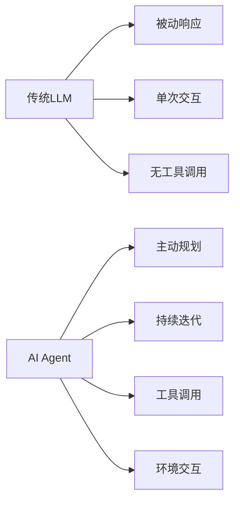

| 对比维度 | 传统LLM | AI Agent |
|---------|---------|----------|
| **交互方式** | 被动问答 | 主动规划执行 |
| **工作模式** | 单次调用 | 多轮循环 |
| **工具能力** | 无 | 可调用外部工具 |
| **记忆能力** | 无状态 | 有状态 |

### Agent四大核心能力

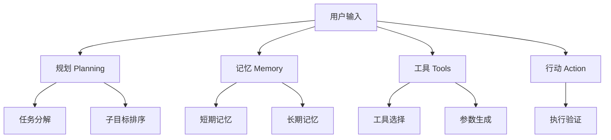

| 能力 | 说明 | Spring AI实现 |
|------|------|--------------|
| **规划(Planning)** | 分解任务 | `ReAct Advisor` |
| **记忆(Memory)** | 存储检索 | `ChatMemory` + `Advisor` |
| **工具(Tools)** | 调用外部系统 | `@Tool` + `FunctionCallback` |
| **行动(Action)** | 执行操作 | `ChatClient` + `Agent` |

### Agent工作流程

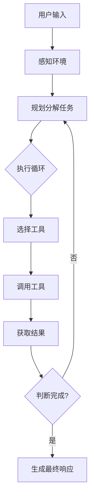

---

## 2. Spring AI框架详解 ★★★★★

### 2.1 Spring AI概述

**Spring AI**是Spring官方提供的AI应用开发框架，提供与AI模型交互的Spring友好型API。

> 官网：https://spring.io/projects/spring-ai

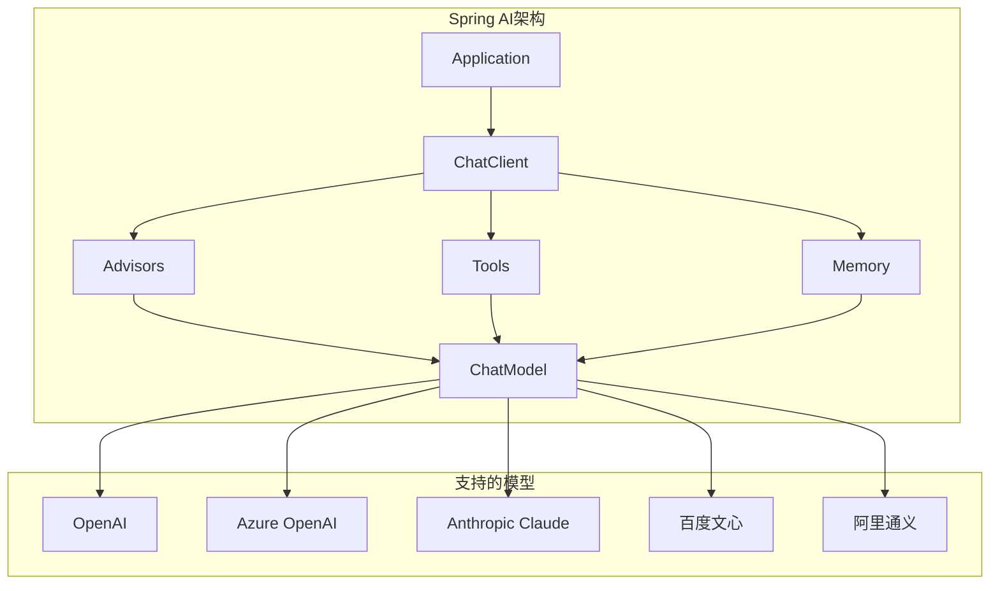

### 2.2 核心组件

| 组件 | 说明 | Java类型 |
|------|------|---------|
| **ChatModel** | 模型客户端 | `ChatModel` |
| **ChatClient** | 对话客户端 | `ChatClient` |
| **Prompt** | 提示词模板 | `Prompt` |
| **ChatMemory** | 对话记忆 | `ChatMemory` |
| **Advisor** | 拦截器链 | `CallAdvisor` |
| **ToolCallback** | 工具回调 | `FunctionToolCallback` |

### 2.3 快速开始

**Maven依赖**：

```xml
<dependency>
    <groupId>org.springframework.ai</groupId>
    <artifactId>spring-ai-openai-spring-boot-starter</artifactId>
</dependency>
```

**配置文件**：

```yaml
spring:
  ai:
    openai:
      api-key: ${OPENAI_API_KEY}
      chat:
        options:
          model: gpt-4
```

**基本使用**：

```java
@RestController
public class AIController {

    private final ChatClient chatClient;

    public AIController(ChatClient chatClient) {
        this.chatClient = chatClient;
    }

    @GetMapping("/chat")
    public String chat(@RequestParam String message) {
        return chatClient.prompt()
            .user(message)
            .call()
            .content();
    }
}
```

---

## 3. Function Calling原理与实现 ★★★★★

### 3.1 什么是Function Calling？

**Function Calling**是LLM生成结构化工具调用的能力，让模型能调用外部工具获取实时信息或执行操作。

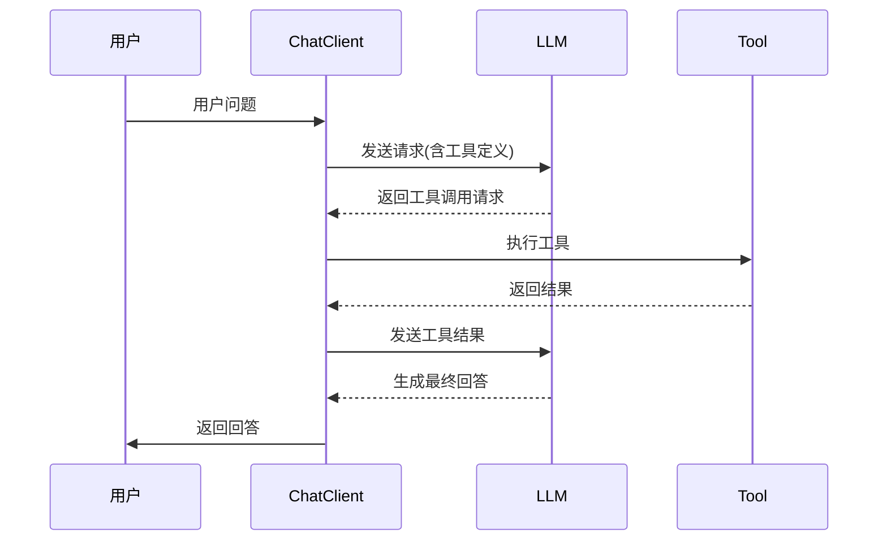

### 3.2 Spring AI实现Function Calling

#### 方式一：@Tool注解（推荐）

```java
/**
 * 天气工具类 - 使用@Tool声明
 */
public class WeatherTools {

    @Tool(description = "获取城市天气信息")
    public String getWeather(@ToolParam(description = "城市名称") String city) {
        // 调用天气API
        return "天气信息";
    }

    @Tool(description = "获取当前日期时间")
    public String getDateTime() {
        return LocalDateTime.now().toString();
    }
}

// 使用ChatClient调用
@Service
public class WeatherService {

    private final ChatClient chatClient;

    public WeatherService(ChatClient.Builder builder) {
        this.chatClient = builder
            .defaultTools(new WeatherTools())  // 注册工具
            .build();
    }

    public String ask(String question) {
        return chatClient.prompt()
            .user(question)
            .call()
            .content();
    }
}
```

#### 方式二：FunctionToolCallback（灵活控制）

```java
@Configuration
public class ToolConfiguration {

    @Bean
    public ToolCallback weatherToolCallback() {
        return FunctionToolCallback.builder("getWeather", new WeatherService())
            .description("获取城市天气信息")
            .inputType(WeatherRequest.class)
            .build();
    }

    @Bean
    public ToolCallback calculatorToolCallback() {
        return FunctionToolCallback.builder("calculate", new CalculatorService())
            .description("数学计算器")
            .inputType(CalculatorRequest.class)
            .build();
    }
}

// 使用
@Service
public class AgentService {

    private final ChatClient chatClient;

    public AgentService(ChatClient.Builder builder, ToolCallback weatherTool) {
        this.chatClient = builder
            .defaultToolCallbacks(weatherTool)
            .build();
    }
}
```

#### 方式三：@Bean + @Description声明式

```java
@Configuration
public class FunctionConfiguration {

    @Bean
    @Description("获取城市天气信息")
    public Function<WeatherRequest, WeatherResponse> weatherFunction() {
        return new WeatherService();
    }

    @Bean
    @Description("执行数学计算")
    public Function<CalculatorRequest, CalculatorResponse> calculateFunction() {
        return new CalculatorService();
    }
}

// 使用时按bean名称引用
public String ask(String question) {
    return chatClient.prompt()
        .user(question)
        .functions("weatherFunction", "calculateFunction")  // 按bean名称
        .call()
        .content();
}
```

### 3.3 工具接口定义

```java
// 天气请求
public record WeatherRequest(String city, String unit) {}

// 天气响应
public record WeatherResponse(double temperature, String condition) {}

// 天气服务实现
public class WeatherService implements Function<WeatherRequest, WeatherResponse> {

    @Override
    public WeatherResponse apply(WeatherRequest request) {
        // 调用外部天气API
        return new WeatherResponse(22.5, "晴朗");
    }
}
```

### 3.4 Tool Schema完整定义

```java
// 完整Tool定义示例
public class AdvancedToolDefinition {

    // 方法一：使用@Tool注解
    @Tool(
        description = "搜索航班信息",
        name = "searchFlights"
    )
    public FlightResponse searchFlights(
        @ToolParam(description = "出发城市", required = true) String origin,
        @ToolParam(description = "目的城市", required = true) String destination,
        @ToolParam(description = "出发日期") String date,
        @ToolParam(description = "行程类型", allowedValues = {"one_way", "round_trip"})
            String tripType
    ) {
        // 实现
        return new FlightResponse();
    }

    // 方法二：实现Function接口
    public class FlightSearchService implements Function<FlightRequest, FlightResponse> {

        public record FlightRequest(
            String origin,
            String destination,
            String date,
            String tripType
        ) {}

        public record FlightResponse(
            List<String> flights,
            double lowestPrice
        ) {}

        @Override
        public FlightResponse apply(FlightRequest request) {
            // 搜索航班逻辑
            return new FlightResponse(List.of("CA1234", "MU5678"), 850.0);
        }
    }
}
```

### 3.5 工具调用策略

| 策略 | 说明 | Spring AI实现 |
|------|------|--------------|
| **单一工具** | 每次调用一个 | 默认行为 |
| **并行调用** | 多个独立工具同时调用 | `.toolCallbacks(list)` |
| **顺序调用** | 工具结果作为下一工具输入 | 循环调用 |

```java
// 并行调用多个工具
List<ToolCallback> tools = List.of(
    weatherTool,
    calculatorTool,
    searchTool
);

chatClient.prompt()
    .user("北京天气如何？顺便帮我算一下 100 * 50")
    .toolCallbacks(tools)  // 并行提供所有工具
    .call()
    .content();
```

---

## 4. Agent核心组件开发 ★★★★

### 4.1 ChatClient详解

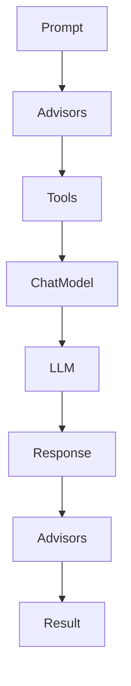

**ChatClient使用模式**：

```java
// 模式一：Builder模式（推荐）
ChatClient chatClient = ChatClient.builder(chatModel)
    .defaultAdvisors(new SimpleLoggerAdvisor())
    .defaultTools(weatherTools)
    .build();

// 模式二：create静态方法
ChatClient chatClient = ChatClient.create(chatModel);

// 模式三：通过ChatClient.Builder注入
@Service
public class MyService {

    public MyService(ChatClient.Builder builder) {
        ChatClient client = builder
            .defaultTools(myTools)
            .build();
    }
}
```

### 4.2 Advisor拦截器链

**Advisor是Spring AI的核心扩展机制**，类似于Spring的拦截器或AOP切面。

```java
// 常用Advisor
ChatClient chatClient = ChatClient.builder(chatModel)
    .defaultAdvisors(
        // 日志记录
        new SimpleLoggerAdvisor(),

        // 对话记忆
        MessageChatMemoryAdvisor.builder(chatMemory)
            .conversationId("user-123")
            .build(),

        // 安全护栏
        SafeGuardAdvisor.builder()
            .sensitiveWords(List.of("password", "secret"))
            .build()
    )
    .build();
```

**自定义Advisor**：

```java
@Component
public class CustomAdvisor implements CallAdvisor {

    @Override
    public String getName() {
        return "customAdvisor";
    }

    @Override
    public int getOrder() {
        return 0;  // 越小越先执行
    }

    @Override
    public ChatClientResponse adviseCall(
            ChatClientRequest request,
            CallAdvisorChain chain) {

        // 前置处理
        System.out.println("请求: " + request);

        // 继续执行链
        ChatClientResponse response = chain.nextCall(request);

        // 后置处理
        System.out.println("响应: " + response);

        return response;
    }
}
```

**Advisor执行顺序**：

```
请求阶段: Advisor1 → Advisor2 → Advisor3 → ChatModel
响应阶段: ChatModel → Advisor3 → Advisor2 → Advisor1
```

### 4.3 ReAct模式实现

**ReAct = Reasoning + Acting**，Spring AI通过`ReActAgent`实现：

```java
// 使用Spring AI Agent Utils的ReAct Agent
@Configuration
public class ReActAgentConfig {

    @Bean
    public ChatClient reactChatClient(ChatModel chatModel) {
        return ChatClient.builder(chatModel)
            .defaultTools(new WeatherTools(), new SearchTools())
            .build();
    }
}

// 或者使用Advisor实现ReAct循环
@Service
public class ReActAgentService {

    private final ChatClient chatClient;

    public ReActAgentService(ChatClient.Builder builder) {
        this.chatClient = builder
            .defaultTools(new CalculatorTools())
            .build();
    }

    public String execute(String task) {
        String result = chatClient.prompt()
            .user(task)
            .call()
            .content();
        return result;
    }
}
```

### 4.4 Chain of Thought (CoT)

```java
// Zero-shot CoT
String response = chatClient.prompt()
    .user("""
        问题: 我的年龄是你的3倍。你5岁时，我是你的4倍。我现在多少岁？

        让我们一步一步思考。
        """)
    .call()
    .content();

// Few-shot CoT
String response = chatClient.prompt()
    .user("""
        Q: 当我哥哥2岁时，我是他的两倍。现在我40岁，我哥哥多少岁？
        A: 让我一步一步思考...
           当哥哥2岁时，我是2*2=4岁，我们相差2岁...
           所以现在哥哥是40-2=38岁。答案是38岁。

        Q: 当我3岁时，我的伴侣是我的3倍。现在我20岁，我的伴侣多少岁？
        A:
        """)
    .call()
    .content();
```

### 4.5 Evaluator-Optimizer模式

```java
// 迭代优化工作流
@Service
public class EvaluatorOptimizerService {

    private final ChatClient chatClient;

    public EvaluatorOptimizerService(ChatClient chatClient) {
        this.chatClient = chatClient;
    }

    public String optimize(String task) {
        String solution = chatClient.prompt()
            .user("解决这个任务: " + task)
            .call()
            .content();

        // 评估
        String evaluation = chatClient.prompt()
            .user("评估这个解决方案: " + solution)
            .call()
            .content();

        // 如果不满足要求，迭代优化
        if (!isSatisfactory(evaluation)) {
            return optimize(task);  // 递归优化
        }

        return solution;
    }
}
```

---

## 5. 主流Agent模式 ★★★★★

### 5.1 ReAct模式（必考）

**ReAct = Reasoning + Acting**，推理与行动交替进行

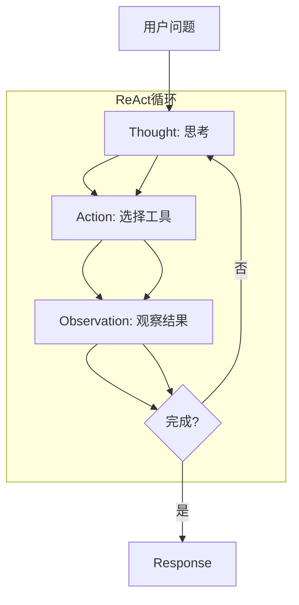

**ReAct完整示例**：

```java
@Service
public class ReActWeatherAgent {

    private final ChatClient chatClient;

    public ReActWeatherAgent(ChatClient.Builder builder) {
        this.chatClient = builder
            .defaultTools(new WeatherTools())
            .build();
    }

    /**
     * 典型ReAct对话：
     * 用户：北京天气如何？
     * Thought：用户想知道北京天气，需要调用天气工具
     * Action：getWeather
     * Action Input：{"city": "北京"}
     * Observation：晴，25度
     * Response：北京今天天气晴朗，气温25度
     */
    public String ask(String question) {
        return chatClient.prompt()
            .user(question)
            .call()
            .content();
    }
}
```

### 5.2 Plan-and-Execute模式

```java
@Service
public class PlanExecuteAgent {

    private final ChatClient chatClient;

    // 1. 规划阶段 - 分解任务
    public List<String> plan(String task) {
        return chatClient.prompt()
            .user("分解以下任务为具体步骤: " + task)
            .call()
            .entity(new TypeReference<>() {});
    }

    // 2. 执行阶段 - 按序执行
    public String execute(String task) {
        List<String> steps = plan(task);
        String result = "";

        for (String step : steps) {
            String stepResult = chatClient.prompt()
                .user("执行步骤: " + step + "\n 上一步结果: " + result)
                .call()
                .content();
            result = stepResult;
        }

        return result;
    }
}
```

### 5.3 自定义Agent实现

```java
@Component
public class CustomAgent {

    private final ChatClient chatClient;
    private final ChatMemory chatMemory;

    public CustomAgent(ChatClient.Builder builder, ChatMemory chatMemory) {
        this.chatClient = builder
            .defaultAdvisors(
                MessageChatMemoryAdvisor.builder(chatMemory)
                    .conversationId("agent-1")
                    .build()
            )
            .defaultTools(new SearchTools(), new CalculatorTools())
            .build();
        this.chatMemory = chatMemory;
    }

    public String run(String userInput) {
        // 1. 规划
        String plan = chatClient.prompt()
            .user("分析任务并制定执行计划: " + userInput)
            .call()
            .content();

        // 2. 执行
        String result = chatClient.prompt()
            .user("执行: " + plan)
            .call()
            .content();

        // 3. 反思
        String reflection = chatClient.prompt()
            .user("反思执行结果: " + result)
            .call()
            .content();

        return reflection;
    }

    // 清除对话历史
    public void clearMemory() {
        chatMemory.clear("agent-1");
    }
}
```

### 5.4 多轮对话Agent

```java
@Configuration
public class ConversationalAgentConfig {

    @Bean
    public ChatMemory chatMemory() {
        return new InMemoryChatMemory();
    }

    @Bean
    public ChatClient conversationalChatClient(
            ChatModel chatModel,
            ChatMemory chatMemory) {

        return ChatClient.builder(chatModel)
            .defaultAdvisors(
                // 记录日志
                new SimpleLoggerAdvisor(),
                // 对话记忆
                MessageChatMemoryAdvisor.builder(chatMemory)
                    .conversationId("user-session")
                    .build()
            )
            .defaultTools(new WeatherTools())
            .build();
    }
}

// 使用
@RestController
public class ChatController {

    private final ChatClient chatClient;

    public ChatController(ChatClient conversationalChatClient) {
        this.chatClient = conversationalChatClient;
    }

    @PostMapping("/chat")
    public String chat(@RequestBody ChatRequest request) {
        return chatClient.prompt()
            .user(request.message())
            .call()
            .content();
    }
}
```

---

## 6. Multi-Agent系统设计 ★★★★★

### 6.1 Spring AI Multi-Agent生态

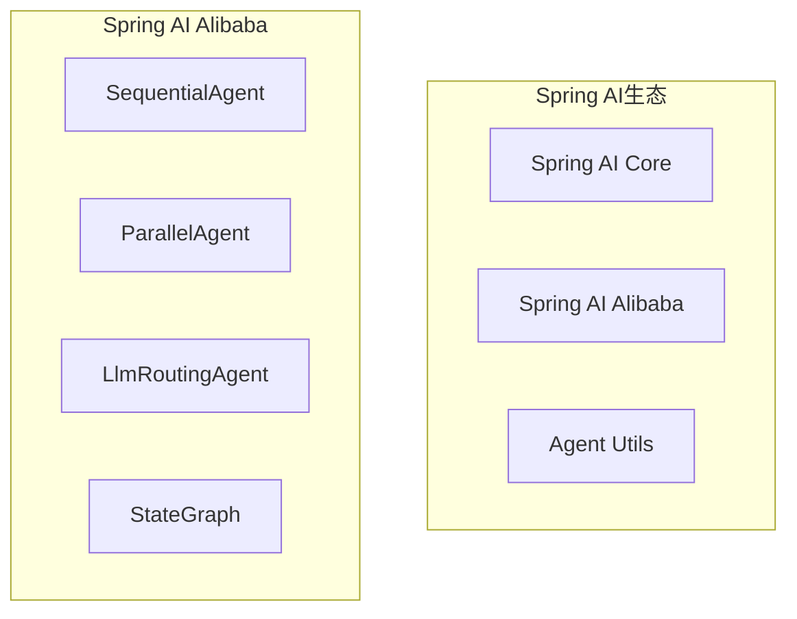

### 6.2 SequentialAgent（顺序执行）

```java
// Maven依赖
/*
<dependency>
    <groupId>com.alibaba.cloud.ai</groupId>
    <artifactId>spring-ai-alibaba</artifactId>
</dependency>
*/

@Configuration
public class SequentialAgentConfig {

    @Bean
    public SequentialAgent contentPipeline(ChatModel chatModel) {
        // 写作Agent
        ReactAgent writerAgent = ReactAgent.builder()
            .name("writer_agent")
            .model(chatModel)
            .instruction("你是一个专业作家。根据主题写一篇文章: {input}")
            .outputKey("article")
            .build();

        // 审核Agent
        ReactAgent reviewerAgent = ReactAgent.builder()
            .name("reviewer_agent")
            .model(chatModel)
            .instruction("审核并改进文章: {article}")
            .outputKey("reviewed_article")
            .build();

        // 翻译Agent
        ReactAgent translatorAgent = ReactAgent.builder()
            .name("translator_agent")
            .model(chatModel)
            .instruction("将文章翻译成英文: {reviewed_article}")
            .outputKey("final_article")
            .build();

        return SequentialAgent.builder()
            .name("content_pipeline")
            .subAgents(List.of(writerAgent, reviewerAgent, translatorAgent))
            .build();
    }
}

// 使用
@Service
public class ContentService {

    private final SequentialAgent contentPipeline;

    public ContentService(SequentialAgent contentPipeline) {
        this.contentPipeline = contentPipeline;
    }

    public String createContent(String topic) {
        Optional<OverAllState> result = contentPipeline.invoke(topic);

        return result
            .map(state -> state.value("final_article").orElse(""))
            .orElse("处理失败");
    }
}
```

### 6.3 ParallelAgent（并行执行）

```java
@Configuration
public class ParallelAgentConfig {

    @Bean
    public ParallelAgent creativeParallelAgent(ChatModel chatModel) {

        ReactAgent proseAgent = ReactAgent.builder()
            .name("prose_writer")
            .model(chatModel)
            .instruction("写一段散文: {input}")
            .outputKey("prose_result")
            .build();

        ReactAgent poetryAgent = ReactAgent.builder()
            .name("poetry_writer")
            .model(chatModel)
            .instruction("写一首诗: {input}")
            .outputKey("poetry_result")
            .build();

        ReactAgent summaryAgent = ReactAgent.builder()
            .name("summarizer")
            .model(chatModel)
            .instruction("总结主题要点: {input}")
            .outputKey("summary_result")
            .build();

        return ParallelAgent.builder()
            .name("creative_parallel")
            .subAgents(List.of(proseAgent, poetryAgent, summaryAgent))
            .mergeOutputKey("merged_results")
            .build();
    }
}

// 使用
@Service
public class CreativeService {

    private final ParallelAgent parallelAgent;

    public String generate(String topic) {
        Optional<OverAllState> result = parallelAgent.invoke(topic);

        return result
            .map(state -> {
                StringBuilder sb = new StringBuilder();
                state.value("prose_result").ifPresent(v -> sb.append("散文: ").append(v).append("\n"));
                state.value("poetry_result").ifPresent(v -> sb.append("诗歌: ").append(v).append("\n"));
                state.value("summary_result").ifPresent(v -> sb.append("摘要: ").append(v));
                return sb.toString();
            })
            .orElse("");
    }
}
```

### 6.4 LlmRoutingAgent（智能路由）

```java
@Configuration
public class RoutingAgentConfig {

    @Bean
    public LlmRoutingAgent smartRouter(ChatModel chatModel) {

        ReactAgent technicalAgent = ReactAgent.builder()
            .name("technical_expert")
            .model(chatModel)
            .description("处理编程、调试等技术支持问题")
            .instruction("你是一个资深软件工程师，提供技术指导")
            .outputKey("technical_output")
            .build();

        ReactAgent businessAgent = ReactAgent.builder()
            .name("business_analyst")
            .model(chatModel)
            .description("处理市场分析、战略规划等业务问题")
            .instruction("你是一个业务分析师，提供战略洞察")
            .outputKey("business_output")
            .build();

        ReactAgent creativeAgent = ReactAgent.builder()
            .name("creative_writer")
            .model(chatModel)
            .description("处理内容创作、文案撰写等创意任务")
            .instruction("你是一个创意作家，创作吸引人的内容")
            .outputKey("creative_output")
            .build();

        return LlmRoutingAgent.builder()
            .name("smart_router")
            .model(chatModel)
            .subAgents(List.of(technicalAgent, businessAgent, creativeAgent))
            .build();
    }
}

// 使用 - LLM自动选择合适的Agent
@Service
public class RoutingService {

    private final LlmRoutingAgent router;

    public String route(String question) {
        // 自动路由到最合适的Agent
        return router.invoke(question).toString();
    }
}
```

### 6.5 StateGraph（状态机工作流）

```java
@Configuration
public class StateGraphWorkflowConfig {

    @Bean
    public CompiledGraph workflowGraph(ChatModel chatModel) {

        // 定义状态key策略
        KeyStrategyFactory keyFactory = () -> {
            Map<String, KeyStrategy> strategies = new HashMap<>();
            strategies.put("input", new ReplaceStrategy());
            strategies.put("processed", new ReplaceStrategy());
            strategies.put("result", new ReplaceStrategy());
            return strategies;
        };

        // 构建工作流图
        StateGraph workflow = new StateGraph(keyFactory)
            // 添加节点
            .addNode("input_handler", node_async(state -> {
                String input = state.value("input", "").toString();
                return Map.of("processed", input.toUpperCase());
            }))
            .addNode("validator", node_async(state -> {
                String processed = state.value("processed", "").toString();
                boolean valid = processed.length() > 5;
                return Map.of("result", valid ? "VALID" : "INVALID");
            }))
            .addNode("processor", node_async(state ->
                Map.of("result", "Processed: " + state.value("processed", "").toString())
            ))
            .addNode("error_handler", node_async(state ->
                Map.of("result", "Error: input too short")
            ));

        // 定义边
        workflow.addEdge(START, "input_handler");
        workflow.addEdge("input_handler", "validator");

        // 条件边
        workflow.addConditionalEdges(
            "validator",
            edge_async(state -> {
                String result = state.value("result", "").toString();
                return result;  // "VALID" 或 "INVALID"
            }),
            Map.of(
                "VALID", "processor",
                "INVALID", "error_handler"
            )
        );

        workflow.addEdge("processor", END);
        workflow.addEdge("error_handler", END);

        return workflow.compile();
    }
}

// 使用
@Service
public class WorkflowService {

    private final CompiledGraph workflow;

    public String execute(String input) {
        return workflow.invoke(Map.of("input", input))
            .map(state -> state.value("result").orElse("").toString())
            .orElse("执行失败");
    }
}
```

### 6.6 Multi-Agent通信模式

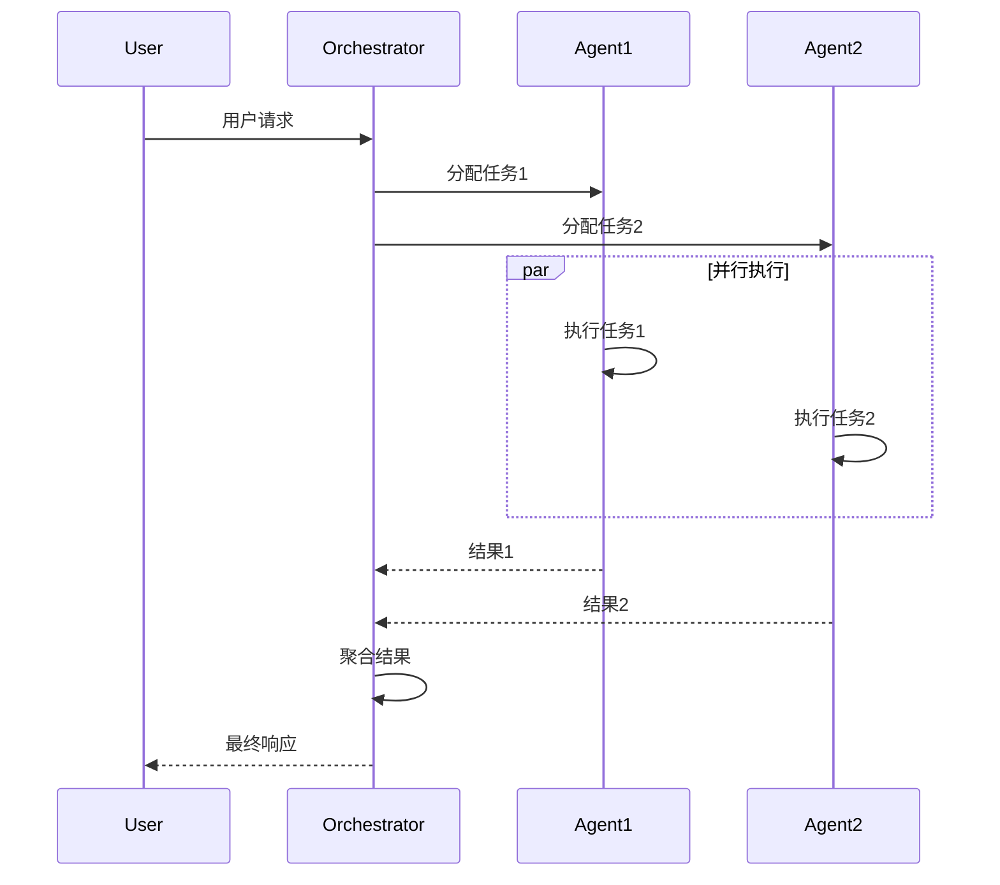

---

## 7. Memory与Context管理 ★★★★

### 7.1 ChatMemory架构

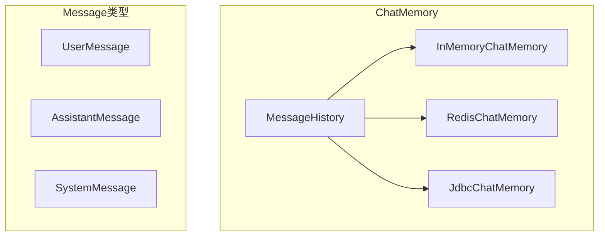

### 7.2 对话记忆实现

```java
// 配置
@Configuration
public class MemoryConfig {

    @Bean
    public ChatMemory chatMemory() {
        // 方式一：内存存储（测试用）
        return new InMemoryChatMemory();

        // 方式二：Redis存储（生产用）
        // return new RedisChatMemory(connectionFactory);

        // 方式三：数据库存储
        // return new JdbcChatMemory(dataSource);
    }

    @Bean
    public ChatClient chatClient(ChatModel chatModel, ChatMemory chatMemory) {
        return ChatClient.builder(chatModel)
            .defaultAdvisors(
                MessageChatMemoryAdvisor.builder(chatMemory)
                    .conversationId("default-session")
                    .build()
            )
            .build();
    }
}

// 使用
@Service
public class ConversationalService {

    private final ChatMemory chatMemory;
    private final ChatClient chatClient;

    public ConversationalService(ChatMemory chatMemory, ChatClient.Builder builder) {
        this.chatMemory = chatMemory;
        this.chatClient = builder
            .defaultAdvisors(
                MessageChatMemoryAdvisor.builder(chatMemory)
                    .conversationId("user-123")
                    .build()
            )
            .build();
    }

    public String chat(String message) {
        return chatClient.prompt()
            .user(message)
            .call()
            .content();
    }

    // 清除对话历史
    public void clearHistory() {
        chatMemory.clear("user-123");
    }
}
```

### 7.3 多级记忆系统

```java
@Service
public class MultiLevelMemoryService {

    // 短期记忆：当前会话
    private final ChatMemory shortTermMemory;

    // 长期记忆：向量存储
    private final VectorStore vectorStore;

    public MultiLevelMemoryService(
            ChatMemory shortTermMemory,
            VectorStore vectorStore) {
        this.shortTermMemory = shortTermMemory;
        this.vectorStore = vectorStore;
    }

    // 存储到长期记忆
    public void storeToLongTerm(String content) {
        vectorStore.add(List.of(new Document(content)));
    }

    // 从长期记忆检索
    public String retrieveFromLongTerm(String query) {
        List<Document> docs = vectorStore.similaritySearch(query);
        return docs.stream()
            .map(Document::getContent)
            .collect(Collectors.joining("\n"));
    }

    // 组合使用
    public String chatWithMemory(String query) {
        // 1. 检索长期记忆
        String longTermContext = retrieveFromLongTerm(query);

        // 2. 组合上下文
        String context = "相关记忆:\n" + longTermContext + "\n\n当前问题:\n" + query;

        // 3. 使用短期记忆对话
        return shortTermMemory.chat(context);
    }
}
```

### 7.4 Context Window管理

| 策略 | 实现 | 适用场景 |
|------|------|---------|
| **截断** | 超出直接丢弃 | 简单场景 |
| **摘要** | 对历史做摘要 | 长对话 |
| **召回** | 检索相关历史 | 知识密集型 |
| **层次记忆** | 分层管理 | 复杂Agent |

```java
// 摘要记忆示例
@Service
public class SummarizingMemoryService {

    private final ChatMemory chatMemory;
    private final ChatClient chatClient;

    public SummarizingMemoryService(
            ChatMemory chatMemory,
            ChatClient.Builder builder) {
        this.chatMemory = chatMemory;
        this.chatClient = builder.build();
    }

    // 当对话超过一定长度时摘要
    public void summarizeIfNeeded(String conversationId, int maxMessages) {
        var messages = chatMemory.get(conversationId);

        if (messages.size() > maxMessages) {
            // 摘要早期消息
            String summary = chatClient.prompt()
                .user("摘要以下对话: " + messages)
                .call()
                .content();

            // 清除旧消息，保留摘要
            chatMemory.clear(conversationId);
            chatMemory.add(conversationId, new AssistantMessage("对话摘要: " + summary));
        }
    }
}
```

---

## 8. RAG与Agent结合 ★★★★

### 8.1 RAG-Agent架构

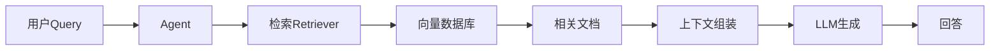

### 8.2 RAG实现

```java
@Configuration
public class RagConfig {

    @Bean
    public VectorStore vectorStore() {
        // 使用Pinecone向量数据库
        // return new PineconeVectorStore(...);

        // 或使用本地向量存储
        return new SimpleVectorStore();
    }

    @Bean
    public ChatClient ragChatClient(
            ChatModel chatModel,
            VectorStore vectorStore) {

        return ChatClient.builder(chatModel)
            .defaultAdvisors(
                // RAG检索Advisor
                new RetrievalAugmentedAdvisor(
                    vectorStore,
                    AdvisorUtils.defaultConverter()
                )
            )
            .build();
    }
}

// 使用
@Service
public class RagService {

    private final VectorStore vectorStore;
    private final ChatClient chatClient;

    public RagService(VectorStore vectorStore, ChatClient.Builder builder) {
        this.vectorStore = vectorStore;
        this.chatClient = builder.build();
    }

    // 索引文档
    public void indexDocument(String content) {
        vectorStore.add(List.of(new Document(content)));
    }

    // RAG查询
    public String query(String question) {
        return chatClient.prompt()
            .user(question)
            .call()
            .content();
    }
}
```

### 8.3 混合检索RAG

```java
@Service
public class HybridRagService {

    private final VectorStore vectorStore;
    private final ChatClient chatClient;

    public HybridRagService(
            VectorStore vectorStore,
            ChatClient.Builder builder) {
        this.vectorStore = vectorStore;
        this.chatClient = builder.build();
    }

    public String hybridQuery(String question) {
        // 1. 语义检索
        List<Document> semanticResults = vectorStore.similaritySearch(question);

        // 2. 关键词检索
        List<Document> keywordResults = keywordSearch(question);

        // 3. 融合结果（RRF算法）
        List<Document> fusedResults = reciprocalRankFusion(
            semanticResults,
            keywordResults
        );

        // 4. 组装上下文
        String context = fusedResults.stream()
            .map(Document::getContent)
            .collect(Collectors.joining("\n"));

        // 5. 生成回答
        return chatClient.prompt()
            .user("基于以下上下文回答:\n" + context + "\n\n问题:" + question)
            .call()
            .content();
    }
}
```

---

## 9. Agent安全与护栏 ★★★★

### 9.1 安全威胁类型

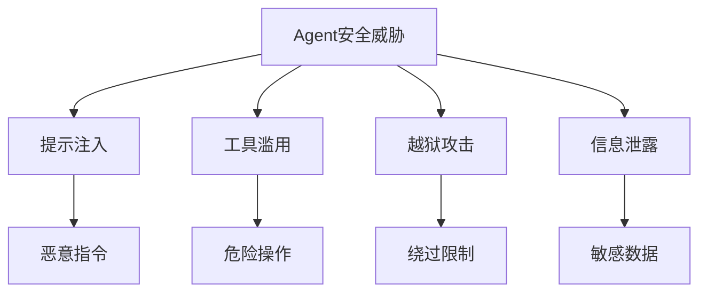

### 9.2 SafeGuardAdvisor

```java
@Configuration
public class SecurityConfig {

    @Bean
    public ChatClient secureChatClient(ChatModel chatModel) {
        return ChatClient.builder(chatModel)
            .defaultAdvisors(
                // 安全护栏
                SafeGuardAdvisor.builder()
                    .sensitiveWords(List.of(
                        "password",
                        "secret",
                        "api-key",
                        "token"
                    ))
                    .build(),

                // 内容审核
                ContentFilterAdvisor.builder()
                    .blockedPatterns(List.of("暴力", "犯罪"))
                    .build()
            )
            .build();
    }
}
```

### 9.3 自定义安全护栏

```java
@Component
public class CustomSecurityAdvisor implements CallAdvisor {

    private final List<String> blockedCommands = List.of(
        "rm -rf",
        "drop table",
        "delete from"
    );

    private final List<String> sensitivePatterns = List.of(
        "\\d{15,18}",  // 身份证号
        "\\d{3,4}-\\d{7,8}",  // 电话号码
        "[a-zA-Z0-9._%+-]+@[a-zA-Z0-9.-]+\\.[a-zA-Z]{2,}"  // 邮箱
    );

    @Override
    public ChatClientResponse adviseCall(
            ChatClientRequest request,
            CallAdvisorChain chain) {

        // 1. 检查用户输入
        String userInput = request.prompt().getUserMessage().getContent();
        validateInput(userInput);

        // 2. 执行请求
        ChatClientResponse response = chain.nextCall(request);

        // 3. 检查输出
        String output = response.getResult().getOutput().getText();
        validateOutput(output);

        return response;
    }

    private void validateInput(String input) {
        // 检查危险命令
        for (String cmd : blockedCommands) {
            if (input.contains(cmd)) {
                throw new SecurityException("禁止的命令: " + cmd);
            }
        }
    }

    private void validateOutput(String output) {
        // 检查敏感信息泄露
        for (String pattern : sensitivePatterns) {
            if (Pattern.matches(pattern, output)) {
                // 脱敏处理
                throw new SecurityException("检测到敏感信息");
            }
        }
    }
}
```

### 9.4 MCP安全机制

```java
// MCP OAuth认证（Spring AI MCP模块）
@Configuration
public class McpSecurityConfig {

    @Bean
    public TokenVerifier tokenVerifier() {
        return new CustomTokenVerifier();
    }

    public class CustomTokenVerifier implements TokenVerifier {
        @Override
        public AccessToken verify(String token) {
            // JWT验证逻辑
            try {
                Jwt jwt = JwtParser()
                    .verifyWith(secretKey)
                    .parse(token);

                return new AccessToken(
                    jwt.getSubject(),
                    List.of("read", "execute"),
                    jwt.getExpiration()
                );
            } catch (JwtException e) {
                return null;
            }
        }
    }
}
```

---

## 10. 高频面试题 ★★★~★★★★★

### Q1：什么是AI Agent？和传统LLM有什么区别？

**参考答案**：
- AI Agent是能够自主感知环境、做出决策并执行动作的智能系统
- 传统LLM是被动问答，单次交互无状态
- Agent具有**规划、记忆、工具调用、环境交互**四大核心能力
- Spring AI通过`ChatClient` + `@Tool` + `Advisor`实现Agent

### Q2：Spring AI如何实现Function Calling？

**参考答案**：
```java
// 方式一：@Tool注解
public class WeatherTools {
    @Tool(description = "获取天气")
    public String getWeather(@ToolParam(description = "城市") String city) {
        return "天气信息";
    }
}

// 使用
chatClient.prompt()
    .user("北京天气如何？")
    .tools(new WeatherTools())
    .call()
    .content();

// 方式二：FunctionToolCallback
ToolCallback callback = FunctionToolCallback.builder("getWeather", new WeatherService())
    .description("获取天气")
    .inputType(WeatherRequest.class)
    .build();
```

### Q3：ReAct模式的原理是什么？

**参考答案**：
- ReAct = Reasoning + Acting，推理与行动交替进行
- 格式：`Thought → Action → Observation → ... → Response`
- Spring AI中通过`ChatClient` + 工具自动实现ReAct循环
- 模型思考是否需要调用工具，调用后观察结果，继续推理直到完成

### Q4：Spring AI的Advisor是什么？执行顺序？

**参考答案**：
- Advisor是拦截器链，类似Spring AOP的切面
- 用于日志、记忆、安全、工具等功能扩展
- 执行顺序：按`getOrder()`值从小到大执行
- 请求阶段：Advisor1 → Advisor2 → ChatModel
- 响应阶段：ChatModel → Advisor2 → Advisor1

### Q5：Spring AI Alibaba的Multi-Agent有哪些？如何选型？

**参考答案**：
| Agent类型 | 说明 | 适用场景 |
|---------|------|---------|
| **SequentialAgent** | 顺序执行，上一个输出作为下一个输入 | 写作→审核→翻译 |
| **ParallelAgent** | 并行执行，结果合并 | 多角度分析 |
| **LlmRoutingAgent** | LLM自动路由 | 意图识别、分类处理 |
| **StateGraph** | 状态机自定义工作流 | 复杂业务流程 |

### Q6：如何保证Agent的可靠性？

**参考答案**：
1. **状态机控制**：使用StateGraph精确控制工作流
2. **错误处理**：工具调用失败时重试或回退
3. **验证机制**：执行前验证参数，执行后检查结果
4. **Human-in-the-loop**：关键决策需要人工确认
5. **监控告警**：使用`SimpleLoggerAdvisor`记录日志

### Q7：Spring AI如何实现对话记忆？

**参考答案**：
```java
// 配置ChatMemory
@Bean
public ChatMemory chatMemory() {
    return new InMemoryChatMemory();
}

@Bean
public ChatClient chatClient(ChatModel chatModel, ChatMemory chatMemory) {
    return ChatClient.builder(chatModel)
        .defaultAdvisors(
            MessageChatMemoryAdvisor.builder(chatMemory)
                .conversationId("user-123")
                .build()
        )
        .build();
}
```

### Q8：RAG和Agent如何结合？

**参考答案**：
- 使用`RetrievalAugmentedAdvisor`实现RAG
- Agent判断是否需要检索知识
- 从向量数据库检索相关文档
- 检索结果作为上下文组装到Prompt
- LLM生成回答

### Q9：如何设计企业级AI客服Agent？

**参考答案**：
1. **架构设计**：
   - `LlmRoutingAgent`：意图识别，路由到不同处理Agent
   - `SequentialAgent`：处理→审核→回复
   - `ParallelAgent`：并行处理多个相关问题

2. **核心能力**：
   - RAG：检索企业知识库
   - 工具调用：CRM、工单系统
   - 记忆：用户画像、会话历史

3. **安全保证**：
   - `SafeGuardAdvisor`：敏感词过滤
   - `ContentFilterAdvisor`：内容审核
   - 审计日志

### Q10：Spring AI Agent和LangChain如何选型？

**参考答案**：
| 对比 | Spring AI | LangChain |
|------|-----------|-----------|
| **语言** | Java首选 | Python首选 |
| **Spring集成** | 原生集成 | 需适配 |
| **生态** | Spring全家桶 | 独立生态 |
| **适用场景** | Java企业应用 | Python/数据科学 |

---

## 附录：Spring AI Agent知识点星级

| 难度 | 知识点 |
|------|--------|
| ★★★ | Agent基础概念、ChatClient基本使用 |
| ★★★★ | @Tool、FunctionCallback、Advisor机制、RAG结合 |
| ★★★★★ | ReAct原理、Multi-Agent设计、StateGraph工作流、企业级Agent架构 |

---

## 参考资料

- [Spring AI官方文档](https://spring.io/projects/spring-ai)
- [Spring AI API Reference](https://docs.spring.io/spring-ai/reference/api)
- [Spring AI Alibaba](https://github.com/alibaba/spring-ai-alibaba)
- [Spring AI Agent Utils](https://github.com/spring-ai-community/spring-ai-agent-utils)
- [MCP Python SDK](https://github.com/modelcontextprotocol/python-sdk)

---

> **笔记说明**：本笔记以Java/Spring AI为核心，涵盖AI Agent开发核心知识点。包括Spring AI框架、Function Calling实现、@Tool注解、Advisor机制、ReAct模式、Multi-Agent设计（Sequential/Parallel/Routing/StateGraph）、Memory管理、RAG结合、安全护栏等。建议Java开发者面试前深入理解。
