# JVM深入理解面试笔记

> 黑马程序员Java面试专题 + 小林coding面试题补充 | 难度星级：★~★★★★★ | 面试频率：高/中/低

---

## 目录

1. [JVM体系结构](#1-jvm体系结构)
2. [内存结构详解](#2-内存结构详解)
3. [堆内存详解](#3-堆内存详解)
4. [垃圾回收算法](#4-垃圾回收算法)
5. [垃圾收集器](#5-垃圾收集器)
6. [类加载机制](#6-类加载机制) | [6.6 SPI机制](#66-spi机制打破双亲委派的典型场景)
7. [运行时常量池](#7-运行时常量池)
8. [字节码执行](#8-字节码执行)
9. [调优参数与工具](#9-调优参数与工具)
10. [高频面试题](#10-高频面试题)

---

## 1. JVM体系结构

### 1.1 JVM整体架构 ★★★☆☆

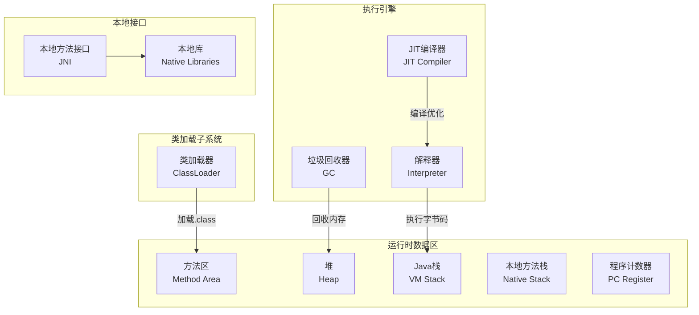

### 1.2 线程私有 vs 线程共享 ★★★☆☆

| 线程私有 | 线程共享 |
|----------|----------|
| 程序计数器 | 方法区 |
| 虚拟机栈 | 堆 |
| 本地方法栈 | |

---

## 2. 内存结构详解

### 2.1 栈帧结构 ★★★★☆

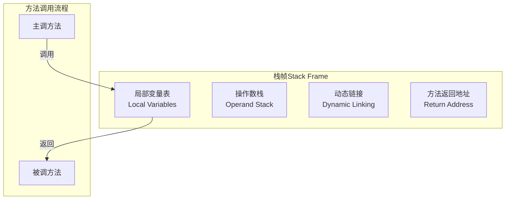

**栈帧组成**：

| 组成部分 | 作用 |
|----------|------|
| 局部变量表 | 存放方法参数和局部变量 |
| 操作数栈 | 存放操作数、计算中间结果 |
| 动态链接 | 指向运行时常量池的方法引用 |
| 方法返回地址 | return address |

### 2.2 常见异常 ★★★☆☆

| 区域 | 异常 | 原因 |
|------|------|------|
| 栈 | StackOverflowError | 递归过深 |
| 栈 | OutOfMemoryError | 线程过多 |
| 堆 | OutOfMemoryError | 对象创建过多 |
| 方法区 | OutOfMemoryError | 类信息过多 |

### 2.3 JVM内存模型详细介绍 ★★★★☆

> **面试官**：JVM的内存模型介绍一下
>
> **候选人**：根据 JDK 8 规范，JVM 运行时内存共分为以下几个部分：
>
> 1. **程序计数器**：可以看作是当前线程所执行的字节码的行号指示器，用于存储当前线程正在执行的 Java 方法的 JVM 指令地址。如果线程执行的是 Native 方法，计数器值为 null。是唯一一个在 Java 虚拟机规范中没有规定任何 OutOfMemoryError 情况的区域。
>
> 2. **Java 虚拟机栈**：每个线程都有自己独立的 Java 虚拟机栈，生命周期与线程相同。每个方法在执行时都会创建一个栈帧。
>
> 3. **本地方法栈**：与 Java 虚拟机栈类似，主要为虚拟机使用到的 Native 方法服务，在 HotSpot 虚拟机中和 Java 虚拟机栈合二为一。
>
> 4. **Java 堆**：是 JVM 中最大的一块内存区域，被所有线程共享。用于存放对象实例。从内存回收角度，堆被划分为新生代和老年代。
>
> 5. **方法区（元空间）**：在 JDK 1.8 及以后的版本中，方法区被元空间取代，使用本地内存。用于存储已被虚拟机加载的类信息、常量、静态变量等数据。
>
> 6. **运行时常量池**：是方法区的一部分，用于存放编译期生成的各种字面量和符号引用。

### 2.4 堆和栈的区别 ★★★★☆

> **面试官**：JVM内存模型里的堆和栈有什么区别？
>
> **候选人**：
> - **用途**：栈主要用于存储局部变量、方法调用的参数、方法返回地址；堆用于存储对象的实例
> - **生命周期**：栈中的数据当方法调用结束时随之消失；堆中的对象生命周期不确定，通过GC管理
> - **存取速度**：栈的存取速度比堆快；堆的存取速度相对较慢
> - **存储空间**：栈的空间相对较小，固定大小；堆的空间较大，动态扩展
> - **可见性**：栈中的数据对线程是私有的；堆中的数据对线程是共享的

### 2.5 堆分为哪几部分 ★★★★★（高频）

> **面试官**：堆分为哪几部分呢？
>
> **候选人**：Java堆主要分为以下几个部分：
>
> 1. **新生代（Young Generation）**：
>    - **Eden区**：大多数新创建的对象首先存放在这里
>    - **Survivor Spaces**：分为S0和S1两个区域，用于在每次Minor GC后存放存活对象
>
> 2. **老年代（Old Generation/Tenured Generation）**：存放过一次或多次Minor GC仍存活的对象
>
> 3. **元空间（Metaspace）**：从Java 8开始，替代了永久代，用于存储类的元数据信息
>
> 4. **大对象区（Humongous Objects）**：在G1垃圾收集器中，为大对象分配专门的区域

### 2.6 大对象分配 ★★★☆☆

> **面试官**：如果有个大对象一般是在哪个区域？
>
> **候选人**：大对象通常会直接分配到老年代。
>
> 原因：
> - 新生代空间相对较小，如果将大对象分配到新生代，可能会很快导致Minor GC频繁
> - 大对象需要连续的内存空间，老年代空间更大，更适合存储大对象
> - 减少因内存碎片导致的分配失败

---

## 3. 堆内存详解

### 3.1 堆内存结构 ★★★★★（高频）

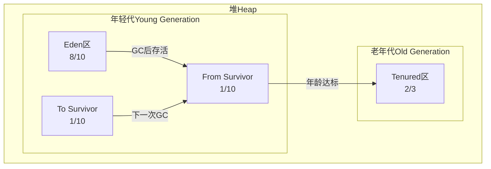

**默认比例**：Eden : Survivor = 8 : 1 : 1

### 3.2 对象分配与晋升 ★★★★☆

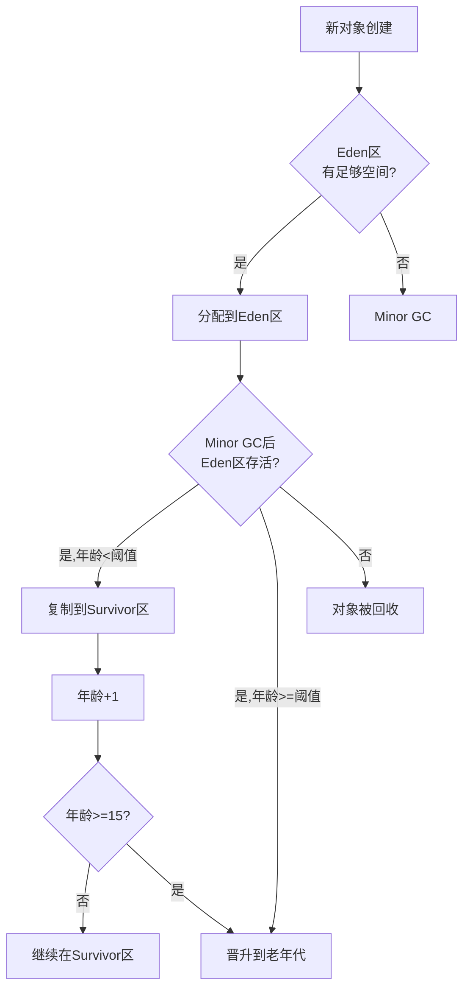

**对象年龄阈值**：默认15岁可晋升老年代

---

## 4. 垃圾回收算法

### 4.1 四种算法对比 ★★★★★（高频）

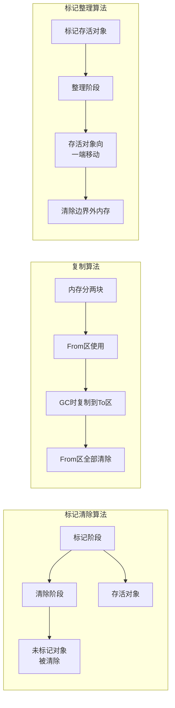

| 算法 | 优点 | 缺点 | 适用场景 |
|------|------|------|----------|
| 标记-清除 | 无内存碎片 | 效率低，产生碎片 | 老年代 |
| 复制 | 无碎片，高效 | 可用内存减半 | 新生代 |
| 标记-整理 | 无碎片，利用率高 | 移动对象开销 | 老年代 |
| 分代收集 | 综合最优 | 参数调优复杂 | 通用 |

> **面试官**：垃圾回收算法有哪些？
>
> **候选人**：主要有四种垃圾回收算法：
>
> 1. **标记-清除算法**：分为标记和清除两个阶段，先标记需要回收的对象，然后统一回收。缺点是效率低且会产生内存碎片
>
> 2. **复制算法**：将内存分成两块，每次只使用其中一块，GC时把存活对象复制到另一块，然后清空之前那块。优点是没有碎片，但浪费了一半内存。适合存活对象少的场景（如新生代）
>
> 3. **标记-整理算法**：标记后不是直接清除，而是将存活对象向一端移动，然后清理边界外的内存。解决了碎片问题，但移动对象有开销
>
> 4. **分代收集算法**：根据对象生存周期不同划分到不同区域，采用不同算法。新生代用复制算法，老年代用标记-整理算法

### 4.2 判断垃圾的方法 ★★★★★（高频）

> **面试官**：判断垃圾的方法有哪些？
>
> **候选人**：主要有两种判断垃圾的算法：
>
> 1. **引用计数法**：为每个对象分配一个引用计数器，每有一个地方引用它时计数器+1，引用失效时-1。当计数器为0时表示对象可回收。缺点是不能解决循环引用问题
>
> 2. **可达性分析算法（根可达算法）**：从GC Roots（如虚拟机栈中引用的对象、方法区中类静态属性引用的对象、本地方法栈中JNI引用的对象等）出发，向下追溯它们引用的对象。如果一个对象到GC Roots没有任何引用链相连，则标记为可回收对象。Java主要采用此算法

### 4.3 Minor GC vs Full GC ★★★☆☆

| 类型 | 触发条件 | 回收区域 | 停顿时间 |
|------|----------|----------|----------|
| Minor GC | Eden区满 | 新生代 | 短 |
| Major GC | 老年代满 | 老年代 | 较长 |
| Full GC | 多种条件 | 全堆+方法区 | 长 |

> **面试官**：MinorGC、MajorGC、FullGC的区别，什么场景触发Full GC？
>
> **候选人**：
> - **Minor GC**：只针对年轻代进行回收，包括Eden区和Survivor区。触发条件是Eden区空间不足
> - **Major GC**：主要针对老年代进行回收，频率较低
> - **Full GC**：对整个堆内存（包括年轻代、老年代和元空间）进行回收。触发条件包括：System.gc()调用、老年代空间不足、空间分配担保失败、元空间不足等

### 4.4 哪些是GC Roots ★★★★☆

| 类型 | 说明 |
|------|------|
| 虚拟机栈中引用的对象 | 栈帧本地变量表中的对象 |
| 类静态属性引用的对象 | 方法区中静态变量引用的对象 |
| 常量引用的对象 | 方法区中常量引用的对象 |
| 本地方法栈中JNI引用的对象 | Native方法引用的对象 |
| 活跃线程引用 | 已启动但未完成的线程 |

---

## 5. 垃圾收集器

### 5.1 收集器关系图 ★★★☆☆

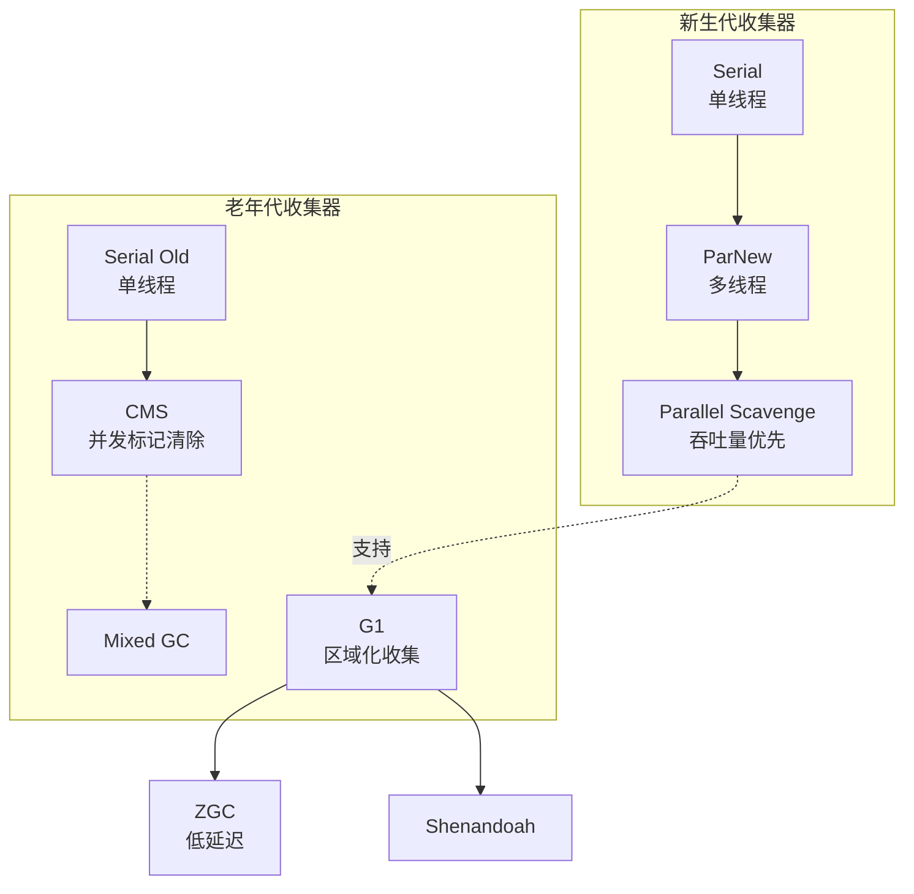

### 5.2 各收集器对比 ★★★★☆

| 收集器 | 算法 | 特点 | 适用场景 |
|--------|------|------|----------|
| Serial | 复制 | 单线程，简单高效 | 小内存，单核 |
| ParNew | 复制 | Serial多线程版 | 多核，新生代 |
| Parallel Scavenge | 复制 | 吞吐量优先 | 后台计算 |
| Serial Old | 标记-整理 | 单线程 | 小内存 |
| Parallel Old | 标记-整理 | 多线程，吞吐量 | 后台计算 |
| CMS | 标记-清除 | 低停顿，并发 | 低延迟需求 |
| G1 | 标记-整理 | 区域化，可预测停顿 | 大内存 |
| ZGC | 标记-整理 | 微秒级停顿 | 高并发低延迟 |

### 5.3 CMS收集器原理 ★★★★☆

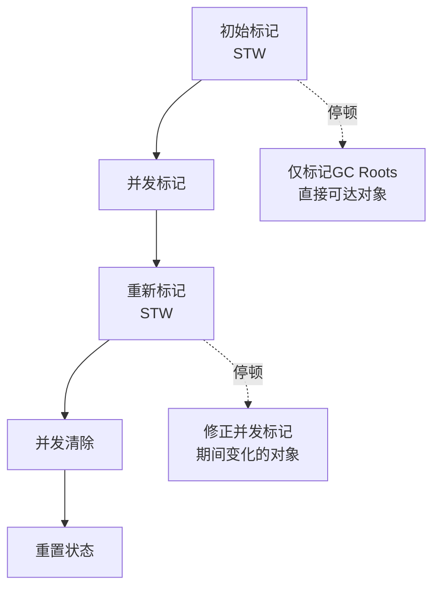

**CMS四阶段**：

| 阶段 | 特点 | STW |
|------|------|-----|
| 初始标记 | 标记GC Roots直接可达 | ✅ 短暂 |
| 并发标记 | 追踪引用链 | ❌ |
| 重新标记 | 修正并发标记期间变化 | ✅ 较短 |
| 并发清除 | 清理垃圾 | ❌ |

> **面试官**：CMS和G1的区别？
>
> **候选人**：
> 1. **使用范围不同**：CMS是老年代收集器，配合新生代Serial/ParNew使用；G1收集范围是整个堆
> 2. **STW时间**：CMS以最小停顿时间为目标；G1可建立可预测的停顿时间模型
> 3. **碎片问题**：CMS使用标记-清除算法会产生内存碎片；G1使用标记-整理，没有碎片
> 4. **浮动垃圾**：CMS会产生浮动垃圾，当浮动垃圾过多时会退化为Serial Old；G1没有浮动垃圾

### 5.4 G1收集器原理 ★★★★☆（高频）

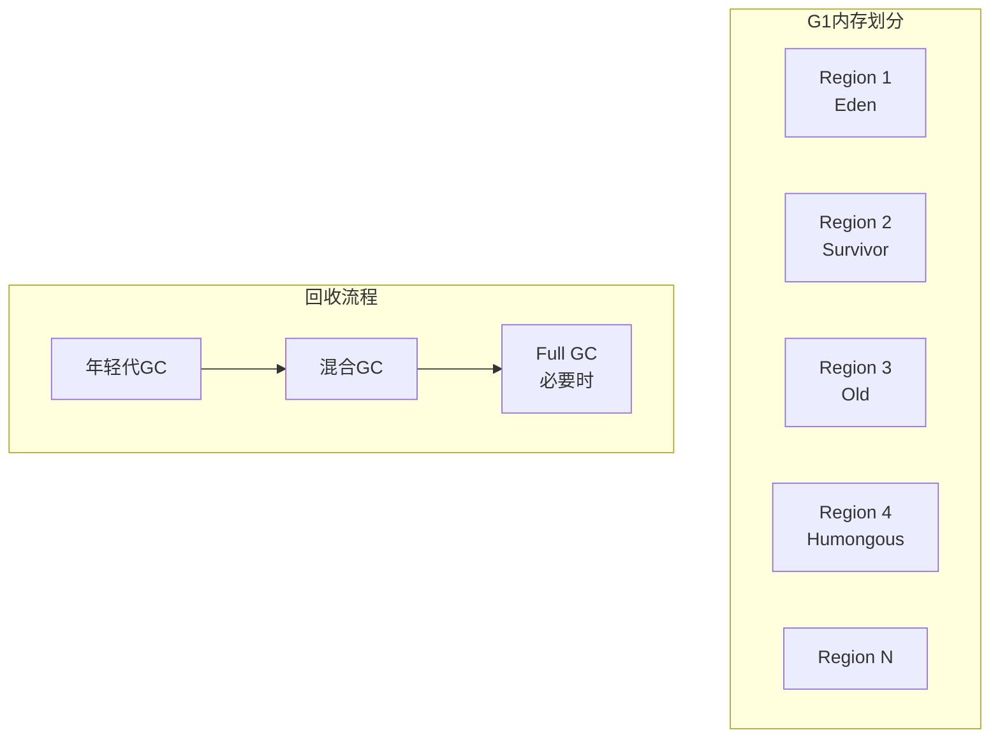

**G1特点**：
- 区域化内存布局，整个堆分成多个Region
- 可预测停顿时间，通过设置期望停顿时间
- 优先回收价值最大的Region（垃圾多、存活对象少）
- 采用标记-整理算法，无内存碎片

**G1回收过程**：
1. **年轻代GC**：Eden区满后进行STW清理，复制存活对象到Survivor区
2. **混合GC**：老年代占比达到阈值后，进行混合回收
3. **Full GC**：如果回收速度跟不上，产生Full GC

### 5.5 ZGC详解 ★★★☆☆（高频）

| 特性 | 说明 |
|------|------|
| 低停顿 | 停顿时间控制在微秒级（<1ms） |
| 并发执行 | 大部分GC操作与应用线程并发执行 |
| 不分代 | 不采用分代收集 |
| 着色指针 | 利用染色指针技术标记对象状态 |
| 读屏障 | 使用读屏障保证并发访问的正确性 |

> **ZGC核心思想**：通过着色指针和读屏障技术，在并发标记和并发移动对象时，保证应用线程访问到的对象总是有效的。

### 5.6 各种GC算法哪些阶段会STW ★★★★☆

> **面试官**：垃圾回收算法哪些阶段会stop the world?
>
> **候选人**：以G1为例，标记-复制算法可以分为三个阶段：标记阶段、转移阶段、重定位阶段，其中标记阶段和转移阶段是STW的。
>
> **G1停顿时间的瓶颈**主要是标记-复制中的**转移阶段**，因为需要复制对象并更新引用。
>
> CMS的STW主要发生在初始标记和重新标记阶段。

---

## 6. 类加载机制

### 6.1 类加载流程 ★★★★★（高频）

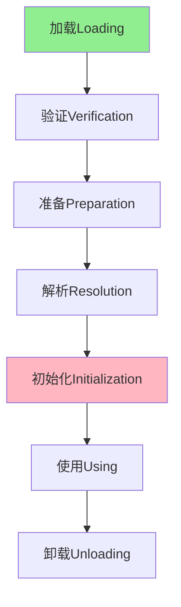

| 阶段 | 说明 |
|------|------|
| **加载** | 通过类的全限定名获取.class二进制字节流，映射为Class对象 |
| **验证** | 确保字节流符合JVM要求，不会危害虚拟机安全 |
| **准备** | 为静态变量分配内存并设置初始值（finalstatic除外） |
| **解析** | 将符号引用替换为直接引用 |
| **初始化** | 执行类构造器()方法，包括静态变量赋值和静态代码块 |
| **使用** | 类被使用，创建实例 |
| **卸载** | 类被GC卸载（条件苛刻） |

> **面试官**：讲一下类加载过程？
>
> **候选人**：类从被加载到虚拟机内存开始，到卸载出内存为止，整个生命周期包括：
>
> 1. **加载**：通过类的全限定名获取.class文件的二进制字节流，将静态存储结构转化为方法区运行时的数据结构，在内存中生成Class对象
>
> 2. **链接**：包括验证、准备、解析三个阶段
>    - 验证：确保class文件字节流符合要求
>    - 准备：为静态变量分配内存并设置初始值
>    - 解析：将符号引用替换为直接引用
>
> 3. **初始化**：执行类的构造器方法()，这是编译器自动生成的
>
> 4. **使用和卸载**：类被使用或卸载

### 6.2 双亲委派模型 ★★★★★（高频）

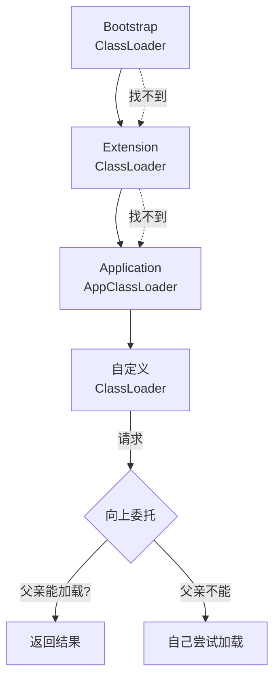

**类加载器优先级**（从高到低）：

| 加载器 | 加载路径 |
|--------|----------|
| Bootstrap | JAVA_HOME/jre/lib |
| Extension | JAVA_HOME/jre/lib/ext |
| Application | classpath指定 |

### 6.3 双亲委派模型的作用 ★★★★★（高频）

> **面试官**：Java中双亲委派是什么？有啥用？
>
> **候选人**：双亲委派是指「一个类加载器要加载类时，先让父加载器去尝试加载，只有父加载器加载不了，自己才会去加载」。
>
> **核心作用**：
> 1. **保证类的唯一性和安全性**：避免同一个类被不同加载器重复加载，确保核心类不会被篡改
> 2. **实现类的复用**：核心类只需要被顶层加载器加载一次，所有子加载器都能共享
>
> **举例**：如果我们自己写了一个`java.lang.String`类，AppClassLoader会委派给Extension ClassLoader，再委派给Bootstrap ClassLoader。Bootstrap ClassLoader发现已经加载过JDK的String类，就直接返回，不会加载我们自定义的String类。

### 6.4 类加载器有哪些 ★★★★☆

| 加载器 | 说明 |
|--------|------|
| Bootstrap ClassLoader | 加载JDK核心库，JVM底层C++实现 |
| Extension ClassLoader | 加载JDK扩展目录jre/lib/ext下的类 |
| Application ClassLoader | 加载classpath指定的类，我们自己写的类默认用它 |
| Custom ClassLoader | 自定义类加载器，可从网络、数据库等加载 |

### 6.5 为什么要自定义ClassLoader ★★☆☆☆

| 场景 | 说明 |
|------|------|
| 隔离加载 | 同一类库不同版本间隔离，如Tomcat |
| 修改加载方式 | 从网络、数据库加载字节码 |
| 加密加载 | 加载时解密，保护字节码 |
| 热部署 | 运行时重新加载类，如OSGI |

### 6.6 SPI机制：打破双亲委派的典型场景 ★★★★★

#### 6.6.1 什么是SPI？

**SPI（Service Provider Interface）** 是Java提供的一种**服务发现机制**，用于实现模块化和解耦。

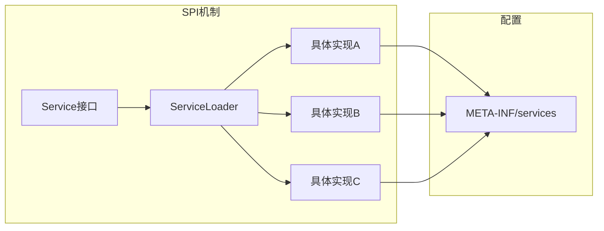

**SPI的核心思想**：接口由JDK/框架提供，实现由第三方厂商提供，运行时动态加载。

#### 6.6.2 为什么需要SPI？

| 问题 | 没有SPI | 使用SPI |
|------|--------|--------|
| **耦合** | 硬编码依赖 | 接口与实现解耦 |
| **扩展** | 修改源码 | 只需添加新实现 |
| **替换** | 重新编译 | 运行时切换 |
| **典型案例** | 写死数据库驱动 | 动态加载MySQL/PostgreSQL驱动 |

**常见SPI应用场景**：

| 场景 | 接口 | 实现 |
|------|------|------|
| 数据库驱动 | `java.sql.Driver` | MySQL、PostgreSQL、Oracle |
| 日志框架 | `SLF4J` | Logback、Log4j |
| 序列化 | `Serialization` | JSON、XML、Hessian |
| JSON处理 | `JsonProvider` | Jackson、Gson |
| 脚本引擎 | `ScriptEngine` | JavaScript、Python |

#### 6.6.3 JDBC SPI加载过程（经典案例）

```java
// JDK提供的接口 - 由BootstrapClassLoader加载
java.sql.Driver

// 第三方实现 - 由AppClassLoader加载
com.mysql.cj.jdbc.Driver
org.postgresql.Driver
```

**问题**：Driver接口由BootstrapClassLoader加载（因为在java.sql包下），但MySQL驱动是AppClassLoader加载的。子类加载器无法使用父加载器加载的类，这违反了双亲委派！

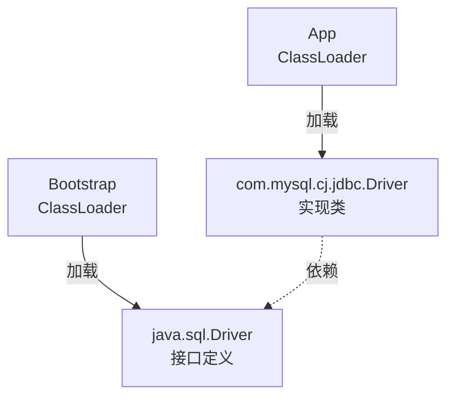

#### 6.6.4 SPI打破双亲委派的原理

**解决方案：线程上下文类加载器（Thread Context ClassLoader）**

```java
// 获取当前线程的上下文类加载器
ClassLoader cl = Thread.currentThread().getContextClassLoader();

// ServiceLoader使用上下文类加载器加载实现
ServiceLoader<Driver> loader = ServiceLoader.load(Driver.class, cl);
```

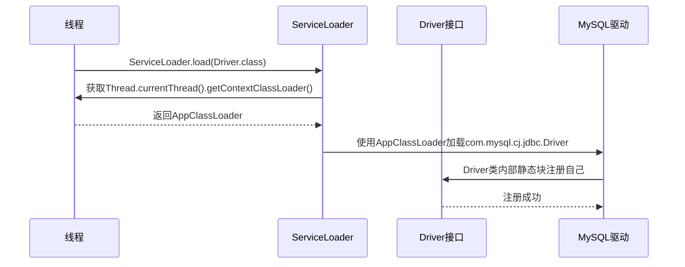

**关键代码**：
```java
// ServiceLoader.load()源码逻辑
public static <S> ServiceLoader<S> load(Class<S> service, ClassLoader loader) {
    // 如果loader为null，使用系统类加载器
    if (loader == null) {
        loader = ClassLoader.getSystemClassLoader();
    }
    // 创建ServiceLoader，loader用于加载实现类
    return new ServiceLoader<>(service, loader);
}

// 实现类必须在自己内部注册
// com.mysql.cj.jdbc.Driver
public class Driver implements java.sql.Driver {
    static {
        // 静态块中向DriverManager注册
        DriverManager.registerDriver(new Driver());
    }
}
```

#### 6.6.5 SPI实现示例

**1. 定义服务接口**（接口方）

```java
// com.example.CacheService 接口
package com.example;

public interface CacheService {
    void set(String key, String value);
    String get(String key);
    void delete(String key);
}
```

**2. 实现服务**（实现方）

```java
// com.example.impl.RedisCache
package com.example.impl;

public class RedisCache implements CacheService {
    @Override
    public void set(String key, String value) {
        // Redis实现
    }

    @Override
    public String get(String key) {
        // Redis实现
        return null;
    }

    @Override
    public void delete(String key) {
        // Redis实现
    }
}
```

**3. 配置SPI文件**（实现方）

```text
# META-INF/services/com.example.CacheService
# 文件内容：实现类的全限定名

com.example.impl.RedisCache
com.example.impl.MemcacheCache
```

**4. 加载服务**（使用方）

```java
public class CacheFactory {

    public static CacheService getCacheService() {
        // 使用SPI机制加载实现
        ServiceLoader<CacheService> loader =
            ServiceLoader.load(CacheService.class);

        // 获取第一个实现
        for (CacheService cache : loader) {
            return cache;  // 返回第一个找到的实现
        }

        throw new RuntimeException("未找到CacheService实现");
    }
}
```

#### 6.6.6 SPI与双亲委派的关系总结

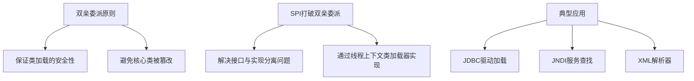

| 对比 | 双亲委派 | SPI |
|------|---------|-----|
| **目的** | 保证类加载安全性 | 实现模块化解耦 |
| **加载方向** | 父→子 | 子→父（逆向查找） |
| **实现机制** | ClassLoader父子关系 | Thread ContextClassLoader |
| **使用场景** | 通用类加载 | 服务发现/插件机制 |

#### 6.6.7 面试回答要点

> **面试官**：什么场景会打破双亲委派？

> **候选人**：主要有以下场景：

> **1. SPI机制**：这是最典型的场景。比如JDBC驱动加载，java.sql.Driver接口由BootstrapClassLoader加载，但MySQL驱动com.mysql.cj.jdbc.Driver由AppClassLoader加载。驱动需要向DriverManager注册，但DriverManager是由BootstrapClassLoader加载的，它无法直接使用AppClassLoader加载的驱动。所以引入了线程上下文类加载器，让AppClassLoader可以逆向委托给BootstrapClassLoader加载的接口。

> **2. 热部署/OSGI**：应用运行时动态替换类

> **3. Tomcat容器**：每个Web应用有自己的ClassLoader，隔离Web应用之间的类

> **核心解决思路**：通过`Thread.currentThread().getContextClassLoader()`获取当前线程的类加载器，这个类加载器默认是AppClassLoader，用它来加载SPI实现类，实现接口与实现的解耦。

---

## 7. 运行时常量池

### 7.1 三种常量池对比 ★★★☆☆

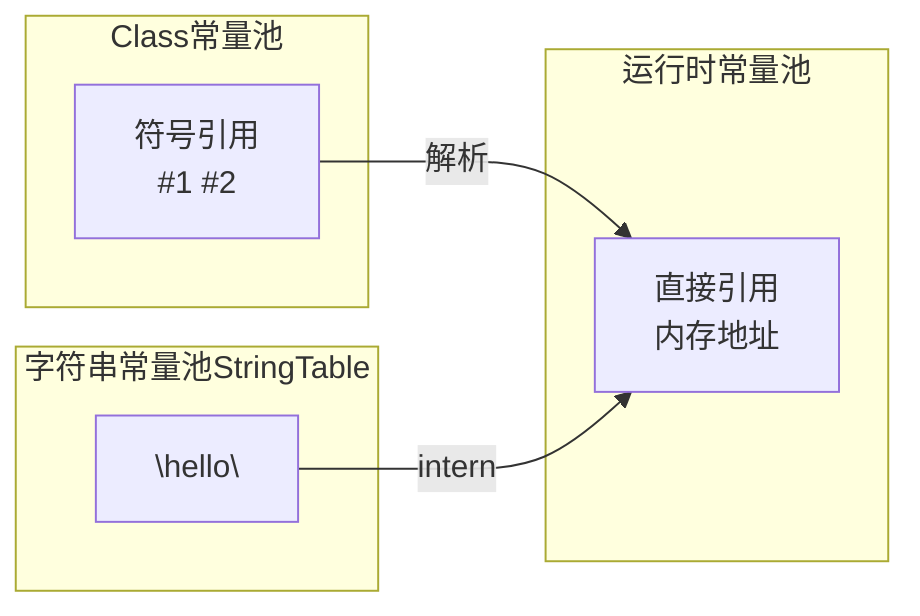

| 常量池 | 位置 | 内容 |
|--------|------|------|
| Class常量池 | Class文件 | 符号引用（类名、方法名等） |
| 运行时常量池 | 方法区 | 符号解析后的直接引用 |
| 字符串常量池 | 堆 | 字符串对象 |

### 7.2 String.intern() ★★★★☆

```java
// JDK6: 将字符串加入常量池，返回新对象地址
// JDK7+: 将字符串加入常量池，返回常量池引用

String s1 = new String("hello");
s1.intern();
String s2 = "hello";
s1 == s2;  // JDK6: false  JDK7+: true
```

> **面试官**：String s = new String("abc") 执行过程中分别对应哪些内存区域？
>
> **候选人**：
> - `new`指令创建的字符串对象是在**堆内存**上
> - `"abc"`是字符串常量，如果不存在，则在堆中创建字符串对象并加入字符串常量池
> - 所以如果abc不存在，会创建两个对象；存在则只创建一个对象

---

## 8. 字节码执行

### 8.1 解释执行 vs JIT编译 ★★★☆☆

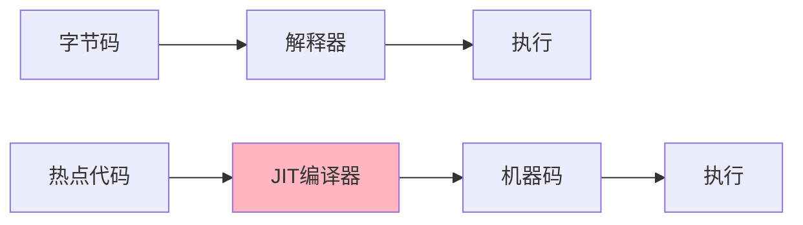

| 方式 | 优点 | 缺点 |
|------|------|------|
| 解释执行 | 启动快 | 运行慢 |
| JIT编译 | 运行快 | 编译耗时 |

### 8.2 热点代码检测 ★★★☆☆

| 概念 | 说明 |
|------|------|
| 热点代码 | 执行频率高的代码 |
| HotSpot VM | 使用基于采样的热点探测和基于计数器的热点探测 |
| 编译阈值 | 方法调用计数器 + 回边计数器 |

---

## 9. 调优参数与工具

### 9.1 常用调优参数 ★★★☆☆

| 参数 | 说明 | 示例 |
|------|------|------|
| -Xms | 堆初始大小 | -Xms256m |
| -Xmx | 堆最大大小 | -Xmx512m |
| -Xss | 栈大小 | -Xss1m |
| -Xmn | 年轻代大小 | -Xmn256m |
| -XX:NewRatio | 新老年代比例 | -XX:NewRatio=2 |
| -XX:MaxTenuringThreshold | 对象晋升年龄 | -XX:MaxTenuringThreshold=15 |
| -XX:+UseG1GC | 使用G1收集器 | -XX:+UseG1GC |
| -XX:+HeapDumpOnOutOfMemoryError | OOM时导出堆dump | -XX:+HeapDumpOnOutOfMemoryError |

### 9.2 问题排查工具 ★★★☆☆

| 工具 | 用途 | 命令 |
|------|------|------|
| jps | 查看Java进程 | jps -l |
| jstack | 查看线程堆栈 | jstack -l pid |
| jmap | 查看内存使用 | jmap -heap pid |
| jstat | 查看GC统计 | jstat -gcutil pid 1000 |
| jinfo | 查看JVM配置 | jinfo -flags pid |
| MAT | 内存分析工具 | 分析heapdump.hprof |

---

## 10. 高频面试题

### 10.1 内存与结构相关 ★★★★★

> **面试官**：JVM内存结构有哪几种内存溢出的情况？
>
> **候选人**：
> 1. **堆内存溢出**：java.lang.OutOfMemoryError: Java heap space，原因是创建大对象或内存泄露
> 2. **栈溢出**：StackOverflowError（递归过深）或OutOfMemoryError（栈扩展失败）
> 3. **元空间溢出**：java.lang.OutOfMemoryError: Metaspace，原因是类信息过多
> 4. **直接内存溢出**：java.lang.OutOfMemoryError: Direct buffer memory

---

> **面试官**：遇到过堆溢出的情况吗？如何解决？
>
> **候选人**：堆溢出通常发生在程序持续创建对象且无法被GC及时回收的场景。
>
> **解决步骤**：
> 1. 通过JVM参数`-XX:+HeapDumpOnOutOfMemoryError -XX:HeapDumpPath=./heapdump.hprof`捕获内存快照
> 2. 使用MAT或JProfiler分析快照，找到内存占用大的对象
> 3. 如果是内存泄漏：找到无用但未被回收的引用链，清理静态集合等
> 4. 如果是内存不足：调整堆大小`-Xms2g -Xmx4g`或优化代码

---

> **面试官**：遇到过栈溢出的情况吗？如何解决？
>
> **候选人**：栈溢出主要发生在递归调用没有正确终止条件时。
>
> **解决方式**：
> 1. 检查递归逻辑，添加正确的终止条件
> 2. 将递归改写为迭代（如用循环替代）
> 3. 通过`-Xss256k`增大栈内存（但会影响线程数量）
> 4. 优化方法栈帧，减少局部变量

### 10.2 垃圾回收相关 ★★★★★

> **面试官**：什么是Java里的垃圾回收？如何触发垃圾回收？
>
> **候选人**：垃圾回收（GC）是自动管理内存的机制，负责自动释放不再被引用的对象所占用的内存。
>
> **触发方式**：
> - 内存不足时自动触发
> - 调用System.gc()（只是建议，不保证立即执行）
> - JVM参数调整GC行为
> - 达到垃圾收集器内部阈值

---

> **面试官**：垃圾回收器CMS和G1的区别？
>
> **候选人**：
> 1. **使用范围**：CMS是老年代收集器；G1是整堆收集器
> 2. **停顿时间**：CMS追求最短停顿；G1可建立可预测停顿模型
> 3. **内存碎片**：CMS用标记-清除有碎片；G1用标记-整理无碎片
> 4. **浮动垃圾**：CMS会产生浮动垃圾；G1不会

---

> **面试官**：什么情况下使用CMS，什么情况使用G1?
>
> **候选人**：
> - **CMS适用场景**：对停顿时间要求敏感、老年代收集、可以接受一定内存碎片
> - **G1适用场景**：大堆内存（6GB以上）、需要可预测停顿时间、追求整体吞吐量

### 10.3 类加载相关 ★★★★★

> **面试官**：讲一下类的加载和双亲委派原则
>
> **候选人**：
> **类加载过程**：加载→链接→初始化
> - 加载：将字节码读取到JVM
> - 链接：验证（安全检查）+ 准备（分配内存+初始值）+ 解析（符号引用转直接引用）
> - 初始化：执行静态代码块和静态变量赋值
>
> **双亲委派原则**：类加载器收到加载请求时，先委派给父加载器处理，只有父加载器无法完成时，自己才尝试加载。
>
> **好处**：保证类唯一性和安全性，比如自己写的String类不会被加载，因为会被委派给Bootstrap ClassLoader加载JDK的String

### 10.4 内存泄漏与溢出 ★★★★☆

> **面试官**：内存泄漏和内存溢出的理解？
>
> **候选人**：
> - **内存泄漏**：对象不再使用但仍被引用，导致GC无法回收，持续占用内存
> - **内存溢出**：JVM无法申请到足够内存，抛出OutOfMemoryError
>
> **常见内存泄漏原因**：
> - 静态集合未清理
> - 未关闭的资源（IO、连接）
> - ThreadLocal未remove

---

> **面试官**：弱引用了解吗？举例说明在哪里可以用？
>
> **候选人**：Java中的弱引用有四种类型：
> - **强引用**：A a = new A()，永远不会GC
> - **软引用**：SoftReference，内存不足时GC
> - **弱引用**：WeakReference，下次GC一定回收
> - **虚引用**：PhantomReference，必须配合ReferenceQueue，GC时收到通知
>
> **使用场景**：WeakHashMap、ThreadLocal的Entry使用弱引用、缓存系统

### 10.5 对象创建过程 ★★★★☆

> **面试官**：创建对象的过程？
>
> **候选人**：对象创建过程：
> 1. **类加载检查**：检查常量池是否有类的符号引用，未加载则先加载
> 2. **分配内存**：确定大小，分配内存（指针碰撞或空闲列表）
> 3. **初始化零值**：保证字段可以不赋初值就使用
> 4. **设置对象头**：哈希码、GC分代年龄、锁状态等
> 5. **执行init**：执行构造方法，真正初始化对象

---

## 附录：面试高频问题速查

| 优先级 | 问题 | 答案要点 |
|--------|------|----------|
| ★★★★★ | JVM内存结构 | 堆、栈、方法区、程序计数器、本地方法栈 |
| ★★★★★ | 对象分配流程 | Eden→Survivor→老年代 |
| ★★★★★ | 垃圾回收算法 | 标记清除、复制、标记整理 |
| ★★★★★ | 双亲委派模型 | 向上委托、向下查找，保证安全 |
| ★★★★★ | CMS/G1收集器 | 四阶段/区域化/可预测停顿 |
| ★★★★★ | 堆溢出排查 | 捕获dump→MAT分析→定位问题 |
| ★★★★☆ | Minor GC vs Full GC | 新生代满/老年代满/各种触发条件 |
| ★★★★☆ | String.intern() | JDK6/7/8行为差异 |
| ★★★★☆ | 类加载过程 | 加载→验证→准备→解析→初始化 |
| ★★★☆☆ | 解释执行vs JIT | 热点代码编译 |
| ★★★☆☆ | 四种引用类型 | 强软弱虚及使用场景 |

---

> **笔记说明**：本笔记根据黑马程序员JVM面试课程和小林coding面试题整理，涵盖JVM核心面试知识点。使用mermaid图解便于理解，建议面试前快速回顾。
