# Java基础核心面试笔记

> 黑马程序员Java面试专题 | 难度星级：★~★★★★★ | 面试频率：高/中/低

---

## 目录

1. [面向对象基础](#1-面向对象基础)
2. [Java数据类型与运算](#2-java数据类型与运算)
3. [关键字详解](#3-关键字详解)
4. [异常体系](#4-异常体系)
5. [泛型详解](#5-泛型详解)
6. [String源码分析](#6-string源码分析)
7. [代码块执行顺序](#7-代码块执行顺序)
8. [深拷贝与浅拷贝](#8-深拷贝与浅拷贝)

---

## 1. 面向对象基础

### 1.1 封装、继承、多态 ★★★★★（高频）

**封装**：把属性私有化，提供公共访问方法

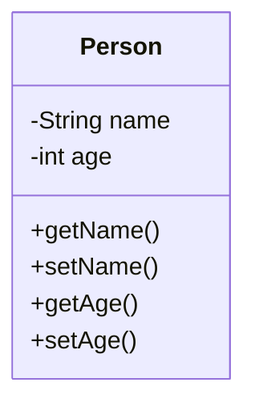

**继承**：子类继承父类成员

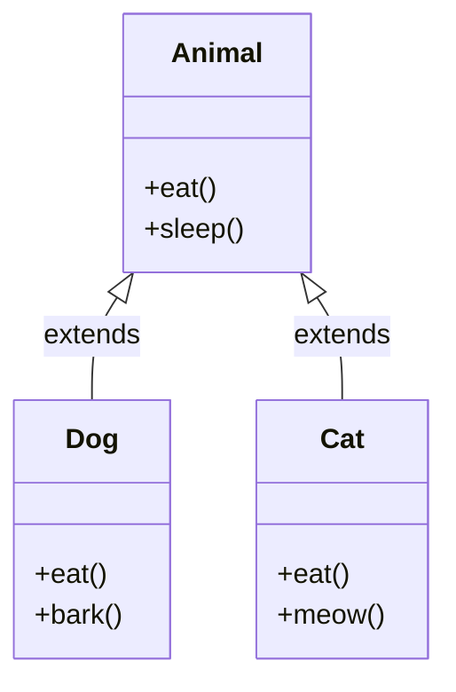

**多态**：同一引用调用同一方法，表现不同行为

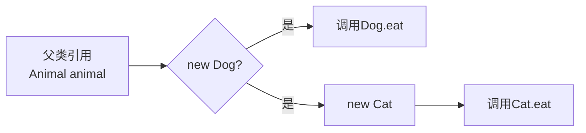

**多态的三个条件**：
1. 继承关系
2. 方法重写
3. 父类引用指向子类对象

### 1.2 多态的成员访问规律 ★★★★★（高频）

| 成员类型 | 编译时类型 | 运行时类型 | 说明 |
|---------|-----------|-----------|------|
| 成员变量 | 看左边 | 看左边 | 无多态性 |
| 成员方法 | 看左边 | 看右边 | 有多态性（虚方法表） |
| 静态方法 | 看左边 | 看左边 | 无多态性 |

### 1.3 向上转型与向下转型 ★★★☆☆

```mermaid
flowchart TD
    A[父类类型 Father] -->|向上转型 自动| B[子类类型 Son]
    B -->|向下转型 强制| A

    F[Father f = new Son()] -->|安全| OK[✅ 编译运行都通过]
    S[Father f2 = new Father()] -->|向下转型| CRASH[❌ ClassCastException]
```

---

## 2. Java数据类型与运算

### 2.1 基本类型与引用类型 ★★★☆☆

| 类型 | 存储位置 | 大小 | 默认值 |
|------|----------|------|--------|
| byte | 栈 | 1字节 | 0 |
| short | 栈 | 2字节 | 0 |
| int | 栈 | 4字节 | 0 |
| long | 栈 | 8字节 | 0L |
| float | 栈 | 4字节 | 0.0f |
| double | 栈 | 8字节 | 0.0d |
| char | 栈 | 2字节 | '\u0000' |
| boolean | 栈 | 1字节 | false |

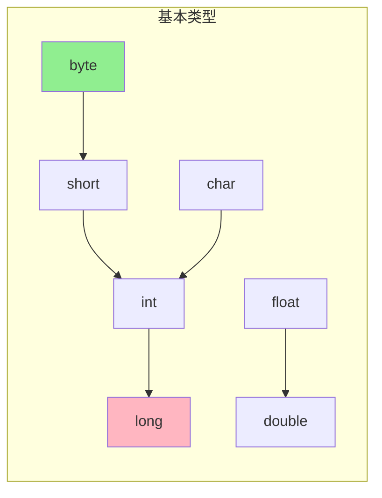

**自动类型提升规则**：
1. 小类型向大类型提升（byte→int→long→float→double）
2. byte、short、char参与运算自动提升为int
3. 多种类型混合运算，结果为最大操作数类型

### 2.2 装箱与拆箱 ★★★★☆

```java
// 自动装箱
Integer i = 10;  // Integer.valueOf(10)

// 自动拆箱
int num = i;  // i.intValue()

// Integer缓存：-128~127
Integer a = 127;
Integer b = 127;
a == b;  // true（缓存）

Integer c = 128;
Integer d = 128;
c == d;  // false（超出缓存）
```

---

## 3. 关键字详解

### 3.1 static关键字 ★★★★★（高频）

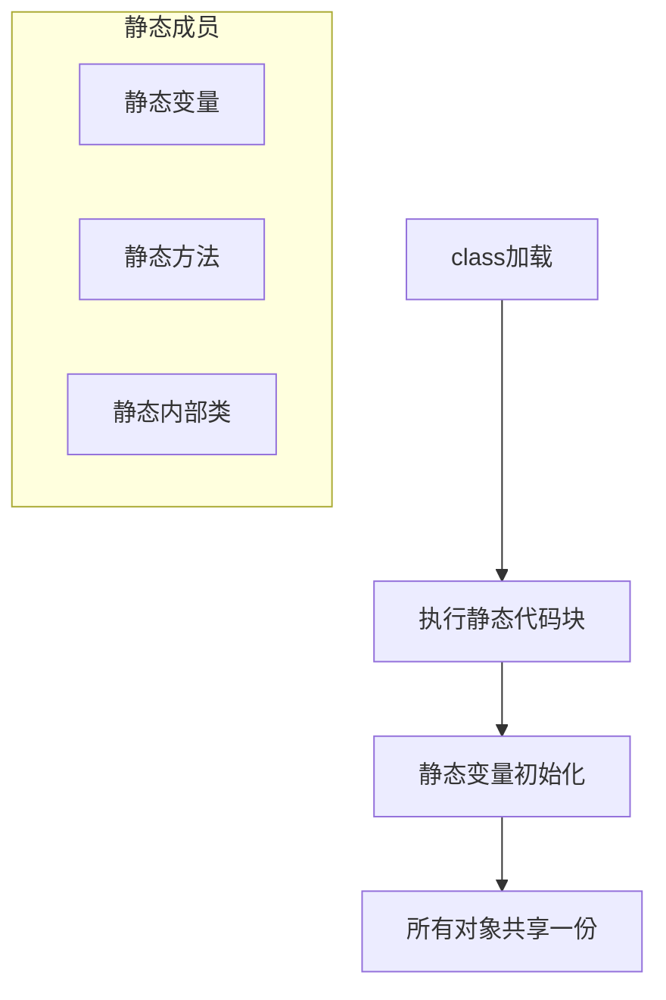

**特点**：
- 类加载时执行，只执行一次
- 被所有对象共享
- 不能访问实例成员（没有this）
- 不能重写（是隐藏）

### 3.2 final关键字 ★★★★★（高频）

| 修饰位置 | 作用 | 示例 |
|---------|------|------|
| 变量 | 常量，值不可变 | `final int NUM = 10;` |
| 方法 | 方法不能被重写 | `final void method() {}` |
| 类 | 类不能被继承 | `final class A {}` |
| 参数 | 参数值不能改变 | `void method(final int x) {}` |

**final变量初始化时机**：
1. 定义时直接赋值
2. 构造方法中赋值
3. 静态代码块中赋值

### 3.3 abstract关键字 ★★★★☆

| 对比项 | 抽象类 | 接口 |
|--------|--------|------|
| 实例化 | 不能 | 不能 |
| 抽象方法 | 可以有 | Java 8前必须有 |
| 具体方法 | 可以有 | Java 8后可以有default |
| 继承 | 单继承 | 多实现 |
| 构造方法 | 可以有 | 不能有 |

### 3.4 interface接口 ★★★★☆

```mermaid
classDiagram
    interface Flyable {
        <<interface>>
        +fly()
        +land()
    }

    interface Swimmable {
        <<interface>>
        +swim()
    }

    class Duck {
        +fly()
        +swim()
    }

    Flyable <|.. Duck : implements
    Swimmable <|.. Duck : implements
```

**Java 8新增**：
- default默认方法
- static静态方法

**Java 9新增**：
- private私有方法（辅助default）

### 3.5 super与this ★★★★☆

| 关键字 | 作用 | 位置要求 |
|--------|------|----------|
| this | 当前对象引用 | - |
| super | 父类对象引用 | - |
| this() | 调用本类构造方法 | 构造方法第一行 |
| super() | 调用父类构造方法 | 构造方法第一行 |

> **规则**：this()和super()不能同时出现，必须放在构造方法第一行。

### 3.6 volatile关键字 ★★★★★（高频）

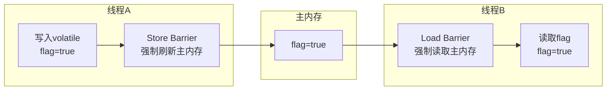

**作用**：保证可见性和有序性，不保证原子性。

### 3.7 synchronized关键字 ★★★★★（高频）

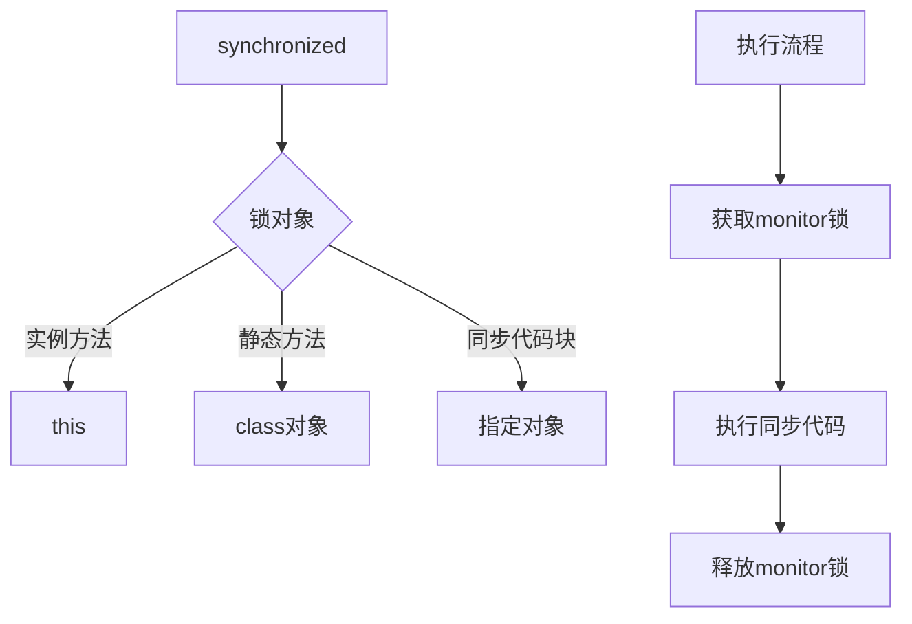

---

## 4. 异常体系

### 4.1 异常分类 ★★★☆☆

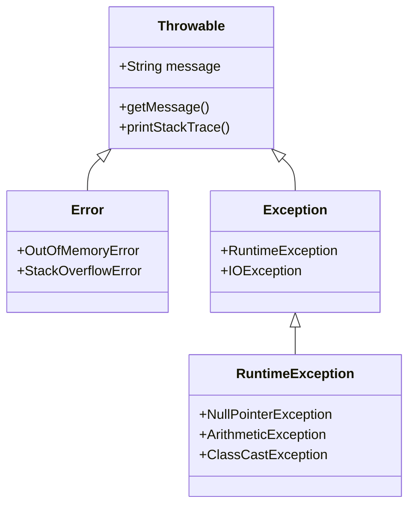

### 4.2 Checked vs Unchecked ★★★★☆

| 类型 | 别名 | 处理要求 | 示例 |
|------|------|----------|------|
| Checked | 编译时异常 | 必须捕获或声明 | IOException |
| Unchecked | 运行时异常 | 可选 | NullPointerException |

### 4.3 try-catch-finally执行顺序 ★★★★★（高频）

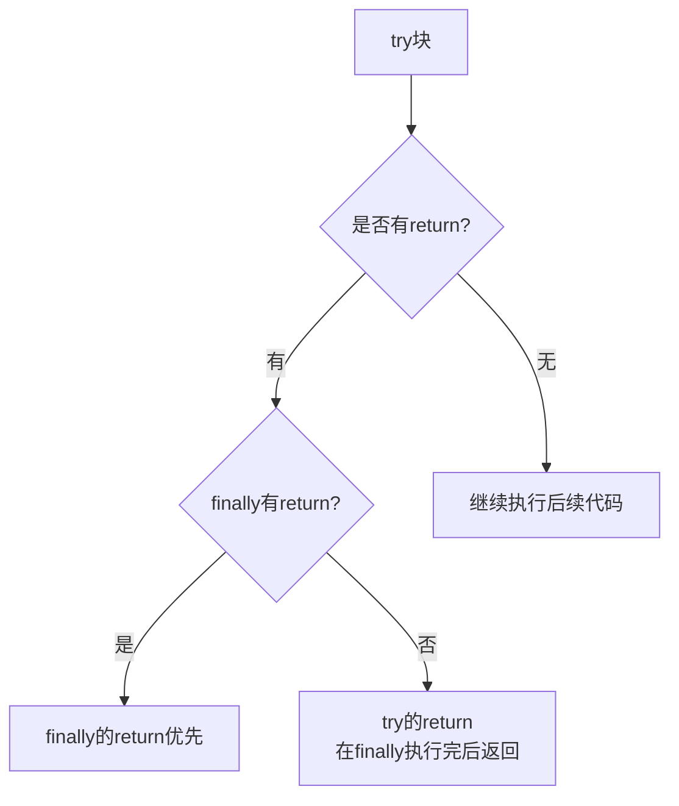

**finally不执行情况**：System.exit()终止JVM

---

## 5. 泛型详解

### 5.1 泛型擦除 ★★★★★（高频）

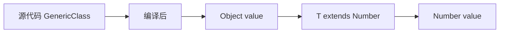

**规则**：
- 无上限 → 擦除为Object
- 有上限 → 擦除为上限类型

### 5.2 PECS原则 ★★★★☆

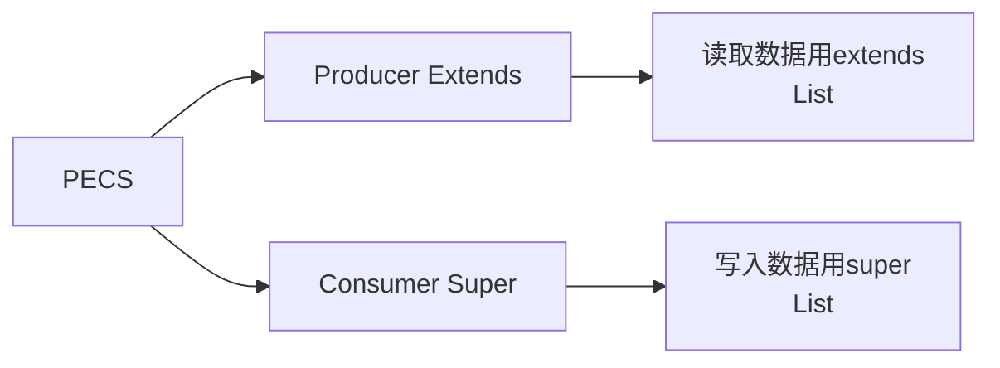

> **记忆口诀**：买外卖(Extends)→店家生产；卖废品(Super)→买家消费

### 5.3 泛型通配符对比

| 通配符 | 作用 | 特点 |
|--------|------|------|
| `<?>` | 无限定通配符 | 可接收任意类型 |
| `<? extends E>` | 上限通配符 | 用于读取（生产者） |
| `<? super E>` | 下限通配符 | 用于写入（消费者） |

---

## 6. String源码分析

### 6.1 String不可变性 ★★★★★（高频）

```java
public final class String {
    private final char[] value;  // 不可变数组
}
```

**不可变原因**：
1. 字符串常量池需要
2. 安全性（防止被篡改）
3. 线程安全
4. hashCode缓存
5. 类加载器依赖

### 6.2 String Pool ★★★★☆

```mermaid
flowchart LR
    subgraph 直接赋值
        A["String s1 = \"hello\""]
        B["String s2 = \"hello\""]
        A --> C[String Pool]
        B --> C
        A -->|相同对象| D[s1 == s2 true]
    end

    subgraph new创建
        E["String s3 = new String(\"hello\")"]
        E --> F[堆内存新对象]
        F --> G[s1 == s3 false]
    end
```

### 6.3 String拼接 ★★★☆☆

```java
// 编译优化：常量拼接直接合并
String s1 = "a" + "b" + "c";  // 编译后 = "abc"

// 变量拼接：使用StringBuilder
String a = "a", b = "b";
String c = a + b + "c";  // new StringBuilder().append(a).append(b).append("c").toString()
```

---

## 7. 代码块执行顺序

### 7.1 代码块分类 ★★★★☆

| 类型 | 语法 | 执行时机 |
|------|------|----------|
| 静态代码块 | `static { }` | 类加载时执行 |
| 构造代码块 | `{ }` | 创建对象时执行 |
| 构造方法 | `类名() {}` | 创建对象时执行 |

### 7.2 执行顺序 ★★★★★（高频）

```mermaid
flowchart TD
    A[new Son()] --> B[父类静态代码块]
    B --> C[子类静态代码块]
    C --> D[父类构造代码块]
    D --> E[父类构造方法]
    E --> F[子类构造代码块]
    F --> G[子类构造方法]
```

**示例输出**：
```
父类静态块
子类静态块
父类构造块
父类构造方法
子类构造块
子类构造方法
```

---

## 8. 深拷贝与浅拷贝

### 8.1 概念对比 ★★★☆☆

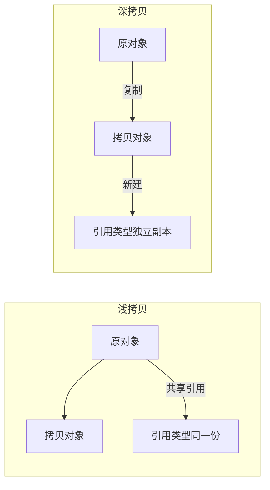

### 8.2 实现方式

```java
// 浅拷贝：Object.clone()
class Person implements Cloneable {
    int[] hobbies;  // 引用类型
    @Override
    protected Object clone() {
        return super.clone();  // 浅拷贝
    }
}

// 深拷贝：重写clone方法
class Person implements Cloneable {
    int[] hobbies;
    @Override
    protected Object clone() {
        Person p = (Person) super.clone();
        p.hobbies = this.hobbies.clone();  // 创建新数组
        return p;
    }
}
```

---

## 附录：面试高频问题速查

| 优先级 | 问题 | 答案要点 |
|--------|------|----------|
| ★★★★★ | 多态成员访问规律 | 编译看左，运行看右（方法） |
| ★★★★★ | static特点 | 类加载执行，所有对象共享 |
| ★★★★★ | final特点 | 不可改变，必须初始化 |
| ★★★★★ | 代码块执行顺序 | 父类静态→子类静态→父类构造→子类构造 |
| ★★★★★ | String不可变原因 | 字符串常量池、安全、线程安全、hashCode缓存 |
| ★★★★☆ | this()和super()规则 | 必须第一行，不能同时出现 |
| ★★★★☆ | 泛型擦除 | 无上限Object，有上限为上限类型 |
| ★★★★☆ | PECS原则 | 生产用extends，消费用super |
| ★★★☆☆ | 深拷贝vs浅拷贝 | 是否创建新引用对象 |

---

> **笔记说明**：本笔记根据黑马程序员Java面试课程整理，涵盖Java基础核心面试知识点。使用mermaid图解便于理解，建议面试前快速回顾。
