# Java并发编程核心面试笔记

> 黑马程序员Java面试专题 + 小林coding面试题补充 | 难度星级：★~★★★★★ | 面试频率：高/中/低

---

## 目录

1. [线程基础](#1-线程基础)
2. [synchronized与Lock](#2-synchronized与lock)
3. [JMM内存模型](#3-jmm内存模型)
4. [volatile与CAS](#4-volatile与cas)
5. [AQS抽象队列同步器](#5-aqs抽象队列同步器)
6. [ReentrantLock可重入锁](#6-reentrantlock可重入锁)
7. [JUC并发工具类](#7-juc并发工具类)
8. [线程池原理](#8-线程池原理)
9. [并发容器](#9-并发容器)
10. [生产消费与线程安全](#10-生产消费与线程安全)
11. [死锁与排查](#11-死锁与排查)
12. [高频面试题](#12-高频面试题)

---

## 1. 线程基础

### 1.1 进程与线程的区别 ★☆☆☆☆

| 对比项 | 进程 | 线程 |
|--------|------|------|
| 定义 | 程序运行实例 | 任务调度最小单位 |
| 资源占用 | 独立地址空间 | 共享进程资源 |
| 切换开销 | 大（需切换页表、内核栈） | 小（仅切换寄存器和栈） |
| 通信 | 需IPC机制 | 直接读写共享内存 |
| 独立性 | 独立 | 依赖进程 |

> **面试话术**：进程是资源分配的基本单位，线程是CPU调度的基本单位。线程共享进程的堆和方法区，但有独立的程序计数器、虚拟机栈和本地方法栈。

### 1.2 并行与并发的区别 ★★☆☆☆

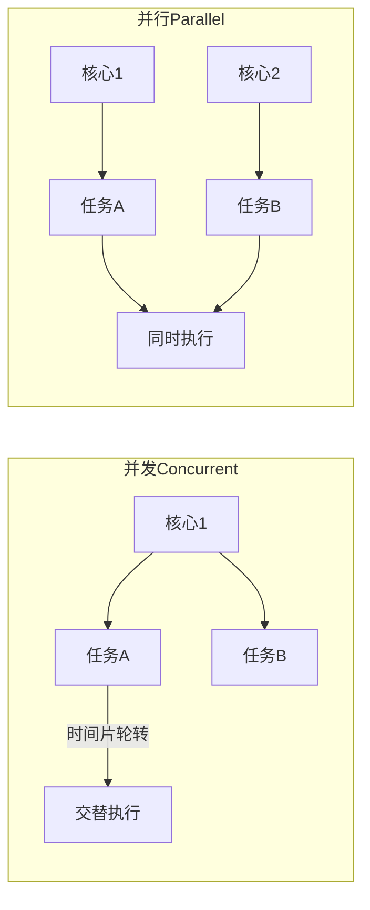

- **并发**：同一时间段内多个任务交替执行（CPU切换）
- **并行**：同一时刻多个任务真正同时执行（多核）

### 1.3 线程的创建方式 ★★★★★（高频）

| 方式 | 实现 | 特点 |
|------|------|------|
| 继承Thread | extends Thread重写run() | 单继承局限性 |
| 实现Runnable | implements Runnable | 无返回值 |
| 实现Callable | implements Callable | 有返回值，可抛异常 |
| 线程池 | ExecutorService | 复用线程，资源管理 |

```java
// 方式1：继承Thread
class MyThread extends Thread {
    @Override
    public void run() {
        System.out.println("继承Thread");
    }
}

// 方式2：实现Runnable
class MyRunnable implements Runnable {
    @Override
    public void run() {
        System.out.println("实现Runnable");
    }
}

// 方式3：实现Callable（有返回值）
class MyCallable implements Callable<Integer> {
    @Override
    public Integer call() throws Exception {
        return 123;
    }
}

// 方式4：线程池
ExecutorService pool = Executors.newFixedThreadPool(10);
pool.execute(new RunnableTask());
Future<Integer> future = pool.submit(new MyCallable());
```

### 1.4 线程状态转换 ★★★★★（高频）

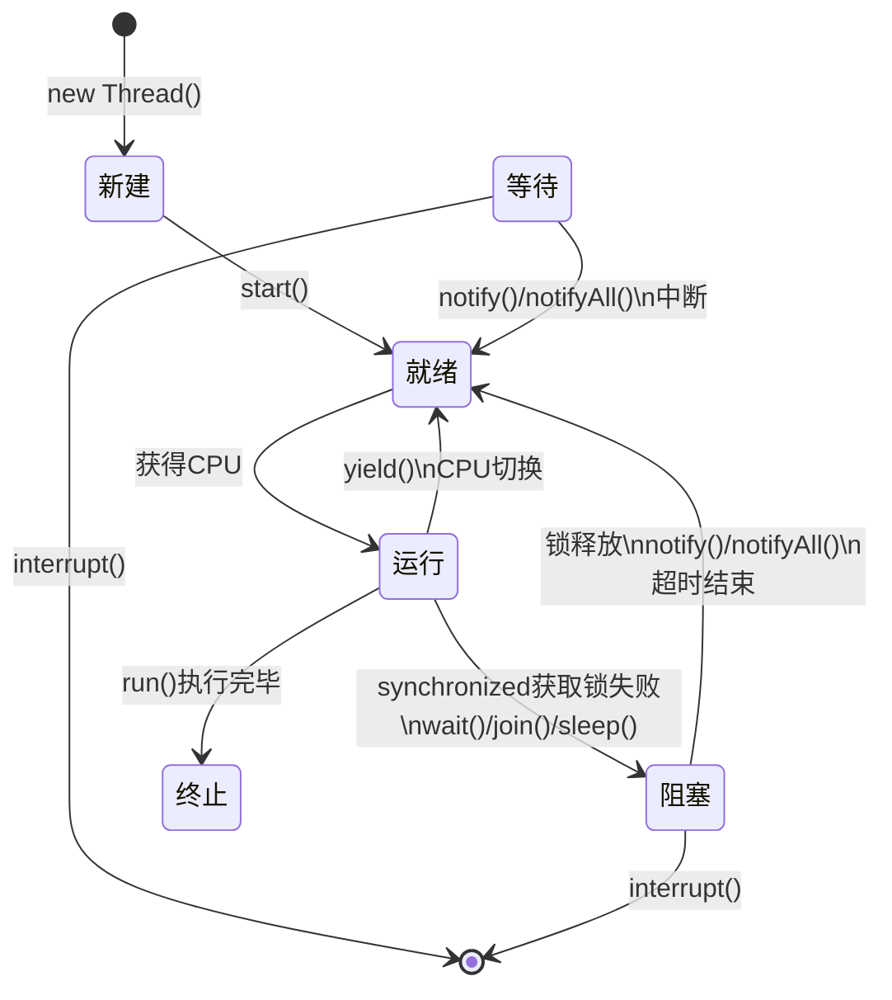

| 状态 | 说明 | 触发条件 |
|------|------|----------|
| NEW | 创建未启动 | new Thread() |
| RUNNABLE | 运行或等待CPU | start() |
| BLOCKED | 阻塞等待锁 | synchronized |
| WAITING | 无限等待 | wait()/join()/LockSupport.park() |
| TIMED_WAITING | 限时等待 | sleep(n)/wait(n)/join(n)/parkNanos() |
| TERMINATED | 结束 | run()正常/异常结束 |

### 1.5 wait() vs sleep() vs yield() ★★★☆☆

| 方法 | 来源 | 锁释放 | 状态 | 响应中断 |
|------|------|--------|------|----------|
| wait() | Object | ✅ | WAITING | ✅ |
| sleep() | Thread | ❌ | TIMED_WAITING | ✅ |
| yield() | Thread | ❌ | RUNNABLE | ❌ |

> **面试话术**：
> - `sleep()`是Thread类的静态方法，让当前线程睡眠指定时间，不释放锁
> - `wait()`是Object类的方法，会释放锁，需要通过notify/notifyAll唤醒
> - `yield()`是Thread类的静态方法，让出CPU时间片，回到就绪状态

### 1.6 notify() vs notifyAll() ★★★☆☆

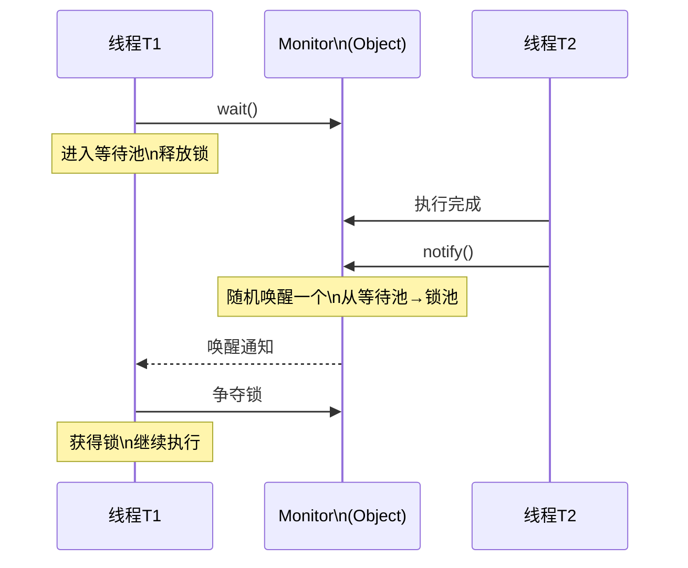

- `notify()`：随机唤醒一个等待线程
- `notifyAll()`：唤醒所有等待线程，竞争锁

> **面试官**：notify选择哪个线程？
>
> **候选人**：notify在源码的注释中说到notify选择唤醒的线程是任意的，但是依赖于具体实现的JVM。JVM有很多实现，比较流行的就是HotSpot，HotSpot对notify()的实现并不是随机唤醒，而是"先进先出"的顺序唤醒。

### 1.7 线程间通信方式 ★★★★☆

| 方式 | 说明 | 适用场景 |
|------|------|----------|
| 共享变量 | volatile/synchronized保证可见性 | 简单标志位 |
| Object wait/notify | 基于对象监视器 | 简单等待/通知 |
| Lock + Condition | 更灵活的等待/通知 | 多个条件变量 |
| BlockingQueue | 生产者-消费者模式 | 队列缓冲 |
| PipedInputStream | 管道通信 | 线程间字节流 |

---

## 2. synchronized与Lock

### 2.1 synchronized底层原理 ★★★★★（高频）

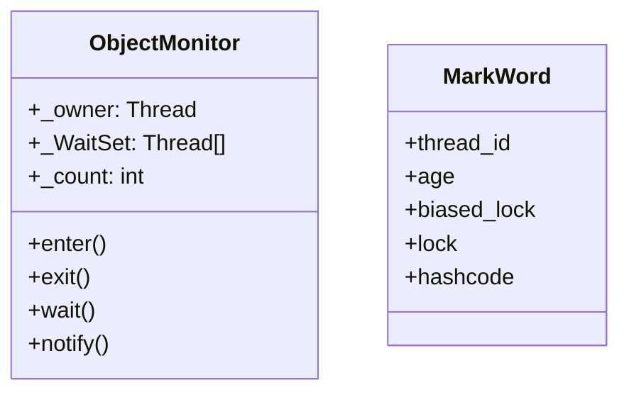

**对象头结构**：

| 存储内容 | 状态 |
|----------|------|
| 对象hashCode + 分代年龄 + 偏向锁标志 + 锁标志位(01) | 无锁 |
| 线程ID + Epoch + 分代年龄 + 偏向锁标志 + 锁标志位(01) | 偏向锁 |
| 指向栈中锁记录的指针 + 锁标志位(00) | 轻量级锁 |
| 指向互斥量(重量级锁)的指针 + 锁标志位(10) | 重量级锁 |

**monitorenter流程**：

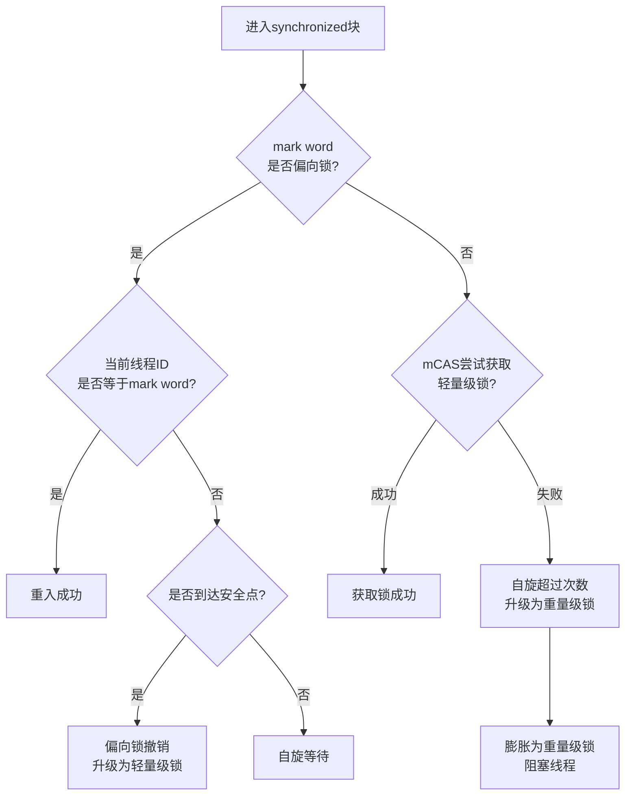

### 2.2 锁的四种状态 ★★★★★（高频）

| 状态 | 标志 | 场景 | 性能 |
|------|------|------|------|
| 无锁 | 001 | 无竞争 | 最优 |
| 偏向锁 | 101 | 单线程重入 | 最优 |
| 轻量级锁 | 00 | 多线程轻度竞争（自旋） | 较优 |
| 重量级锁 | 10 | 多线程竞争激烈 | 最差 |

> **面试话术**：JVM为了减少锁竞争带来的性能开销，设计了锁升级机制。偏向锁在无竞争情况下消除同步开销；轻量级锁采用CAS自旋避免线程阻塞；重量级锁让抢锁失败的线程阻塞。

### 2.3 synchronized锁升级过程 ★★★★★（高频）

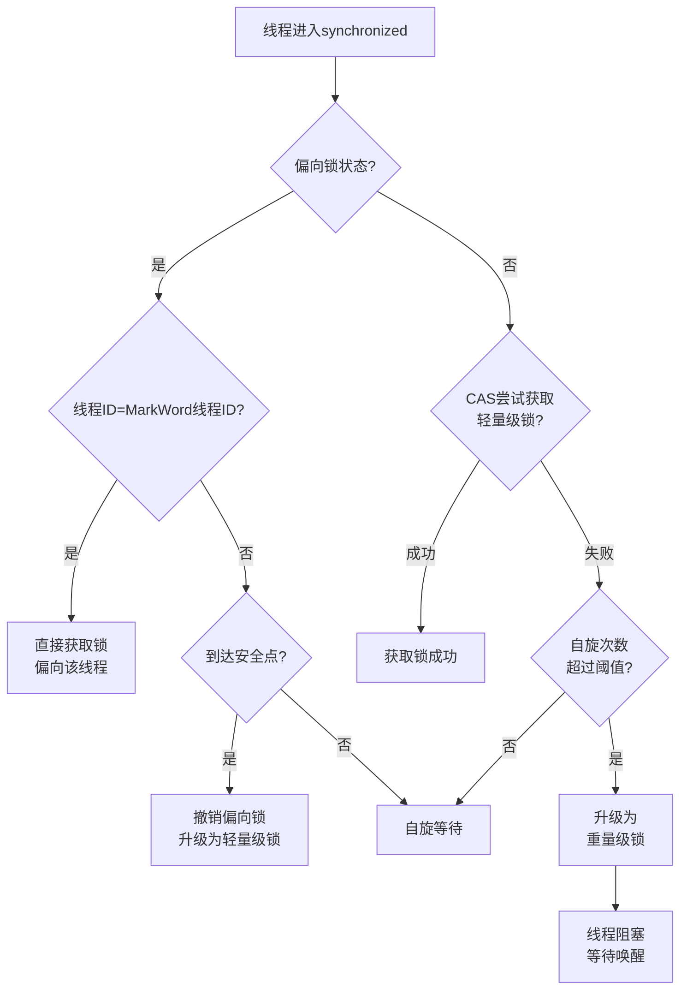

**具体过程**：
1. **无锁→偏向锁**：当一个线程首次进入synchronized块时，如果偏向锁启用，JVM会将Mark Word中的线程ID设为当前线程ID
2. **偏向锁→轻量级锁**：当有其他线程尝试获取锁时，偏向锁升级。多个线程通过CAS竞争锁
3. **轻量级锁→重量级锁**：自旋超过10次或自旋线程过多时，轻量级锁膨胀为重量级锁，未获取锁的线程被阻塞

### 2.4 JVM对synchronized的优化 ★★★★☆

| 优化 | 说明 |
|------|------|
| 锁膨胀 | 无锁→偏向锁→轻量级锁→重量级锁的升级过程 |
| 锁消除 | 检测到某段代码无共享竞争可能，消除同步锁 |
| 锁粗化 | 多个连续加锁扩展为一个范围更大的锁 |
| 自适应自旋锁 | 根据上次自旋成功率动态调整自旋次数 |

### 2.5 synchronized vs ReentrantLock ★★★★★（高频）

| 对比项 | synchronized | ReentrantLock |
|--------|--------------|---------------|
| 锁类型 | 关键字 | API |
| 锁粒度 | 粗粒度 | 细粒度（可指定范围） |
| 公平锁 | 不支持 | 支持 |
| 锁获取 | 阻塞式 | 非阻塞（tryLock） |
| 条件变量 | 无 | 多个Condition |
| 可重入 | 支持 | 支持 |
| 中断响应 | 不可中断 | 可中断 |
| 底层实现 | Monitor | AQS |

```java
// synchronized示例
synchronized (obj) {
    // 临界区
}

// ReentrantLock示例
ReentrantLock lock = new ReentrantLock(true); // true为公平锁
lock.lock();
try {
    // 临界区
} finally {
    lock.unlock();
}
```

---

## 3. JMM内存模型

### 3.1 JMM八种内存交互操作 ★★★☆☆

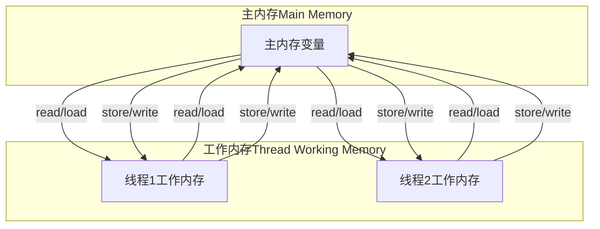

| 操作 | 说明 | 作用 |
|------|------|------|
| lock | 作用于主内存 | 标识变量为线程独占 |
| unlock | 作用于主内存 | 释放线程独占标识 |
| read | 主内存→工作内存 | 传输变量值 |
| load | 工作内存 | 将read值放入变量副本 |
| use | 工作内存→执行引擎 | 变量值传给执行引擎 |
| assign | 执行引擎→工作内存 | 执行引擎结果存入变量 |
| store | 工作内存→主内存 | 传输变量值 |
| write | 主内存 | 将store值写入主内存变量 |

### 3.2 happens-before八大规则 ★★★★☆

| 规则 | 说明 | 示例 |
|------|------|------|
| 程序次序规则 | 同一个线程，前面的操作happens-before后面的 | a=1; b=2; |
| 锁定规则 | unlock happens-before lock | unlock先于lock |
| volatile规则 | 写 happens-before 读 | volatile w; r; |
| 线程启动规则 | start() happens-before 线程内操作 | t.start(); t.run(); |
| 线程终止规则 | 线程内操作 happens-before 其他线程检测到终止 | t.run(); t.isAlive(); |
| 传递性 | A happens-before B，B happens-before C，则A happens-before C | - |
| 线程中断规则 | interrupt() happens-before 检测到中断 | t.interrupt(); t.isInterrupted(); |
| 对象构造规则 | 构造函数结束 happens-before finalize() | - |

---

## 4. volatile与CAS

### 4.1 volatile特性 ★★★★★（高频）

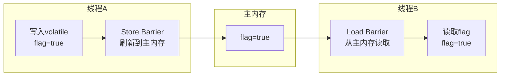

**两大特性**：

1. **可见性**：写操作后立即刷新到主内存，读操作从主内存读取
2. **有序性**：禁止指令重排序（内存屏障）

| 屏障类型 | 说明 |
|----------|------|
| StoreStore | 写-写不能重排 |
| StoreLoad | 写-读不能重排 |
| LoadLoad | 读-读不能重排 |
| LoadStore | 读-写不能重排 |

### 4.2 CAS原理 ★★★★★（高频）

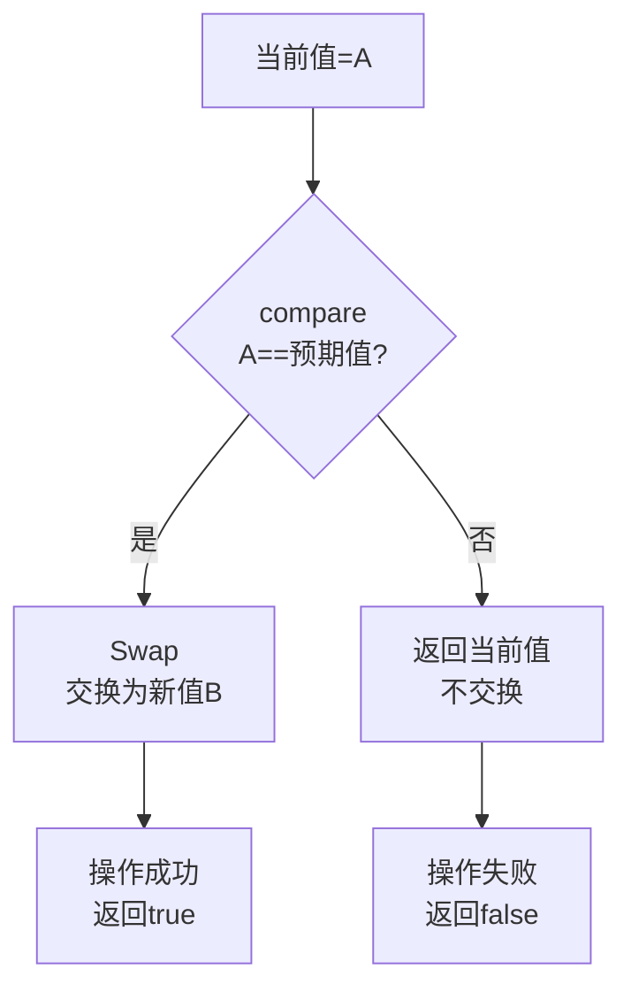

**CAS三大问题**：

| 问题 | 说明 | 解决方案 |
|------|------|----------|
| ABA问题 | 值从A→B→A，CAS仍成功 | 使用版本号AtomicStampedReference |
| 自旋开销 | 竞争激烈时大量自旋 | 限制自旋次数或适应性自旋 |
| 只能保证单个变量 | 无法操作多个变量 | 使用AtomicReference操作对象 |

---

## 5. AQS抽象队列同步器

### 5.1 AQS核心结构 ★★★★☆

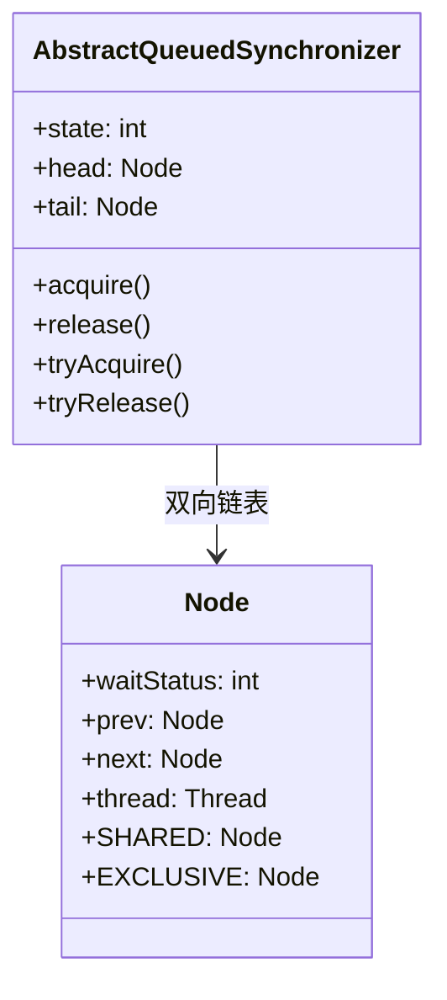

**Node状态**：

| 状态 | 值 | 说明 |
|------|-----|------|
| CANCELLED | 1 | 线程取消等待 |
| SIGNAL | -1 | 后继线程需要唤醒 |
| CONDITION | -2 | 线程在条件队列 |
| PROPAGATE | -3 | 共享模式传播 |
| INITIAL | 0 | 初始状态 |

### 5.2 AQS核心思想 ★★★★★（高频）

> **面试官**：介绍一下AQS
>
> **候选人**：AQS全称为AbstractQueuedSynchronizer，是Java中的一个抽象类，是用于构建锁、同步器、协作工具类的工具类（框架）。
>
> AQS核心思想是，如果被请求的共享资源空闲，那么就将当前请求资源的线程设置为有效的工作线程，将共享资源设置为锁定状态；如果共享资源被占用，就需要一定的阻塞等待唤醒机制来保证锁分配。这个机制主要用的是CLH队列的变体实现的，将暂时获取不到锁的线程加入到队列中。
>
> CLH：Craig、Landin and Hagersten队列，是单向链表，AQS中的队列是CLH变体的虚拟双向队列（FIFO），AQS是通过将每条请求共享资源的线程封装成一个节点来实现锁的分配。
>
> AQS使用一个Volatile的int类型的成员变量来表示同步状态，通过内置的FIFO队列来完成资源获取的排队工作，通过CAS完成对State值的修改。

### 5.3 AQS三大部分 ★★★★★（高频）

| 部分 | 说明 |
|------|------|
| **状态state** | volatile修饰的同步状态，如Semaphore表示许可证数量，CountDownLatch表示倒数计数，ReentrantLock表示锁占有情况 |
| **FIFO队列** | 存放等待锁的线程，是双向链表形式 |
| **获取/释放方法** | 期望协作工具类去实现的获取/释放等重要方法（模板方法） |

### 5.4 独占模式获取流程 ★★★★☆

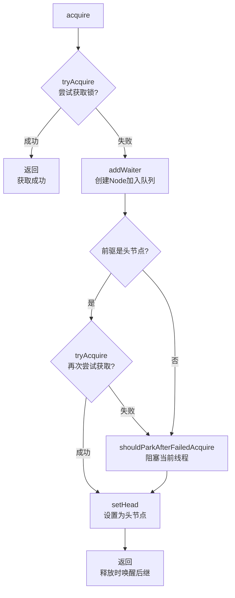

### 5.5 CAS和AQS的关系 ★★★★☆

> **面试官**：CAS 和 AQS 有什么关系？
>
> **候选人**：CAS 和 AQS 两者的区别：
> - CAS 是一种乐观锁机制，它包含三个操作数：内存位置（V）、预期值（A）和新值（B）。整个过程是原子性的。
> - AQS 是一个用于构建锁和同步器的框架，许多同步器如 ReentrantLock、Semaphore、CountDownLatch 等都是基于 AQS 构建的。
>
> 两者的联系：
> - CAS 为 AQS 提供原子操作支持：AQS 内部使用 CAS 操作来更新 state 变量，以实现线程安全的状态修改。

---

## 6. ReentrantLock可重入锁

### 6.1 可重入原理 ★★★★☆

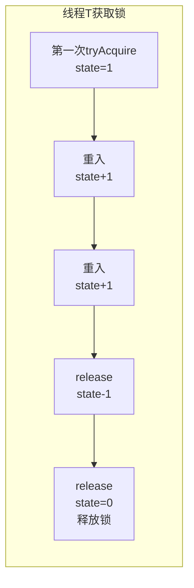

> **原理**：ReentrantLock内部维护一个state计数器，重入一次+1，释放一次-1，直到state=0才完全释放。

### 6.2 公平锁 vs 非公平锁

| 类型 | 原理 | 性能 | 特点 |
|------|------|------|------|
| 公平锁 | 按等待顺序获取锁 | 较差 | 避免饥饿 |
| 非公平锁 | 插队获取锁 | 较好 | 可能饥饿 |

```java
// 非公平锁（默认）
ReentrantLock lock1 = new ReentrantLock();

// 公平锁
ReentrantLock lock2 = new ReentrantLock(true);
```

> **面试话术**：非公平锁性能更高，因为可以减少线程切换开销。但可能造成线程饥饿。synchronized是非公平锁。

### 6.3 ReentrantLock高级特性 ★★★★☆

| 特性 | 说明 |
|------|------|
| 可中断 | 使用lockInterruptibly()可响应中断 |
| 定时锁 | 使用tryLock(timeout)可设置超时 |
| 公平锁 | 构造器传true创建公平锁 |
| 多个条件变量 | 使用newCondition()创建多个Condition |

---

## 7. JUC并发工具类

### 7.1 CountDownLatch ★★★★★（高频）

> **面试官**：CountDownLatch 是做什么的讲一讲？
>
> **候选人**：CountDownLatch 是 Java 并发包（`java.util.concurrent`）中的一个同步工具类，**用于让一个或多个线程等待其他线程完成操作后再继续执行**。
>
> **核心原理**：
> - **初始化计数器**：创建 `CountDownLatch` 时指定一个初始计数值（如 `N`）
> - **等待线程阻塞**：调用 `await()` 的线程会被阻塞，直到计数器变为 0
> - **任务完成通知**：其他线程完成任务后调用 `countDown()`，使计数器减 1
> - **唤醒等待线程**：当计数器减到 0 时，所有等待的线程会被唤醒

```java
// 主线程等待所有子线程就绪后启动
public class CountDownLatchDemo {
    public static void main(String[] args) throws InterruptedException {
        CountDownLatch latch = new CountDownLatch(3);

        for (int i = 0; i < 3; i++) {
            new Thread(() -> {
                System.out.println("线程" + Thread.currentThread().getName() + "执行完毕");
                latch.countDown();
            }).start();
        }

        latch.await(); // 等待所有线程执行完
        System.out.println("所有线程执行完毕，主线程继续");
    }
}
```

**vs CyclicBarrier**：

| 对比项 | CountDownLatch | CyclicBarrier |
|--------|----------------|---------------|
| 原理 | 计数器减到0放行 | 等待所有线程到齐后一起放行 |
| 复用 | 不可复用，计数器为0后不可重置 | 可复用，parties调用await后重置 |
| 场景 | 等待多个任务完成 | 等待多线程汇合 |

### 7.2 CyclicBarrier ★★★★☆

```java
// 所有人都到齐了再一起执行
public class CyclicBarrierDemo {
    public static void main(String[] args) {
        CyclicBarrier barrier = new CyclicBarrier(3, () -> {
            System.out.println("所有人都到了，开始执行任务！");
        });

        for (int i = 0; i < 3; i++) {
            new Thread(() -> {
                System.out.println("线程" + Thread.currentThread().getName() + "到达栅栏");
                try {
                    barrier.await(); // 等待其他人
                } catch (InterruptedException | BrokenBarrierException e) {
                    e.printStackTrace();
                }
            }).start();
        }
    }
}
```

### 7.3 Semaphore ★★★★☆（高频）

> **面试官**：Semaphore 是什么？用在什么场景？
>
> **候选人**：Semaphore 是一个计数信号量，用于控制同时访问某个共享资源的线程数量。通过 `acquire()` 方法获取许可，使用 `release()` 方法释放许可。如果没有许可可用，线程将被阻塞，直到有许可被释放。可以用来限制对某些资源（如数据库连接池、文件操作等）的并发访问量。

```java
// 限制最多3个线程同时执行
public class SemaphoreDemo {
    public static void main(String[] args) {
        Semaphore semaphore = new Semaphore(3);

        for (int i = 0; i < 10; i++) {
            new Thread(() -> {
                try {
                    semaphore.acquire(); // 获取许可
                    System.out.println("线程" + Thread.currentThread().getName() + "获取到许可");
                    Thread.sleep(1000);
                    System.out.println("线程" + Thread.currentThread().getName() + "释放许可");
                    semaphore.release(); // 释放许可
                } catch (InterruptedException e) {
                    e.printStackTrace();
                }
            }).start();
        }
    }
}
```

### 7.4 JUC并发工具类对比 ★★★★☆

| 工具类 | 作用 | 场景 |
|--------|------|------|
| CountDownLatch | 倒数计数，计数器为0放行 | 等待多个任务完成 |
| CyclicBarrier | 栅栏，所有线程到达后一起放行 | 多线程汇合执行 |
| Semaphore | 信号量，控制并发数量 | 限流、资源池管理 |

---

## 8. 线程池原理

### 8.1 线程池七大参数 ★★★★★（高频）

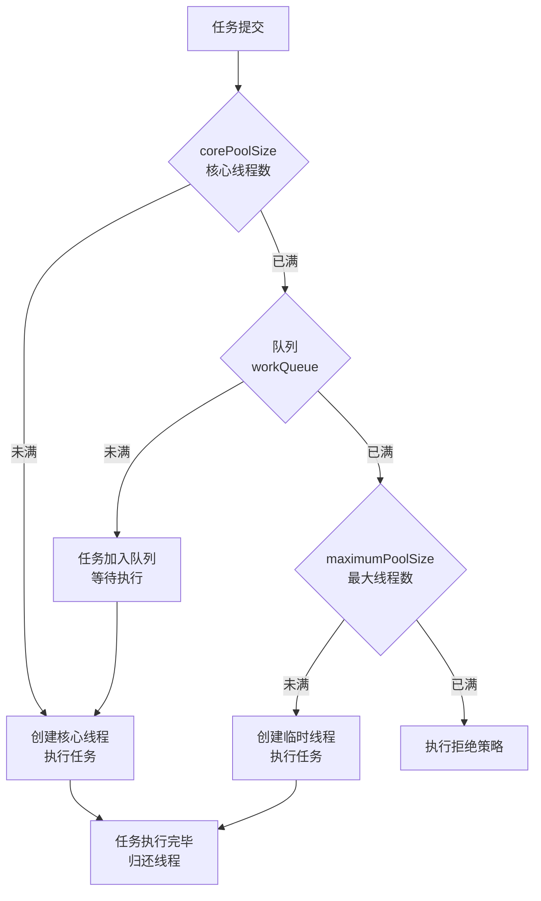

| 参数 | 说明 | 典型值 |
|------|------|--------|
| corePoolSize | 核心线程数 | CPU核数 |
| maximumPoolSize | 最大线程数 | CPU核数×2 |
| keepAliveTime | 空闲线程存活时间 | 60秒 |
| unit | 时间单位 | TimeUnit.SECONDS |
| workQueue | 任务队列 | LinkedBlockingQueue |
| threadFactory | 线程工厂 | Executors.defaultThreadFactory() |
| handler | 拒绝策略 | AbortPolicy |

### 8.2 四种拒绝策略 ★★★★★（高频）

| 策略 | 说明 | 特点 |
|------|------|------|
| AbortPolicy | 抛RejectedExecutionException | 默认，抛弃任务 |
| CallerRunsPolicy | 由调用线程执行 | 压力转移 |
| DiscardPolicy | 直接丢弃 | 静默丢失 |
| DiscardOldestPolicy | 丢弃最老的任务 | 可能丢弃重要任务 |

### 8.3 Executors创建线程池的坑 ★★★★☆

```java
// 坑1：OOM风险
ExecutorService fixedPool = Executors.newFixedThreadPool(100);
// 队列无界Integer.MAX_VALUE，任务堆积导致OOM

// 坑2：线程数无界
ExecutorService cachedPool = Executors.newCachedThreadPool();
// maximumPoolSize=Integer.MAX_VALUE，可能创建过多线程

// 推荐：手动创建线程池
new ThreadPoolExecutor(
    corePoolSize,
    maximumPoolSize,
    keepAliveTime,
    TimeUnit.SECONDS,
    new LinkedBlockingQueue<>(100),  // 有界队列
    new ThreadFactoryBuilder().setNameFormat("pool-%d").build(),
    new ThreadPoolExecutor.AbortPolicy()
);
```

### 8.4 常见线程池类型 ★★★☆☆

| 类型 | 特点 | 适用场景 |
|------|------|----------|
| FixedThreadPool | 固定线程数 | CPU密集型 |
| CachedThreadPool | 线程数可动态增长 | IO密集型 |
| SingleThreadExecutor | 单线程 | 顺序执行 |
| ScheduledThreadPool | 定时任务 | 周期任务 |

---

## 9. 并发容器

### 9.1 ConcurrentHashMap vs Hashtable vs HashMap

| 对比项 | HashMap | Hashtable | ConcurrentHashMap |
|--------|---------|-----------|-------------------|
| 线程安全 | ❌ | ✅ synchronized | ✅ CAS+synchronized |
| 并发度 | - | 低（全表锁） | 高（桶级锁） |
| null支持 | key/value都允许 | 都不允许 | 都不允许 |
| 1.7结构 | 数组+链表 | 数组+链表 | Segment分段锁 |
| 1.8结构 | 数组+链表+红黑树 | 数组+链表 | CAS+synchronized+红黑树 |
| 迭代器 | fail-fast | fail-fast | 弱一致性 |

### 9.2 CopyOnWriteArrayList原理 ★★★☆☆

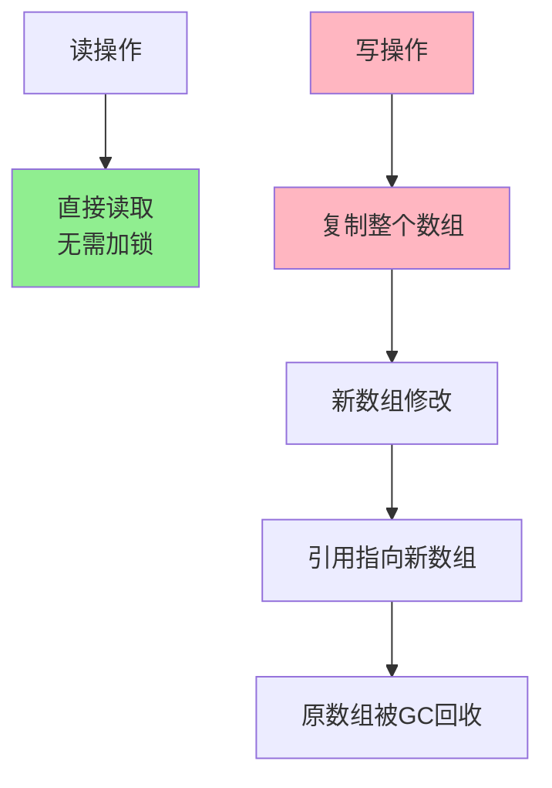

**特点**：
- 读操作不加锁，写操作复制数组
- 适用于读多写少场景
- 写操作有内存开销

---

## 10. 生产消费与线程安全

### 10.1 生产者消费者模式 ★★★☆☆

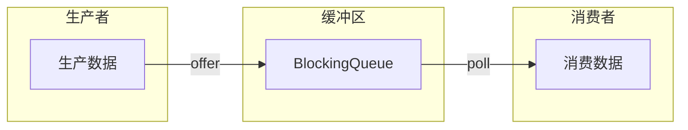

**实现方式一：BlockingQueue**

```java
public class ProducerConsumerDemo {
    private BlockingQueue<Integer> queue = new LinkedBlockingQueue<>(10);

    // 生产者
    public void produce() {
        while (true) {
            int data = new Random().nextInt(100);
            try {
                queue.offer(data, 2, TimeUnit.SECONDS);
                System.out.println("生产者生产：" + data);
            } catch (InterruptedException e) {
                e.printStackTrace();
            }
        }
    }

    // 消费者
    public void consume() {
        while (true) {
            try {
                Integer data = queue.poll(2, TimeUnit.SECONDS);
                System.out.println("消费者消费：" + data);
            } catch (InterruptedException e) {
                e.printStackTrace();
            }
        }
    }
}
```

**实现方式二：synchronized + wait/notify**

```java
public class ProducerConsumerSync {
    private int buffer = 0;
    private boolean hasData = false;

    public synchronized void produce(int data) {
        while (hasData) {
            try { wait(); } catch (InterruptedException e) { e.printStackTrace(); }
        }
        buffer = data;
        hasData = true;
        System.out.println("生产：" + data);
        notifyAll();
    }

    public synchronized int consume() {
        while (!hasData) {
            try { wait(); } catch (InterruptedException e) { e.printStackTrace(); }
        }
        hasData = false;
        notifyAll();
        return buffer;
    }
}
```

**实现方式三：Lock + Condition**

```java
public class ProducerConsumerLock {
    private int buffer = 0;
    private boolean hasData = false;
    private Lock lock = new ReentrantLock();
    private Condition notEmpty = lock.newCondition();
    private Condition notFull = lock.newCondition();

    public void produce(int data) {
        lock.lock();
        try {
            while (hasData) {
                notFull.await();
            }
            buffer = data;
            hasData = true;
            System.out.println("生产：" + data);
            notEmpty.signalAll();
        } finally {
            lock.unlock();
        }
    }

    public int consume() {
        lock.lock();
        try {
            while (!hasData) {
                notEmpty.await();
            }
            hasData = false;
            notFull.signalAll();
            return buffer;
        } finally {
            lock.unlock();
        }
    }
}
```

### 10.2 CountDownLatch vs CyclicBarrier

| 对比项 | CountDownLatch | CyclicBarrier |
|--------|----------------|---------------|
| 原理 | 计数器减到0放行 | 等待所有线程到齐后一起放行 |
| 复用 | 不可复用 | 可复用 |
| 场景 | 等待多个任务完成 | 等待多线程汇合 |

---

## 11. 死锁与排查

### 11.1 死锁的必要条件 ★★★★★（高频）

> **面试官**：什么是死锁？死锁的必要条件是什么？
>
> **候选人**：死锁是指两个或两个以上的线程在执行过程中，因争夺资源而造成的互相等待现象，如果没有外力干预，它们都无法推进下去。
>
> 死锁的四个必要条件：
> 1. **互斥条件**：一个资源每次只能被一个线程使用
> 2. **请求与保持条件**：一个线程因请求资源而阻塞时，对已获得的资源保持不放
> 3. **不剥夺条件**：线程已获得的资源，在未使用完之前，不能被强行剥夺
> 4. **循环等待条件**：若干线程形成头尾相接的循环等待资源关系

### 11.2 手写死锁代码 ★★★★☆

```java
public class DeadLockDemo {
    private static final Object lockA = new Object();
    private static final Object lockB = new Object();

    public static void main(String[] args) {
        // 线程1：先拿lockA，再拿lockB
        Thread t1 = new Thread(() -> {
            synchronized (lockA) {
                System.out.println("线程1：拿到lockA");
                try { Thread.sleep(100); } catch (InterruptedException e) {}
                synchronized (lockB) {
                    System.out.println("线程1：拿到lockB");
                }
            }
        });

        // 线程2：先拿lockB，再拿lockA
        Thread t2 = new Thread(() -> {
            synchronized (lockB) {
                System.out.println("线程2：拿到lockB");
                try { Thread.sleep(100); } catch (InterruptedException e) {}
                synchronized (lockA) {
                    System.out.println("线程2：拿到lockA");
                }
            }
        });

        t1.start();
        t2.start();
    }
}
```

### 11.3 避免死锁的方法 ★★★★☆

| 方法 | 说明 |
|------|------|
| 避免锁的嵌套 | 尽量减少锁的嵌套层次 |
| 固定加锁顺序 | 所有线程按相同顺序获取锁 |
| 使用定时锁 | tryLock(timeout)超时自动放弃 |
| 设置锁超时 | 避免无限等待 |

```java
// 解决方案：固定加锁顺序
public class DeadLockSolution {
    public static void main(String[] args) {
        // 线程1和线程2都按 lockA -> lockB 的顺序获取锁
    }
}
```

### 11.4 死锁排查命令 ★★★★☆

```bash
# 1. 查看Java进程
jps -l

# 2. 查看线程堆栈信息
jstack -l <pid>

# 3. 查找死锁
jstack -l <pid> | grep -A 10 "deadlock"
```

---

## 12. 高频面试题

### 12.1 synchronized相关 ★★★★★

> **面试官**：synchronized 锁升级的过程讲一下
>
> **候选人**：具体的锁升级的过程是：**无锁→偏向锁→轻量级锁→重量级锁**。
>
> 1. **无锁**：没有开启偏向锁时的状态
> 2. **偏向锁**：如果还没有一个线程拿到这个锁，状态为"匿名偏向"。当一个线程拿到偏向锁时，下次竞争只需比较线程ID
> 3. **轻量级锁**：多个线程通过CAS竞争锁，通过自旋避免线程阻塞
> 4. **重量级锁**：自旋超过阈值后升级为重量级锁，未获取锁的线程被操作系统挂起

---

> **面试官**：synchronized 和 ReentrantLock 区别？
>
> **候选人**：
> - **用法不同**：synchronized 可修饰方法/代码块，ReentrantLock 只能用在代码块
> - **获取释放锁**：synchronized自动释放，ReentrantLock需手动
> - **锁类型**：synchronized非公平锁，ReentrantLock可配置公平/非公平
> - **响应中断**：ReentrantLock可响应中断解决死锁，synchronized不能
> - **底层实现**：synchronized是JVM Monitor实现，ReentrantLock是AQS实现

---

> **面试官**：synchronized 支持重入吗？如何实现的？
>
> **候选人**：synchronized是可重入锁。底层利用线程ID和锁状态status实现：
> - 线程第一次获取锁时，状态从0变为1，线程ID存储自己的ID
> - 同一线程再次获取时，比较线程ID是自己的，则status+1
> - 释放时status-1，直到为0时完全释放锁

### 12.2 线程池相关 ★★★★★

> **面试官**：线程池参数有哪些？
>
> **候选人**：线程池有7个核心参数：
> 1. corePoolSize：核心线程数
> 2. maximumPoolSize：最大线程数
> 3. keepAliveTime：空闲线程存活时间
> 4. unit：时间单位
> 5. workQueue：任务队列
> 6. threadFactory：线程工厂
> 7. handler：拒绝策略
>
> 执行流程：任务提交→核心线程→队列→最大线程→拒绝策略

---

> **面试官**：线程池的拒绝策略有哪些？
>
> **候选人**：有四种：
> 1. **AbortPolicy**：抛RejectedExecutionException，默认策略
> 2. **CallerRunsPolicy**：由调用线程执行
> 3. **DiscardPolicy**：直接丢弃
> 4. **DiscardOldestPolicy**：丢弃最老的任务

### 12.3 JUC并发工具类 ★★★★★

> **面试官**：CountDownLatch、CyclicBarrier、Semaphore的区别？
>
> **候选人**：
> - **CountDownLatch**：倒数计数，计数器为0时放行，不可复用
> - **CyclicBarrier**：栅栏，所有线程都到达后一起放行，可复用
> - **Semaphore**：信号量，控制同时访问资源的线程数量

### 12.4 ThreadLocal相关 ★★★★☆

> **面试官**：ThreadLocal会有什么问题？如何解决？
>
> **候选人**：ThreadLocal可能导致**内存泄漏**：
> - ThreadLocalMap使用ThreadLocal的弱引用作为key
> - 如果ThreadLocal没有外部强引用，GC时会回收，但value仍被Entry持有
> - 解决方法是使用完ThreadLocal后调用remove()方法

### 12.5 线程通信相关 ★★★★☆

> **面试官**：线程间通信方式有哪些？
>
> **候选人**：
> 1. **Object的wait/notify/notifyAll**
> 2. **Lock和Condition**
> 3. **volatile关键字**
> 4. **CountDownLatch/CyclicBarrier/Semaphore**
> 5. **BlockingQueue**
> 6. **Thread.join()**

---

## 附录：面试高频问题速查

| 优先级 | 问题 | 答案要点 |
|--------|------|----------|
| ★★★★★ | synchronized锁升级过程 | 偏向锁→轻量级锁→重量级锁 |
| ★★★★★ | start() vs run() | start创建新线程，run普通方法 |
| ★★★★★ | 线程池参数及流程 | 7参数：core/max/queue/threadFactory... |
| ★★★★★ | volatile保证可见性原理 | 内存屏障强制刷新主存 |
| ★★★★★ | sleep vs wait vs yield | sleep持锁不释放/wait释放/yield让步 |
| ★★★★★ | 死锁四个必要条件 | 互斥/请求保持/不剥夺/循环等待 |
| ★★★★☆ | CAS原理及ABA问题 | 比较交换，版本号解决 |
| ★★★★☆ | AQS原理 | state+CLH队列+模板方法 |
| ★★★★☆ | ThreadLocal内存泄漏 | 弱引用+手动remove |
| ★★★★☆ | JUC工具类区别 | CountDownLatch/CyclicBarrier/Semaphore |
| ★★★☆☆ | ReentrantLock公平/非公平 | 按序vs插队 |
| ★★★☆☆ | 生产者消费者实现 | BlockingQueue/wait+notify |

---

> **笔记说明**：本笔记根据黑马程序员Java面试课程和小林coding面试题整理，涵盖并发编程核心面试知识点。配合mermaid图解便于理解，建议面试前快速回顾。
