# Java集合框架源码分析面试笔记

> 黑马程序员Java面试专题 + 小林coding面试题整理 | 难度星级：★~★★★★★ | 面试频率：高/中/低

---

## 目录

1. [集合框架整体结构](#1-集合框架整体结构)
2. [ArrayList源码分析](#2-arraylist源码分析)
3. [LinkedList源码分析](#3-linkedlist源码分析)
4. [HashMap源码分析](#4-hashmap源码分析)
5. [ConcurrentHashMap源码分析](#5-concurrenthashmap源码分析)
6. [Hashtable vs HashMap vs ConcurrentHashMap对比](#6-hashtable-vs-hashmap-vs-concurrenthashmap对比)
7. [TreeMap源码分析](#7-treemap源码分析)
8. [LinkedHashMap原理](#8-linkedhashmap原理)
9. [Queue体系结构](#9-queue体系结构)
10. [各集合线程安全性对比](#10-各集合线程安全性对比)
11. [fail-fast vs fail-safe](#11-fail-fast-vs-fail-safe)
12. [各集合适用场景](#12-各集合适用场景)

---

## 1. 集合框架整体结构

### 1.1 两大体系 ★★★☆☆

```mermaid
flowchart TB
    subgraph Collection单列集合
        A[List有序可重复]
        B[Set无序不重复]
        C[Queue队列]
    end

    subgraph Map双列集合
        D[HashMap]
        E[TreeMap]
        F[LinkedHashMap]
    end

    Iterable <|-- Collection
    Collection <|-- List
    Collection <|-- Set
    Map <|-- HashMap
    Map <|-- TreeMap
```

### 1.2 List vs Set vs Map

| 集合 | 特点 | 实现类 |
|------|------|--------|
| List | 有序可重复 | ArrayList, LinkedList, Vector |
| Set | 无序不重复 | HashSet, TreeSet, LinkedHashSet |
| Map | 键值对 | HashMap, TreeMap, LinkedHashMap |

### 1.3 线程安全分类 ★★★★☆

| 分类 | 集合 | 说明 |
|------|------|------|
| 线程安全 | Vector, Stack, Hashtable | synchronized |
| 线程安全 | Collections.synchronizedXxx | 包装同步 |
| 线程安全 | CopyOnWriteArrayList | 写时复制 |
| 线程安全 | ConcurrentHashMap | CAS+synchronized |
| 线程安全 | BlockingQueue | 阻塞队列 |
| 线程不安全 | ArrayList, HashMap等 | 并发需外部同步 |

---

## 2. ArrayList源码分析

### 2.1 核心属性 ★★★☆☆

```java
public class ArrayList<E> {
    // 默认初始容量
    private static final int DEFAULT_CAPACITY = 10;

    // 空数组
    private static final Object[] EMPTY_ELEMENTDATA = {};

    // 存储元素的数组
    transient Object[] elementData;

    // 元素个数
    private int size;
}
```

### 2.2 扩容机制 ★★★★★（高频）

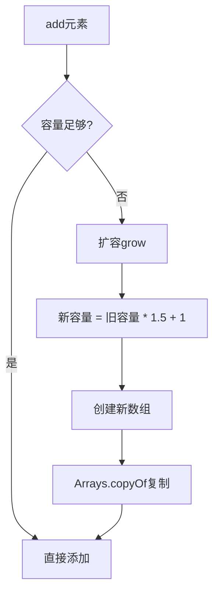

**扩容公式**：`newCapacity = oldCapacity + (oldCapacity >> 1)` 即 **1.5倍**

### 2.3 线程安全问题 ★★★★★（高频面试题）

**ArrayList不是线程安全的**，多线程并发修改会暴露以下问题：

| 问题 | 原因 |
|------|------|
| 部分值为null | 两个线程同时检测到不需扩容，同时设置同一位置 |
| 索引越界异常 | size++不是原子操作，一个线程size++未完成时另一个线程也进来 |
| size不准确 | size++分为三步：取值→加1→赋值，可能丢失一次加法 |

**解决方案**：
```java
// 方案1：Collections.synchronizedList
List<Object> list = Collections.synchronizedList(new ArrayList<>());

// 方案2：CopyOnWriteArrayList（读多写少）
CopyOnWriteArrayList<Object> list = new CopyOnWriteArrayList<>();

// 方案3：Vector（基本不用，性能差）
Vector<Object> list = new Vector<>();
```

### 2.4 fail-fast机制 ★★★★☆

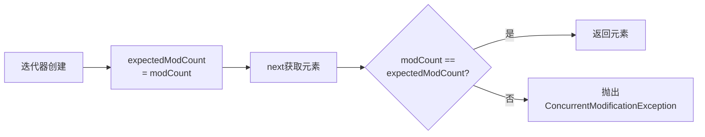

**原因**：`modCount`记录集合结构性修改次数，迭代器检测到变化则快速失败。

---

## 3. LinkedList源码分析

### 3.1 双向链表结构 ★★★☆☆

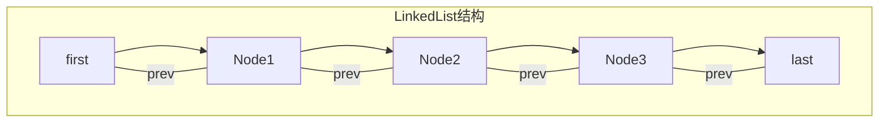

**Node结构**：

```java
private static class Node<E> {
    E item;           // 元素值
    Node<E> next;     // 后继
    Node<E> prev;     // 前驱
}
```

### 3.2 时间复杂度对比

| 操作 | ArrayList | LinkedList |
|------|-----------|------------|
| get(int index) | O(1) | O(n) |
| add(E e) | O(1) | O(1) |
| add(int index, E e) | O(n) | O(n) |
| remove(int index) | O(n) | O(n) |

---

## 4. HashMap源码分析

### 4.1 JDK7 vs JDK8结构变化 ★★★★★（高频）

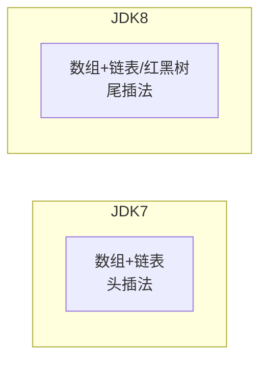

**红黑树转换条件**（同时满足）：
1. 链表长度 > 8
2. 数组容量 >= 64（否则先扩容）

**为什么用红黑树而不是平衡二叉树？**

| 对比 | AVL树 | 红黑树 |
|------|-------|--------|
| 平衡度 | 严格平衡 | 弱平衡 |
| 插入/删除开销 | 大（频繁旋转） | 小 |
| 查找性能 | O(log n) | O(log n) |
| HashMap场景 | 不适合 | 适合 |

HashMap要求的是综合增删改查性能，AVL树插入时要频繁调整影响性能，红黑树牺牲部分查找性能但大大减少调整次数。

### 4.2 哈希算法（扰动函数）★★★★★

```java
static final int hash(Object key) {
    int h;
    return (key == null) ? 0 : (h = key.hashCode()) ^ (h >>> 16);
}
```

```mermaid
flowchart LR
    A[key.hashCode] --> B[h = hashCode]
    B --> C[h ^ (h >>> 16)]
    C --> D[扰动混合\n高低位特征结合]
    D --> E[计算桶索引\nhash & (length-1)]
```

### 4.3 扩容机制 ★★★★★（高频）

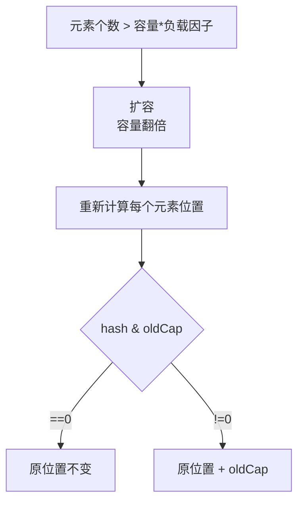

**判断原理**：
- oldCap=16 (10000)
- hash1 & 16 = 0 → 原位置
- hash2 & 16 = 16 → 原位置+16

**扩容优化**：不需要重新计算hash，只需要看hash值的最高位是0还是1

### 4.4 HashMap为什么线程不安全 ★★★★★（高频面试题）

**JDK1.7头插法问题**：
- 扩容时链表会反转，多线程环境下形成环形链表
- 导致死循环、CPU 100%

**JDK1.8尾插法问题**：
- 数据覆盖：多线程put时，计算出的索引相同，后一个覆盖前一个
- size不准确：size++不是原子操作
- 哈希碰撞攻击：精心构造的hash值使链表过长

**具体问题场景**：

```java
// 场景1：数据覆盖
// 线程A和B同时计算出索引为5，都执行put，后者覆盖前者

// 场景2：size不准确
// size++分为三步：取值、加1、赋值，可能丢失更新

// 场景3：JDK1.7环形链表
// 头插法+扩容+多线程 = 环形链表 + 死循环
```

### 4.5 HashMap大小为什么是2的n次方 ★★★★☆

**核心原因**：

1. **位运算替代取模**：`hash & (length-1)` 等价于 `hash % length`
2. **减少哈希碰撞**：length-1二进制全1，能充分利用hash值的分布
3. **扩容优化**：只需要判断hash & oldCap，不需要重新计算hash

**反例**：如果length=15，length-1=14(1110)，最后一位永远是0，浪费一半空间

---

## 5. ConcurrentHashMap源码分析

### 5.1 JDK7 vs JDK8对比 ★★★★★（高频）

```mermaid
flowchart LR
    subgraph JDK7分段锁
        A[Segment[0]] --> A1[HashEntry数组]
        A[Segment[1]] --> A2[HashEntry数组]
        A[Segment[n]] --> A3[HashEntry数组]
    end

    subgraph JDK8CAS+synchronized
        B[Node数组] --> B1[链表/红黑树]
        B --> B2[链表/红黑树]
        B --> B3[链表/红黑树]
    end
```

| 版本 | 结构 | 并发度 | 锁方式 |
|------|------|--------|--------|
| JDK7 | Segment分段锁 | 16 | ReentrantLock |
| JDK8 | CAS + synchronized | 数组长度 | synchronized |

### 5.2 分段锁 vs CAS+synchronized ★★★★★（高频面试题）

**JDK7分段锁原理**：

```java
// 分段锁结构
Segment<K,V>[] segments;

// 每个Segment类似一个小HashMap，有自己的锁
static class Segment<K,V> extends ReentrantLock {
    transient volatile HashEntry<K,V>[] table;
}
```

**优点**：
- 并发度高，不同Segment之间互不影响
- 16个Segment理论上最多16线程并发

**缺点**：
- 锁粒度还是比较粗（一个Segment一把锁）
- 初始化时需要创建所有Segment

### 5.3 JDK8 CAS+synchronized详解 ★★★★★（高频）

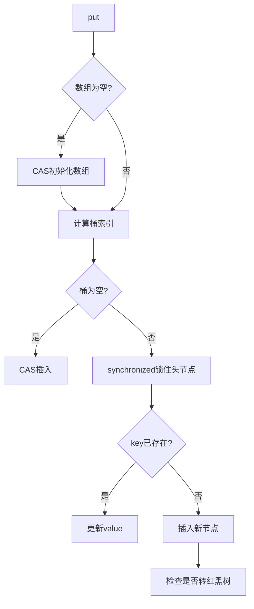

**CAS使用场景**：
- 数组初始化
- 桶为空时的插入

**synchronized使用场景**：
- 桶不为空（发生hash碰撞）
- 需要遍历链表/红黑树

### 5.4 为什么JDK8改用synchronized？ ★★★☆☆

| 对比 | ReentrantLock | synchronized |
|------|---------------|--------------|
| 锁粒度 | Segment级（粗粒度） | 桶级（细粒度） |
| 优化 | 无 | JVM持续优化 |
| 可见性 | 保证 | 保证 |
| 公平性 | 可选 | 非公平 |

**JDK8优势**：
- 锁粒度更细，并发度更高
- JVM对synchronized持续优化（偏向锁、轻量级锁）
- 红黑树优化查询性能

---

## 6. Hashtable vs HashMap vs ConcurrentHashMap对比

### 6.1 核心对比 ★★★★★（高频）

| 对比项 | Hashtable | HashMap | ConcurrentHashMap |
|--------|-----------|---------|-------------------|
| 线程安全 | synchronized | 不安全 | CAS+synchronized |
| 并发度 | 低（全表锁） | - | 高（桶级锁） |
| null支持 | key/value都不允许 | 都允许 | 都不允许 |
| 1.7结构 | 数组+链表 | 数组+链表 | Segment分段锁 |
| 1.8结构 | 数组+链表 | 数组+链表+红黑树 | CAS+synchronized+红黑树 |
| 迭代器 | fail-fast | fail-fast | 弱一致性 |
| 扩容 | 2n+1 | 2倍 | 2倍 |

### 6.2 选型建议

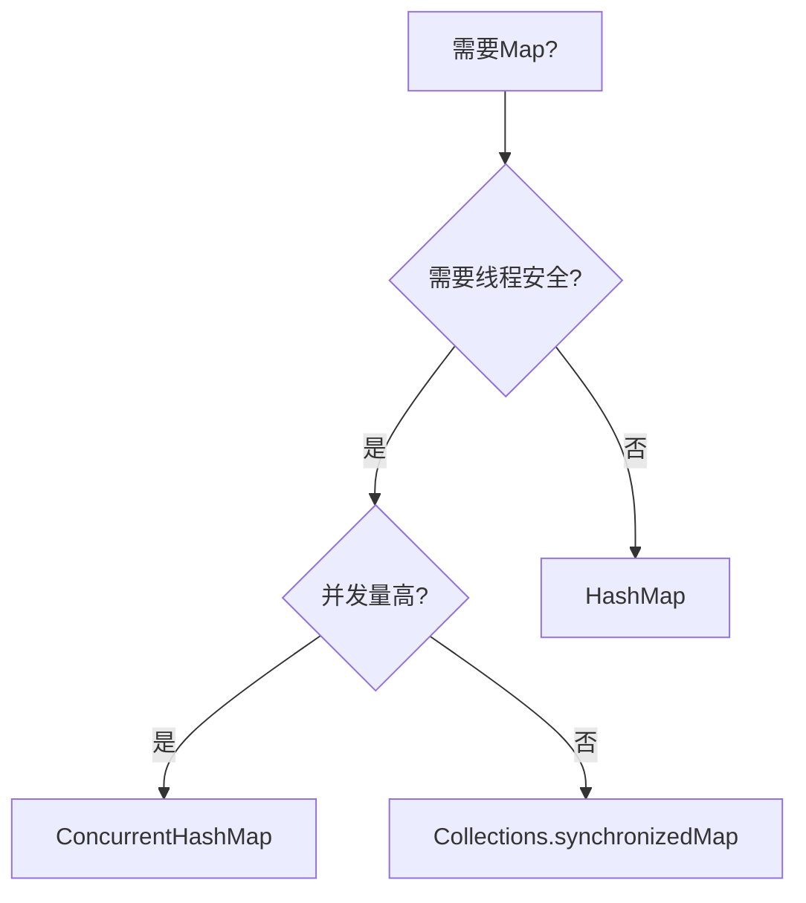

---

## 7. TreeMap源码分析

### 7.1 红黑树五大性质 ★★★☆☆

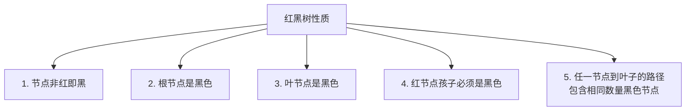

### 7.2 插入调整三种情况 ★★★☆☆

| 情况 | 条件 | 操作 |
|------|------|------|
| 情况1 | 父节点黑色 | 直接插入 |
| 情况2 | 父节点红+叔叔节点红 | 父叔变黑，祖父变红，递归向上 |
| 情况3 | 父节点红+叔叔节点黑 | 旋转+变色（LL/RR/LR/RL） |

---

## 8. LinkedHashMap原理

### 8.1 结构特点 ★★★☆☆

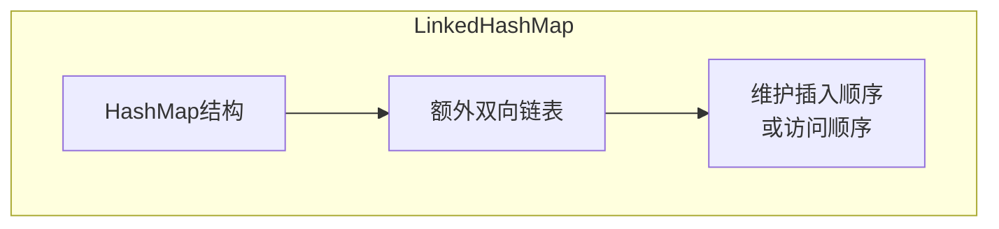

### 8.2 LRU缓存实现 ★★★★★（高频）

```java
// 使用accessOrder=true实现访问顺序
public class LRUCache<K, V> extends LinkedHashMap<K, V> {

    private final int capacity;

    public LRUCache(int capacity) {
        super(capacity, 0.75f, true);  // accessOrder=true
        this.capacity = capacity;
    }

    @Override
    protected boolean removeEldestEntry(Map.Entry<K, V> eldest) {
        return size() > capacity;
    }
}
```

---

## 9. Queue体系结构

### 9.1 Queue vs Deque ★★★☆☆

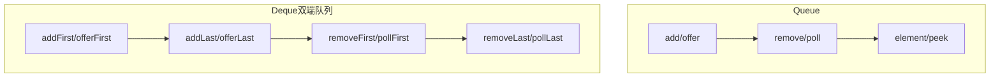

### 9.2 阻塞队列分类

| 队列 | 特点 | 有界性 |
|------|------|--------|
| ArrayBlockingQueue | 数组实现 | 有界 |
| LinkedBlockingQueue | 链表实现 | 可选有界 |
| PriorityBlockingQueue | 优先级队列 | 无界 |
| DelayQueue | 延迟队列 | 无界 |
| SynchronousQueue | 不存储元素 | 容量0 |

---

## 10. 各集合线程安全性对比

### 10.1 线程安全类总览 ★★★★☆

| 线程安全集合 | 实现方式 | 适用场景 |
|--------------|----------|----------|
| Vector | synchronized | 基本不用 |
| Hashtable | synchronized | 基本不用 |
| Collections.synchronizedXxx | synchronized包装 | 低并发 |
| ConcurrentHashMap | CAS+synchronized | 高并发Map |
| CopyOnWriteArrayList | 写时复制 | 读多写少 |
| CopyOnWriteArraySet | 写时复制 | 读多写少 |
| BlockingQueue | 阻塞操作 | 生产者消费者 |

---

## 11. fail-fast vs fail-safe

### 11.1 概念对比 ★★★★★（高频面试题）

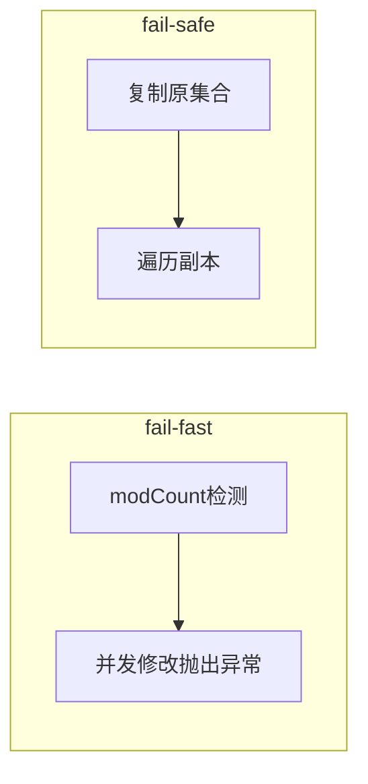

| 对比项 | fail-fast | fail-safe |
|--------|-----------|-----------|
| 实现方式 | modCount检测 | 复制集合副本 |
| 是否抛异常 | ConcurrentModificationException | 不抛异常 |
| 内存开销 | 无 | 有（复制集合） |
| 典型集合 | HashMap, ArrayList | CopyOnWriteArrayList |
| 是否保证一致性 | 不保证 | 最终一致 |

### 11.2 fail-fast触发场景 ★★★★☆

```java
// 场景1：迭代过程中修改集合
List<String> list = new ArrayList<>();
list.add("a");
list.add("b");
for (String s : list) {  // 抛出ConcurrentModificationException
    list.remove(s);
}

// 场景2：多线程并发修改
// 线程A遍历，线程B修改，都基于同一个modCount
```

### 11.3 fail-safe解决方案 ★★★★☆

```java
// 使用CopyOnWriteArrayList（读写分离）
CopyOnWriteArrayList<String> list = new CopyOnWriteArrayList<>();
// 读操作直接读取，无锁
// 写操作加锁复制，替换原数组

// 使用迭代器时获取快照
Iterator<String> iter = list.iterator();
// 获取的是创建迭代器时的快照
```

### 11.4 ConcurrentHashMap的弱一致性 ★★★☆☆

**弱一致性体现**：
- 遍历时可能看到部分修改
- size()可能不准确
- isEmpty()可能不准确

**原因**：为了提高并发性能，不在读操作加锁

**与fail-safe的区别**：
- fail-safe：复制副本遍历
- ConcurrentHashMap：不复制，但部分操作无锁

---

## 12. 各集合适用场景

### 12.1 List选择 ★★★★☆

| 场景 | 推荐 | 原因 |
|------|------|------|
| 随机访问多 | ArrayList | O(1)随机访问 |
| 插入删除多 | LinkedList | O(1)插入删除 |
| 线程安全需求 | CopyOnWriteArrayList | 读多写少 |
| 需要栈/队列 | LinkedList | 实现Deque |

### 12.2 Map选择 ★★★★★（高频面试题）

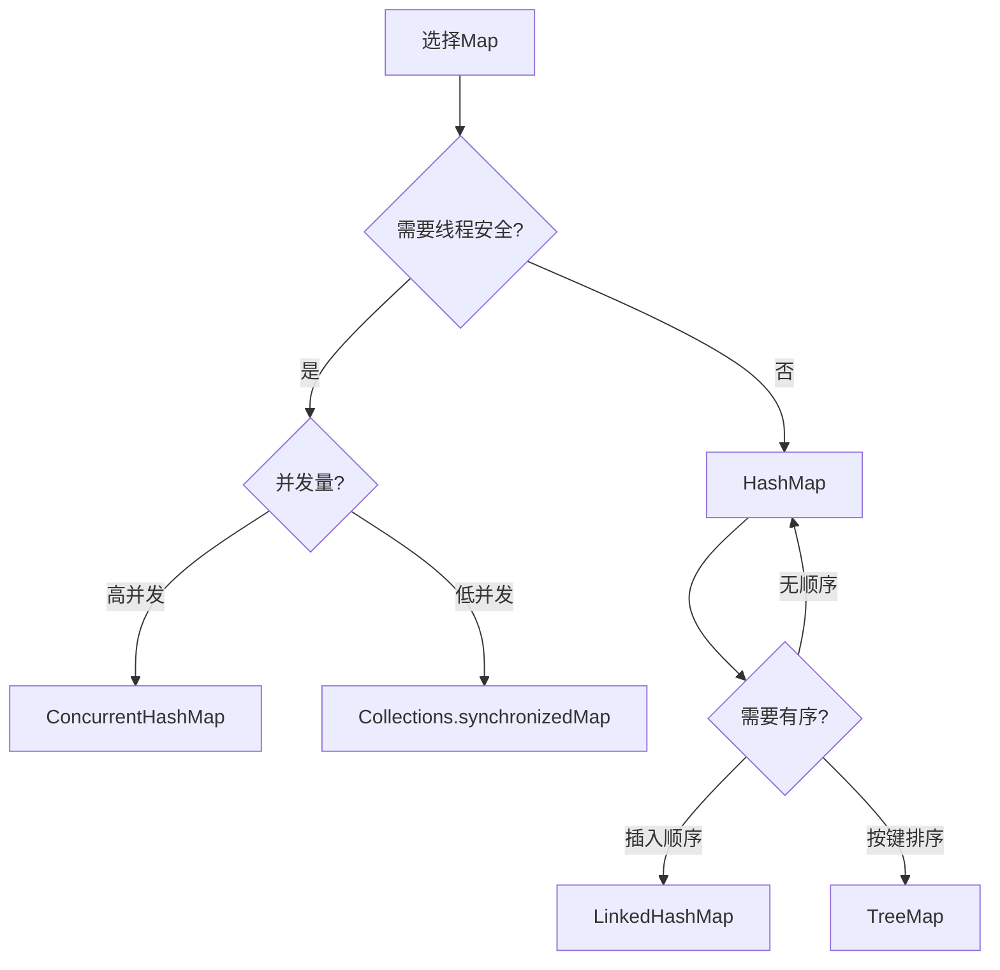

### 12.3 Set选择 ★★★★☆

| 场景 | 推荐 | 底层实现 |
|------|------|----------|
| 快速查找 | HashSet | HashMap |
| 保持插入顺序 | LinkedHashSet | LinkedHashMap |
| 自然排序 | TreeSet | TreeMap |
| 高并发 | ConcurrentSkipListSet | SkipList |

### 12.4 Queue选择 ★★★★☆

| 场景 | 推荐 | 特点 |
|------|------|------|
| 生产者消费者 | BlockingQueue | 阻塞等待 |
| 高并发无阻塞 | ConcurrentLinkedQueue | CAS |
| 优先级任务 | PriorityQueue | 堆结构 |
| 线程池任务队列 | LinkedBlockingQueue | 可选有界 |

---

## 附录：面试高频问题速查

| 优先级 | 问题 | 答案要点 |
|--------|------|----------|
| ★★★★★ | HashMap原理 | 数组+链表/红黑树，哈希算法，扩容机制 |
| ★★★★★ | HashMap线程不安全 | 数据覆盖、size不准确、环形链表 |
| ★★★★★ | ConcurrentHashMap原理 | JDK7分段锁，JDK8 CAS+synchronized |
| ★★★★★ | fail-fast vs fail-safe | modCount检测 vs 复制副本 |
| ★★★★☆ | ArrayList扩容 | 1.5倍，Arrays.copyOf |
| ★★★★☆ | HashMap vs Hashtable | 线程安全，null支持 |
| ★★★★☆ | 红黑树性质 | 五大性质，插入调整 |
| ★★★★☆ | HashMap为什么用红黑树 | AVL调整开销大，红黑树综合性能优 |
| ★★★★☆ | ConcurrentHashMap vs CAS+synchronized | 锁粒度细，桶级锁 |
| ★★★☆☆ | LinkedList vs ArrayList | 链表vs数组，get/add复杂度 |
| ★★★☆☆ | LRU实现 | LinkedHashMap accessOrder |
| ★★★☆☆ | HashMap大小为什么2^n | 位运算等价取模，扩容优化 |

---

## 小林coding面试高频追问

### Q1：HashMap既然线程不安全，为什么还要用？

**参考答案**：
- 单线程环境下，HashMap性能更好（无锁开销）
- 多线程环境下可用ConcurrentHashMap
- 低并发场景Collections.synchronizedMap足够
- 根据场景选择合适的集合

### Q2：ConcurrentHashMap的分段锁已经被弃用了吗？

**参考答案**：
- JDK7使用Segment分段锁（ReentrantLock）
- JDK8改为CAS+synchronized，锁粒度更细
- "分段锁"概念在JDK8仍有，但实现方式变了
- JDK8通过synchronized锁头节点实现桶级锁

### Q3：为什么ConcurrentHashMap不允许null值？

**参考答案**：
- null值会造成二义性：映射不存在 vs 映射值为null
- 多线程环境下无法区分
- HashMap允许null是历史原因，单线程场景可以区分

### Q4：HashMap的负载因子为什么是0.75？

**参考答案**：
- 空间和时间复杂度的平衡
- 太小：频繁扩容，空间浪费
- 太大：碰撞增多，链表/红黑树变长
- 0.75是统计最优值，空间和时间效率最佳

### Q5：红黑树和二叉平衡树的区别？

**参考答案**：
- 平衡二叉树（AVL）：严格平衡，插入删除开销大
- 红黑树：弱平衡，调整代价小
- HashMap场景：增删改查都频繁，红黑树综合性能更好

### Q6：ArrayList和LinkedList选择哪个？

**参考答案**：
- ArrayList：频繁随机访问，尾部操作多
- LinkedList：频繁中间插入删除，需要队列/栈结构
- 现代JVM对数组连续内存优化好，ArrayList实际更快

### Q7：CopyOnWriteArrayList的缺点？

**参考答案**：
- 每次写操作都复制数组，开销大
- 不适合写多读少场景
- 只能保证最终一致性，不保证实时一致
- 内存占用高（同时存在新旧数组）

---

> **笔记说明**：本笔记根据黑马程序员Java面试课程和小林coding面试题整理，深入源码分析集合框架。使用mermaid图解便于理解，建议面试前快速回顾。
