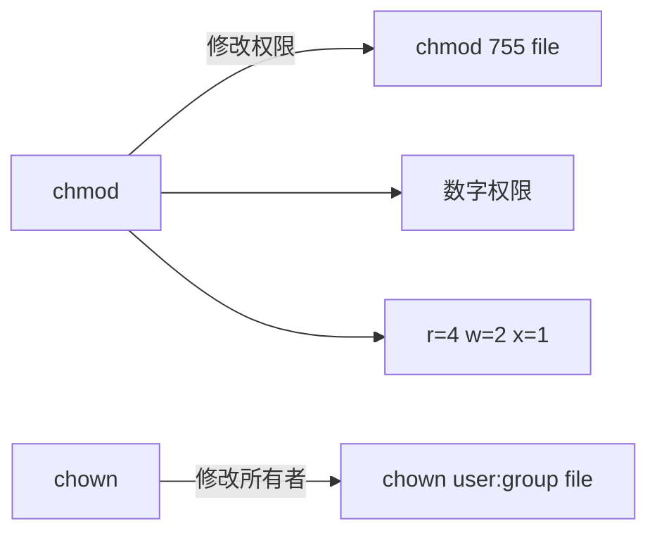
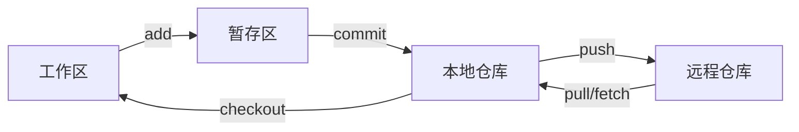

# Linux与Git命令核心面试知识点

> 小林coding x 黑马程序员 | 难度星级：★~★★★★★ | 面试频率：高/中/低

---

## 目录

1. [Linux常用命令](#1-linux常用命令)
2. [进程与线程管理](#2-进程与线程管理)
3. [网络相关命令](#3-网络相关命令)
4. [Shell脚本](#4-shell脚本)
5. [Git命令](#5-git命令)

---

## 1. Linux常用命令 ★★☆

### 文件操作命令

| 命令 | 说明 | 示例 |
|------|------|------|
| `ls` | 列出目录内容 | `ls -la` 显示详细信息 |
| `cd` | 切换目录 | `cd /home` |
| `mkdir` | 创建目录 | `mkdir -p a/b/c` |
| `rm` | 删除文件/目录 | `rm -rf dir` |
| `cp` | 复制文件/目录 | `cp source dest` |
| `mv` | 移动/重命名 | `mv oldname newname` |
| `cat` | 查看文件内容 | `cat file.txt` |
| `head` | 查看文件开头 | `head -n 10 file` |
| `tail` | 查看文件结尾 | `tail -f log` |
| `find` | 查找文件 | `find . -name "*.java"` |

### 权限管理命令



**权限数字：**
- `0` = 无权限
- `1` = 执行
- `2` = 写
- `4` = 读

**示例：**
```bash
chmod 755 file    # rwxr-xr-x
chmod 644 file    # rw-r--r--
chmod +x script   # 添加执行权限
```

---

## 2. 进程与线程管理 ★★★

### ps命令

```bash
ps aux    # 显示所有进程
ps -ef    # 显示详细进程信息
ps -T -p <pid>   # 查看进程中的线程
```

**ps显示内容：**

| 列 | 说明 |
|----|------|
| PID | 进程ID |
| PPID | 父进程ID |
| USER | 进程所属用户 |
| %CPU | CPU占用率 |
| %MEM | 内存占用率 |
| VSZ | 虚拟内存大小 |
| RSS | 物理内存大小 |
| STAT | 进程状态 |
| COMMAND | 进程命令 |

### top命令

```bash
top             # 查看系统状态
top -p <pid>   # 查看指定进程
top -H          # 查看所有线程
```

**top显示内容：**

| 内容 | 说明 |
|------|------|
| Load Average | 最近1/5/15分钟平均负载 |
| Tasks | 运行/睡眠/停止/僵尸进程数 |
| CPU usage | CPU总体及各核心使用率 |
| Memory usage | 物理内存总量、已用、空闲、缓存 |
| Swap usage | 交换空间使用情况 |

**按1显示多CPU核心：**

### 进程状态

| 状态 | 说明 |
|------|------|
| R | 运行中或可运行 |
| S | 睡眠状态 |
| D | 不可中断的睡眠 |
| T | 暂停或跟踪 |
| Z | 僵尸进程 |

### 杀进程命令

```bash
kill <pid>           # 正常终止
kill -9 <pid>        # 强制终止
kill -15 <pid>      # 优雅终止（默认）
pkill -f <进程名>    # 按进程名杀进程
```

### 查看负载情况

```bash
uptime    # 查看系统负载
# Load Average: 1.00, 5.00, 10.00
# 三个数字 = 过去1分钟、5分钟、15分钟的负载
```

**负载判断：**
- 负载值一般不超过CPU核数的1-1.5倍
- 超过1.5倍需要重视，会严重影响系统

---

## 3. 网络相关命令 ★★★

### netstat命令

```bash
netstat -anp           # 查看所有网络连接
netstat -tulpn         # 查看监听端口
netstat -rn            # 查看路由表
```

**netstat显示内容：**
- TCP连接状态（LISTEN、ESTABLISHED等）
- 四元组信息（源IP、目标IP、源端口、目标端口）

### 查看端口占用

```bash
lsof -i:<端口>         # 查看端口被哪个进程占用
netstat -tulpn | grep <端口>
```

### 端口连通性测试

```bash
telnet <IP> <端口>     # 测试端口连通性
nc -zv <IP> <端口>     # netcat测试端口
ping <IP>              # 测试网络连通性
```

### ip和ifconfig

```bash
ip addr                # 查看IP地址
ifconfig              # 传统查看网络接口
```

---

## 4. Shell脚本 ★★★

### 文本处理三剑客

| 命令 | 用途 | 特点 |
|------|------|------|
| **grep** | 文本搜索 | 按行匹配，支持正则 |
| **sed** | 文本替换 | 按行处理，适合编辑 |
| **awk** | 文本分析 | 按列处理，适合统计 |

### grep命令

```bash
grep "关键字" 文件            # 搜索包含关键字的行
grep -r "关键字" 目录         # 递归搜索
grep -i "关键字" 文件          # 忽略大小写
grep -n "关键字" 文件         # 显示行号
grep -v "关键字" 文件         # 反向选择
```

### sed命令

```bash
# 替换文本
sed -i 's/旧字符串/新字符串/g' 文件

# 示例
sed -i 's/Hello/Hi/g' example.txt

# -i 直接修改原文件
# s/旧/新/g 全局替换
```

**sed vs awk区别：**

| 命令 | 适用场景 |
|------|----------|
| sed | 简单文本替换、删除、插入，按行处理 |
| awk | 复杂文本处理，按列处理，支持条件判断 |

### awk命令

```bash
# 按列处理
awk '{print $1, $3}' 文件     # 打印第1、3列
awk -F',' '{print $2}' 文件   # 指定分隔符

# 计算列值
awk '{sum+=$3} END {print sum}' 文件

# 配合grep使用
grep "search_string" log_file | awk '{ print length }'
```

### 查找日志耗时最高的10条记录

```bash
# 按第三列（请求耗时）倒序排序，取前10条
sort -k3 -nr 日志文件 | head -n 10

# -k3 按第三列排序
# -n 按数字排序
# -r 倒序
```

### Shell脚本基础

```bash
#!/bin/bash
# 定义变量
NAME="value"
# 条件判断
if [ $a -gt $b ]; then
    echo "a > b"
fi
# 循环
for i in {1..10}; do
    echo $i
done
```

---

## 5. Git命令 ★★★

### Git工作原理



**四个区域：**
| 区域 | 说明 |
|------|------|
| Workspace | 工作区 |
| Index/Stage | 暂存区 |
| Repository | 本地仓库 |
| Remote | 远程仓库 |

### 基础命令

```bash
# 初始化和克隆
git init                  # 初始化仓库
git clone <url>           # 克隆远程仓库

# 基本操作
git add .                 # 添加到暂存区
git commit -m "message"  # 提交到本地仓库
git push origin main      # 推送到远程
git pull origin main      # 拉取并合并

# 查看状态
git status               # 查看状态
git diff                 # 查看修改内容
git log                  # 查看提交历史
git log --oneline       # 简洁日志
```

### Git撤回操作

```bash
# 撤回 git add
git reset HEAD <file>

# 撤回 git commit（保留工作区）
git reset --soft HEAD^

# 撤回 git commit（保留工作区和暂存区）
git reset --mixed HEAD^

# 撤回 git commit（丢弃所有修改）
git reset --hard HEAD^

# 撤回 git push（强制推送）
git reset HEAD^
git push origin <branch> --force
```

### Git分支管理

```bash
# 创建和切换分支
git branch <name>         # 创建分支
git checkout <name>       # 切换分支
git checkout -b <name>    # 创建并切换
git switch <name>         # 现代切换

# 合并分支
git merge <branch>        # 合并分支
git rebase <branch>      # 变基合并

# 删除分支
git branch -d <name>     # 删除已合并分支
git branch -D <name>     # 强制删除
```

### git rebase vs git merge

| 对比 | rebase | merge |
|------|--------|-------|
| 提交历史 | 线性，更整洁 | 保留分支记录 |
| 合并方式 | 逐个复制提交 | 创建合并提交 |
| 适用场景 | 整理提交记录 | 保留分支历史 |

### Git冲突解决

```bash
# 1. 查看冲突文件
git status

# 2. 打开冲突文件，冲突标记如下：
<<<<<<< HEAD
当前分支的代码
=======
其他分支的代码
>>>>>>> branch-name

# 3. 手动编辑解决冲突

# 4. 标记冲突已解决
git add <file>

# 5. 完成合并提交
git commit -m "resolve conflict"
```

### Git远程操作

```bash
# 添加远程仓库
git remote add origin <url>

# 查看远程仓库
git remote -v

# 推送分支
git push -u origin <branch>

# 设置上游分支
git branch --set-upstream-to=origin/<branch>
```

### 实用Git命令

```bash
# 暂存工作区
git stash                 # 暂存
git stash pop            # 恢复暂存

# 查看差异
git diff --staged        # 暂存区vs最新提交
git diff HEAD~1         # 当前vs上次提交

# 撤销修改
git checkout -- <file>  # 撤销工作区修改
git restore <file>      # 同样效果

# 查看提交者
git blame <file>         # 查看文件每行是谁写的
```

---

## 高频面试题 ★★★~★★★★

### Q1：如何排查CPU跑到100%的问题？

**参考答案**：
1. 执行`top`命令，定位到占用CPU高的进程
2. 使用`ps -T -p <pid>`找到进程中占用比较高的线程
3. 使用`jstack <pid>`查看该线程的堆栈信息
4. 根据堆栈信息定位代码，看是否有死循环

### Q2：Linux如何查看负载情况？

**参考答案**：
使用`uptime`或`top`命令查看Load Average：
- 三个数字依次是过去1分钟、5分钟、15分钟的平均负载
- 负载值一般不超过CPU核数的1-1.5倍
- 超过1.5倍需要重视，会影响系统性能

### Q3：如何查看端口被哪个进程占用？

**参考答案**：
```bash
# 方式1：lsof
lsof -i:<端口号>

# 方式2：netstat
netstat -tulpn | grep <端口号>
```

### Q4：如何测试端口是否可达？

**参考答案**：
```bash
# telnet方式
telnet <IP> <端口>

# nc方式
nc -zv <IP> <端口>
```

### Q5：git rebase和merge有什么区别？

**参考答案**：
- **merge**：创建一个新的合并提交，将两个分支的提交历史连接在一起，保留分支记录
- **rebase**：将源分支上的每个提交复制到目标分支最新位置，使提交历史变成线性

### Q6：如何撤回已经push的代码？

**参考答案**：
```bash
# 1. 回退本地仓库
git reset --hard HEAD^

# 2. 强制推送到远程
git push origin <branch> --force
```

### Q7：Shell三剑客的区别？

**参考答案**：
| 命令 | 用途 | 特点 |
|------|------|------|
| grep | 搜索文本 | 按行匹配，支持正则 |
| sed | 替换/删除/插入 | 按行处理，简单编辑 |
| awk | 复杂文本分析 | 按列处理，支持运算 |

---

## 附录：常用命令速查

```
文件操作：ls cd mkdir rm cp mv cat head tail find
权限管理：chmod chown
进程管理：ps top kill pkill
网络命令：netstat lsof telnet nc ping
文本处理：grep sed awk wc
系统命令：uptime df du free
Git命令：add commit push pull merge rebase reset stash
```

---

> **笔记说明**：本笔记结合小林coding和黑马程序员整理，涵盖Linux和Git命令核心面试知识点。建议面试前快速回顾。
