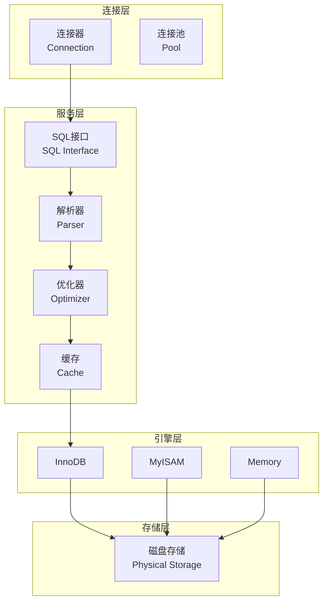
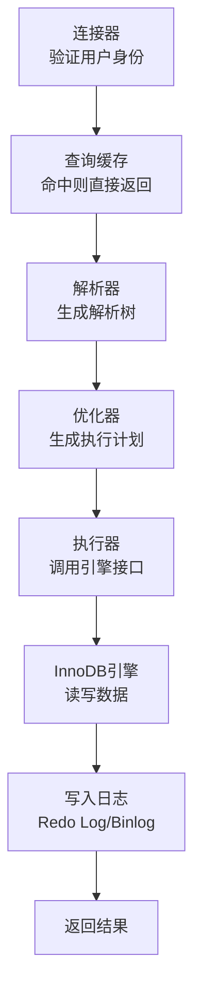
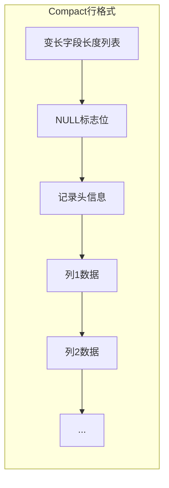
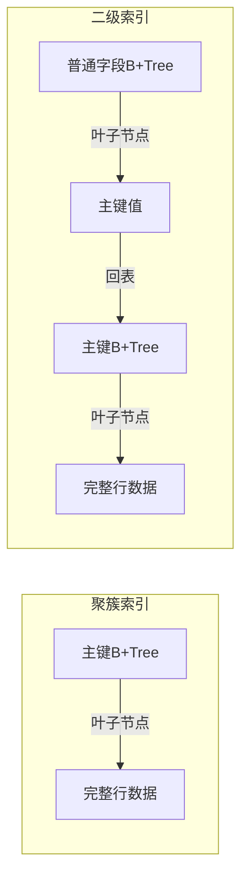
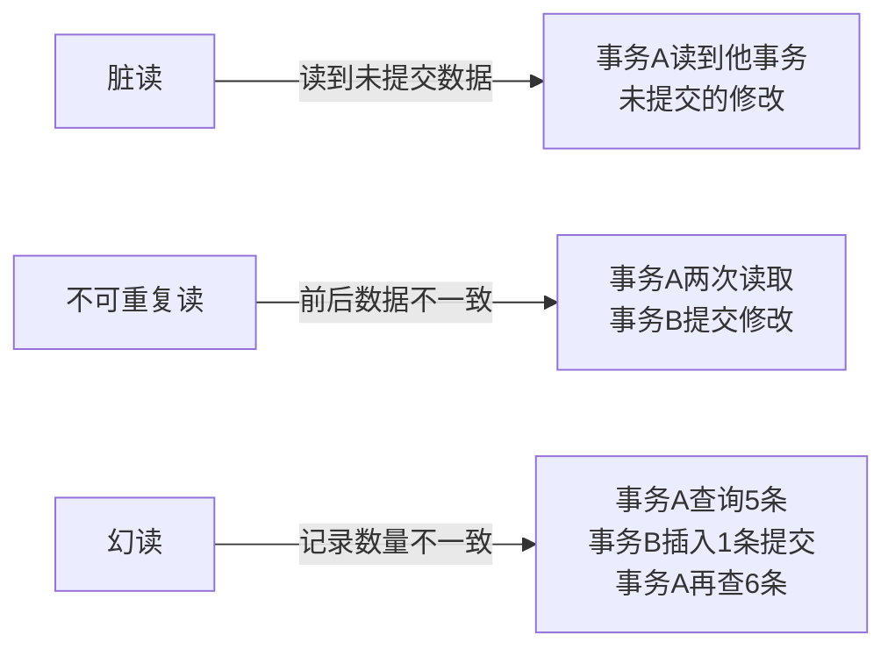
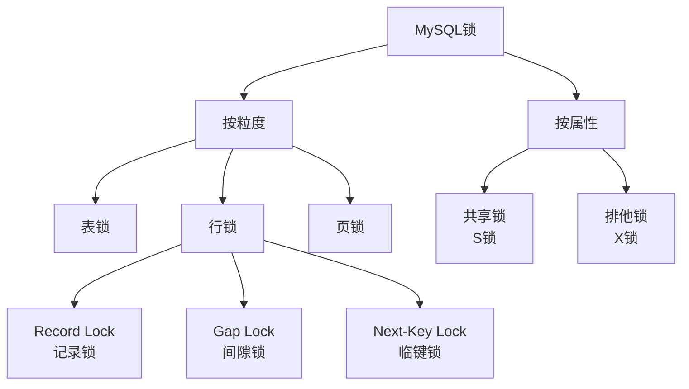
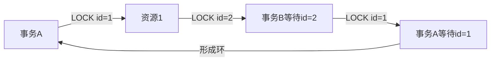
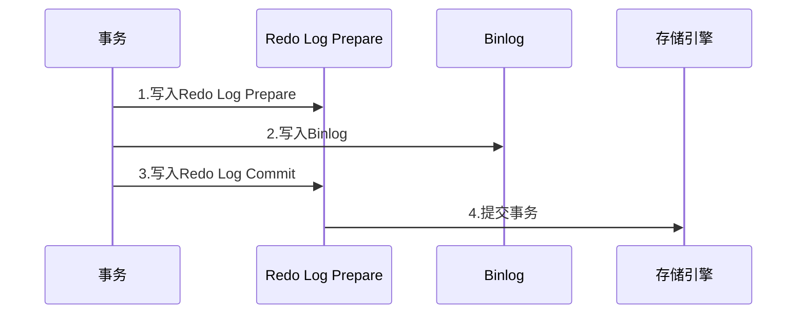
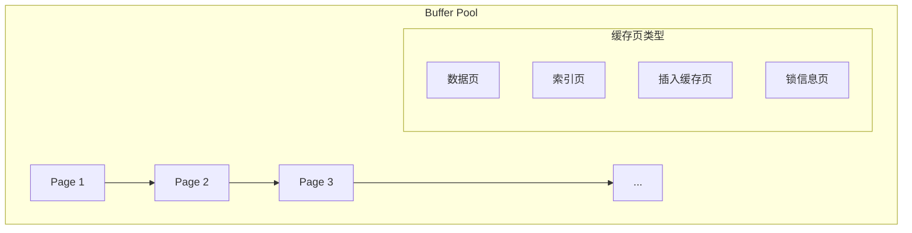

# MySQL核心面试笔记

> 小林coding x 黑马程序员 | 难度星级：★~★★★★★ | 面试频率：高/中/低

---

## 目录

1. [MySQL架构](#1-mysql架构)
2. [InnoDB行记录存储](#2-innodb行记录存储)
3. [索引详解](#3-索引详解)
4. [事务隔离级别与MVCC](#4-事务隔离级别与mvcc)
5. [MySQL锁机制](#5-mysql锁机制)
6. [日志系统](#6-日志系统)
7. [Buffer Pool](#7-buffer-pool)
8. [SQL优化](#8-sql优化)

---

## 1. MySQL架构

### 1.1 MySQL分层架构 ★★★☆☆



### 1.2 执行一条SQL的完整过程 ★★★★☆



---

## 2. InnoDB行记录存储

### 2.1 行记录格式 ★★★☆☆



---

## 3. 索引详解

### 3.1 索引分类 ★★★★☆

| 分类角度 | 索引类型 | 说明 |
|---------|---------|------|
| 数据结构 | B+Tree索引 | InnoDB默认 |
| 物理存储 | 聚簇索引 | 主键索引，叶子存完整数据 |
| 物理存储 | 二级索引 | 辅助索引，叶子存主键值 |
| 字段特性 | 主键索引 | 主键自动建索引 |
| 字段特性 | 唯一索引 | 值唯一 |
| 字段特性 | 普通索引 | 普通字段索引 |
| 字段个数 | 单列索引 | 单个字段 |
| 字段个数 | 联合索引 | 多个字段 |

### 3.2 B+Tree vs B Tree vs 二叉树 ★★★★★（高频）

| 数据结构 | 特点 | 查询复杂度 |
|---------|------|-----------|
| B+Tree | 多叉平衡树，叶子链表 | O(logdN) |
| B Tree | 多叉平衡树，非叶也存数据 | O(logdN) |
| 二叉树 | 二叉平衡/有序 | O(logN) |
| Hash | KV对，等值查询 | O(1) |

**B+Tree优势**：
- 非叶子节点不存数据，同等高度存更多索引
- 叶子节点双向链表，适合范围查询
- 查询效率稳定（都在叶子节点）

### 3.3 聚簇索引 vs 二级索引 ★★★★☆



**回表查询**：先查二级索引获取主键，再查主键索引获取完整数据

### 3.4 覆盖索引 ★★★☆☆

**概念**：查询的数据在二级索引叶子节点中就能找到，不需要回表

```sql
-- 覆盖索引示例
SELECT id, name FROM users WHERE name = '张三';
-- id和name都在name索引的叶子节点中，无需回表
```

### 3.5 索引失效场景 ★★★★★（高频）

```mermaid
flowchart TD
    A[索引失效场景] --> B[1.左模糊查询\nlike '%xxx']
    A --> C[2.索引列参与运算\nid + 1 = 10]
    A --> D[3.索引列使用函数\nYEAR(date) = 2024]
    A --> E[4.类型转换\n字符串列用数字]
    A --> F[5.OR有非索引列\nname='xx' OR age=18]
    A --> G[6.最左前缀不匹配\n联合索引ABC,查AB但无A]
    A --> H[7.!= / NOT IN\n导致全表扫描]
```

**最佳左前缀原则**：对于联合索引(a,b,c)，查询必须使用a或a,b或a,b,c

---

## 4. 事务隔离级别与MVCC

### 4.1 四种隔离级别 ★★★★☆

| 隔离级别 | 脏读 | 不可重复读 | 幻读 |
|---------|------|-----------|------|
| 读未提交 | 可能 | 可能 | 可能 |
| 读已提交 | 不可能 | 可能 | 可能 |
| 可重复读 | 不可能 | 不可能 | 可能 |
| 串行化 | 不可能 | 不可能 | 不可能 |

**MySQL默认隔离级别**：可重复读（InnoDB）

### 4.2 并行事务问题 ★★★★☆



### 4.3 MVCC原理 ★★★★★（高频）

```mermaid
flowchart TB
    subgraph MVCC核心
        A[隐藏列] -->|trx_id| B[事务ID]
        A -->|roll_pointer| C[回滚指针]
        C -->|指向| D[undo log\n历史版本]
    end

    subgraph 版本链
        E[最新版本] -->|roll_pointer| F[版本1]
        F -->|roll_pointer| G[版本2]
    end

    subgraph ReadView
        H[m_ids] -->|活跃事务ID列表
        I[min_trx_id] -->|最小活跃事务ID
        J[max_trx_id] -->|创建时最大事务ID]
    end
```

**ReadView判断规则**：
1. trx_id < min_trx_id：可见
2. trx_id > max_trx_id：不可见
3. trx_id in m_ids：不可见，需顺着roll_pointer查找历史版本
4. trx_id not in m_ids：可见

### 4.4 读已提交 vs 可重复读 ★★★☆☆

| 隔离级别 | ReadView生成时机 | 每次读取版本链起点 |
|---------|-----------------|-----------------|
| 读已提交 | 每个SELECT语句开始时 | 重新生成 |
| 可重复读 | 事务开始时 | 整个事务只用第一个ReadView |

### 4.5 幻读解决方案 ★★★☆☆

| 类型 | 解决方式 |
|------|----------|
| 快照读 | MVCC |
| 当前读 | Next-Key Lock（记录锁+间隙锁） |

---

## 5. MySQL锁机制

### 5.1 锁分类 ★★★★☆



### 5.2 记录锁 vs 间隙锁 vs 临键锁 ★★★★☆

| 锁类型 | 锁定范围 | 作用 |
|--------|---------|------|
| 记录锁 | 单行记录 | 防止删除或修改 |
| 间隙锁 | 记录之间的间隙 | 防止插入 |
| 临键锁 | 记录+间隙 | 记录锁+间隙锁 |

### 5.3 死锁 ★★★☆☆



**死锁解决**：
- 超时自动回滚（innodb_lock_wait_timeout）
- 死锁检测，主动回滚小事务

---

## 6. 日志系统

### 6.1 三种日志对比 ★★★★★（高频）

| 日志 | 作用 | 内容 | 写入时机 |
|------|------|------|---------|
| redo log | 物理日志，崩溃恢复 | 页修改数据 | 事务执行中 |
| undo log | 逻辑日志，回滚事务 | INSERT/UPDATE/DELETE逆操作 | 事务执行中 |
| binlog | 归档日志，主从同步 | DDL/DML | 事务提交后 |

### 6.2 两阶段提交 ★★★★☆



---

## 7. Buffer Pool

### 7.1 Buffer Pool结构 ★★★☆☆



**作用**：缓存磁盘数据，减少磁盘IO

### 7.2 缓存淘汰策略 ★★★☆☆

LRU（最近最少使用）算法优化版：
- 预读机制
- 淘汰冷热数据（37分）

---

## 8. SQL优化

### 8.1 EXPLAIN分析 ★★★★☆

```sql
EXPLAIN SELECT * FROM users WHERE name = '张三';

-- 关键字段
type: const/eq_ref/ref/range/all  -- 访问类型
key: idx_name                      -- 使用索引
rows: 100                          -- 扫描行数
Extra: Using index/Using where     -- 额外信息
```

### 8.2 慢查询优化 ★★★☆☆

| 优化方向 | 方法 |
|---------|------|
| 索引优化 | 覆盖索引、联合索引、最左前缀 |
| SQL优化 | 避免SELECT *、避免函数、避免隐式转换 |
| 分页优化 | 延迟关联、游标分页 |
| 避免回表 | 覆盖索引 |

### 8.3 分页查询优化 ★★★☆☆

```sql
-- 低效分页
SELECT * FROM orders ORDER BY id LIMIT 1000000, 10;

-- 优化：延迟关联
SELECT o.* FROM orders o
INNER JOIN (SELECT id FROM orders ORDER BY id LIMIT 1000000, 10) t
ON o.id = t.id;
```

---

## 附录：面试高频问题速查

| 优先级 | 问题 | 答案要点 |
|--------|------|----------|
| ★★★★★ | 为什么MySQL用B+树 | 单次IO少、范围查询优、叶子链表 |
| ★★★★★ | 索引失效场景 | 左模糊、函数、OR、类型转换 |
| ★★★★★ | MVCC原理 | 隐藏列、ReadView、版本链 |
| ★★★★★ | 事务隔离级别 | 4种级别，MySQL默认RR |
| ★★★★★ | 脏读/不可重复读/幻读 | 未提交/已提交/记录数不一致 |
| ★★★★☆ | 聚簇索引vs二级索引 | 叶子存数据vs存主键 |
| ★★★★☆ | redo log vs binlog | 物理vs逻辑，崩溃恢复vs主从 |
| ★★★★☆ | Next-Key Lock | 记录锁+间隙锁，解决幻读 |
| ★★★☆☆ | count(*)优化 | 最小索引列覆盖 |

---

> **笔记说明**：本笔记结合小林coding图解MySQL和黑马程序员整理，涵盖MySQL核心面试知识点。建议面试前快速回顾。
