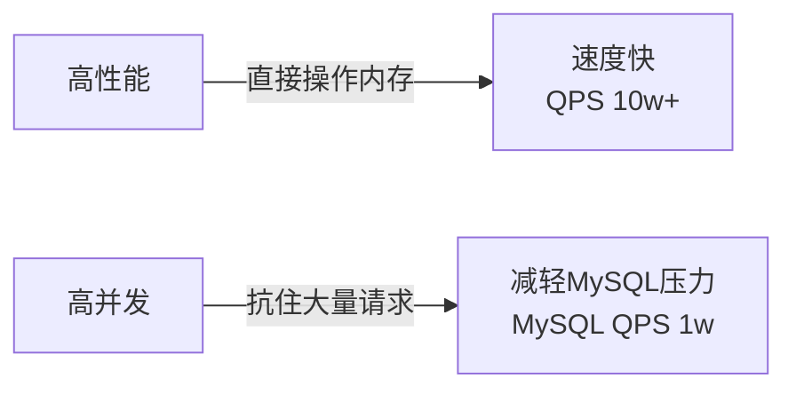
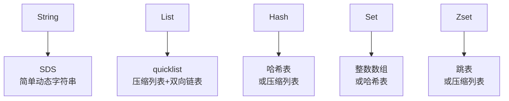
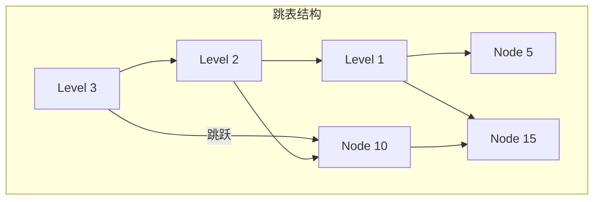
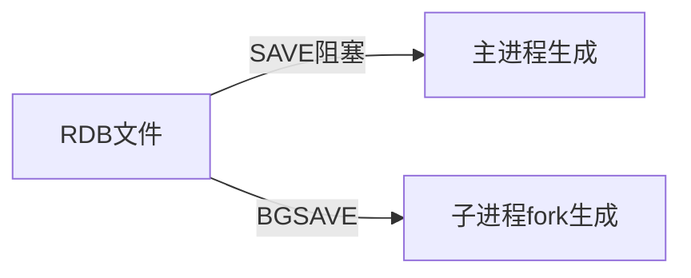
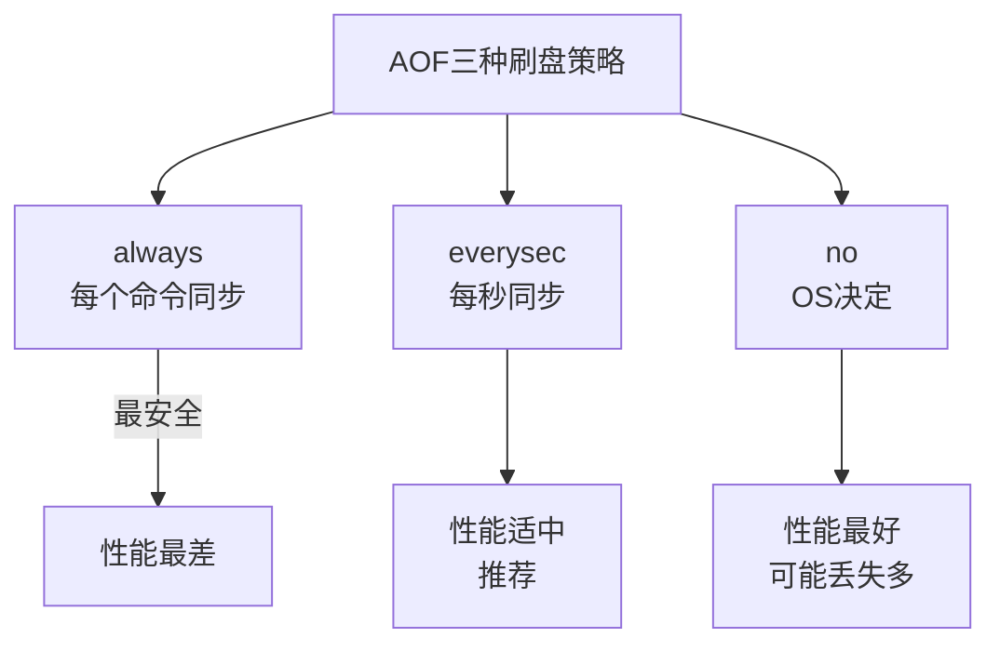
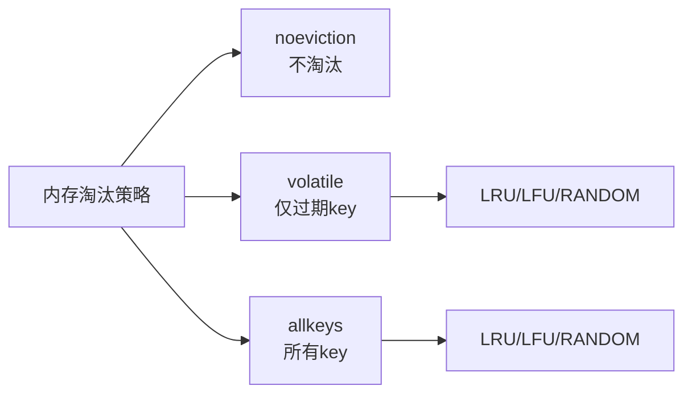
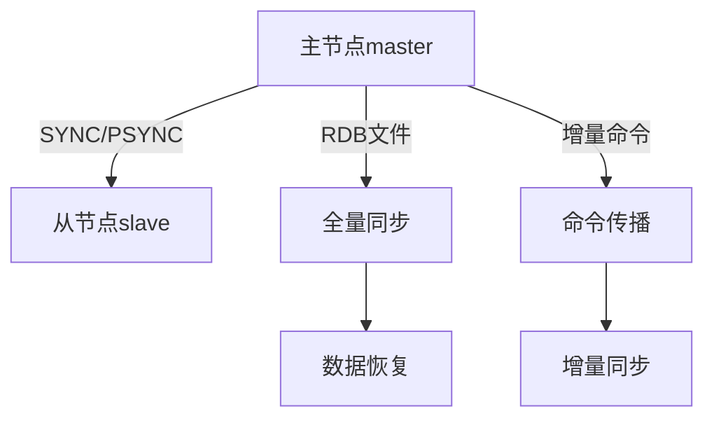
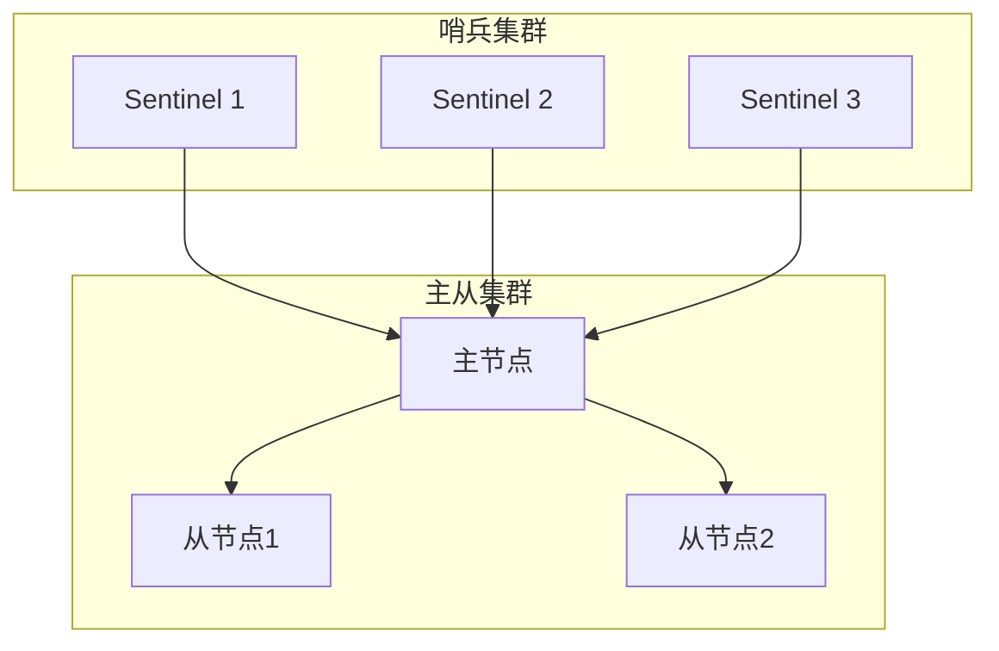
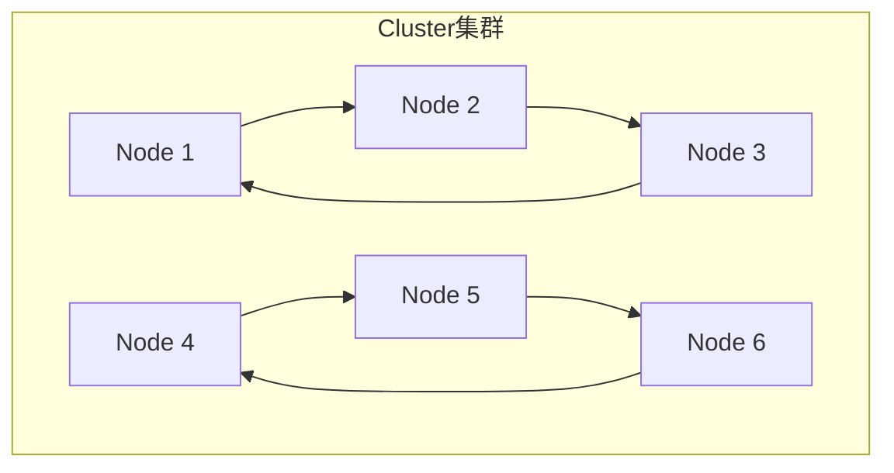

# Redis核心面试笔记

> 小林coding x 黑马程序员 | 难度星级：★~★★★★★ | 面试频率：高/中/低

---

## 目录

1. [Redis基础](#1-redis基础)
2. [Redis数据类型](#2-redis数据类型)
3. [Redis持久化机制](#3-redis持久化机制)
4. [Redis过期删除与内存淘汰](#4-redis过期删除与内存淘汰)
5. [Redis主从复制](#5-redis主从复制)
6. [Redis哨兵与Cluster](#6-redis哨兵与cluster)
7. [Redis缓存问题](#7-redis缓存问题)
8. [数据库与缓存一致性](#8-数据库与缓存一致性)

---

## 1. Redis基础

### 1.1 Redis vs Memcached ★★★☆☆

| 对比项 | Redis | Memcached |
|--------|-------|-----------|
| 数据类型 | 丰富（5种+4种） | 简单KV |
| 持久化 | 支持RDB/AOF | 不支持 |
| 集群模式 | 原生支持 | 需客户端实现 |
| 线程模型 | 单线程+多线程IO | 多线程 |

### 1.2 为什么用Redis作为缓存 ★★★★☆



---

## 2. Redis数据类型

### 2.1 五种基本数据类型 ★★★★★（高频）

| 数据类型 | 命令示例 | 底层实现 | 应用场景 |
|----------|----------|----------|----------|
| String | GET/SET | SDS | 缓存、计数器、分布式锁 |
| List | LPUSH/RPOP | quicklist | 消息队列、列表 |
| Hash | HSET/HGET | 哈希表/压缩列表 | 对象存储、购物车 |
| Set | SADD/SMEMBERS | 整数数组/哈希表 | 标签、好友关系 |
| Zset | ZADD/ZRANGE | 跳表 | 排行榜、延迟队列 |

### 2.2 数据类型底层实现 ★★★★☆



### 2.3 SDS vs C字符串 ★★★☆☆

| 特性 | SDS | C字符串 |
|------|-----|---------|
| 获取长度 | O(1)，通过len | O(n)，需遍历 |
| 缓冲区溢出 | 动态扩展 | 可能溢出 |
| 内存分配 | 惰性释放/预分配 | 每次需重新分配 |
| 二进制安全 | 是 | 否 |

### 2.4 跳表原理 ★★★☆☆



**特点**：多层索引，快速定位，O(logN)查找

---

## 3. Redis持久化机制

### 3.1 RDB vs AOF对比 ★★★★☆

| 对比项 | RDB | AOF |
|--------|-----|-----|
| 原理 | 定时快照 | 记录每次写命令 |
| 文件大小 | 小（数据快照） | 大（命令日志） |
| 恢复速度 | 快 | 慢 |
| 数据安全性 | 可能有丢失 | 可配置 |

### 3.2 RDB持久化 ★★★☆☆



### 3.3 AOF持久化 ★★★★☆



**AOF重写**：BGSAVE重写AOF，合并重复命令，减小文件大小

---

## 4. Redis过期删除与内存淘汰

### 4.1 过期删除策略 ★★★★☆

| 策略 | 原理 | 优点 | 缺点 |
|------|------|------|------|
| 定时删除 | 定时器主动删除 | 内存友好 | CPU不友好 |
| 惰性删除 | 访问时检查删除 | CPU友好 | 内存不友好 |
| 定期删除 | 定期抽查删除 | 平衡 | - |

**Redis采用**：惰性删除 + 定期删除

### 4.2 内存淘汰策略 ★★★☆☆



| 策略 | 说明 |
|------|------|
| volatile-lru | LRU淘汰过期key |
| allkeys-lru | LRU淘汰所有key |
| volatile-lfu | LFU淘汰过期key |
| allkeys-lfu | LFU淘汰所有key |
| volatile-random | 随机淘汰过期key |
| allkeys-random | 随机淘汰所有key |
| volatile-ttl | 淘汰TTL最短的key |

---

## 5. Redis主从复制

### 5.1 主从复制原理 ★★★★☆



### 5.2 全量同步 vs 增量同步 ★★★☆☆

| 类型 | 触发条件 | 数据范围 |
|------|----------|----------|
| 全量同步 | 首次连接/断线重连 | 所有数据 |
| 增量同步 | 主从有offset差 | offset之后的数据 |

---

## 6. Redis哨兵与Cluster

### 6.1 哨兵模式 ★★★★☆



**作用**：监控、自动故障转移、通知

### 6.2 Redis Cluster ★★★☆☆



**特点**：16384个槽位，自动分片，高可用

---

## 7. Redis缓存问题

### 7.1 缓存雪崩 ★★★★☆


**解决方案**：
- 过期时间加上随机值
- 互斥锁重建
- 热点数据永不过期

### 7.2 缓存击穿 ★★★★☆


**解决方案**：
- 互斥锁
- 热点数据永不过期
- 逻辑过期

### 7.3 缓存穿透 ★★★★☆


**解决方案**：
- 布隆过滤器
- 空对象缓存
- 参数校验

---

## 8. 数据库与缓存一致性

### 8.1 常见方案 ★★★★☆

```mermaid
flowchart LR
    A[Cache Aside] -->|最常用| B[读：先缓存后数据库\n写：先数据库后缓存]
    C[Read Through] -->|应用只操作缓存\n缓存负责读写数据库]
    D[Write Through] -->|同步写\n缓存和数据库一起写]
    E[Write Behind] -->|异步写\n先写缓存，后写数据库]
```

### 8.2 Cache Aside模式 ★★★★☆

```mermaid
sequenceDiagram
    participant A as 应用
    participant C as 缓存
    participant D as 数据库

    Note over A,C,D: 读操作
    A->>C: 1.查缓存
    C->>A: 2.命中返回
    C->>D: 3.未命中，查数据库
    D-->>C: 4.返回数据
    C-->>A: 5.写入缓存

    Note over A,C,D: 写操作
    A->>D: 1.写数据库
    D-->>A: 2.返回成功
    A->>C: 3.删除缓存
```

---

## 附录：面试高频问题速查

| 优先级 | 问题 | 答案要点 |
|--------|------|----------|
| ★★★★★ | Redis为什么快 | 内存操作、单线程、IO多路复用 |
| ★★★★★ | 数据类型及底层 | SDS、quicklist、跳表、哈希表 |
| ★★★★★ | 缓存问题 | 雪崩、击穿、穿透及解决方案 |
| ★★★★★ | 持久化方式 | RDB快照、AOF命令日志 |
| ★★★★☆ | 主从复制原理 | 全量同步、增量同步 |
| ★★★★☆ | 过期删除策略 | 惰性删除+定期删除 |
| ★★★★☆ | 内存淘汰策略 | LRU/LFU/RANDOM |
| ★★★☆☆ | 分布式锁实现 | SETNX+过期时间 |

---

> **笔记说明**：本笔记结合小林coding图解Redis和黑马程序员整理，涵盖Redis核心面试知识点。建议面试前快速回顾。
