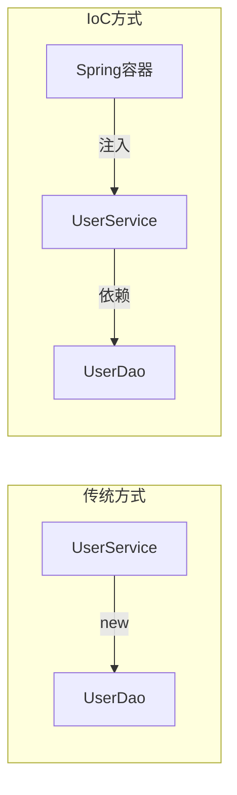
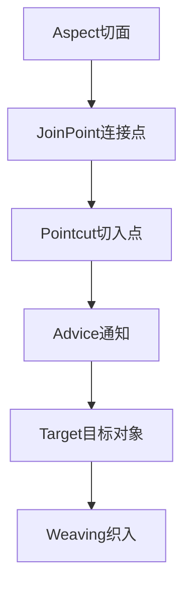
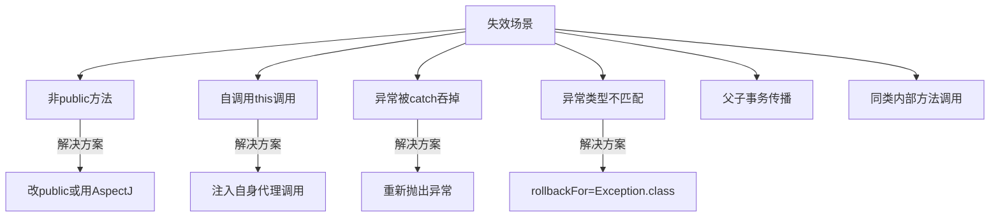
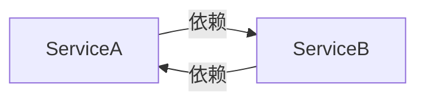
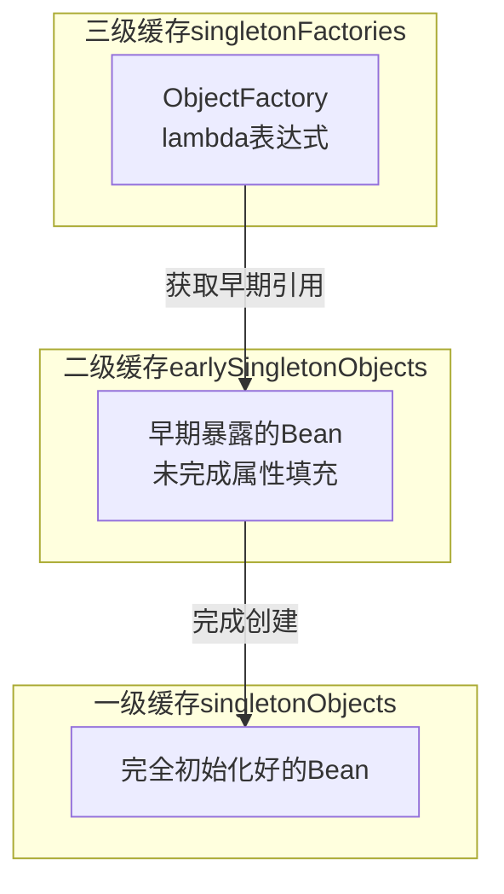
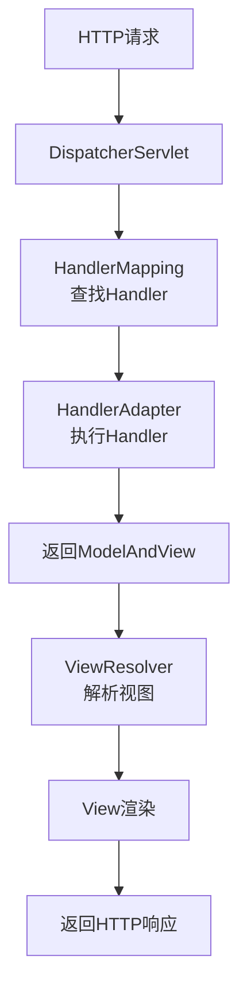
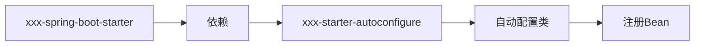
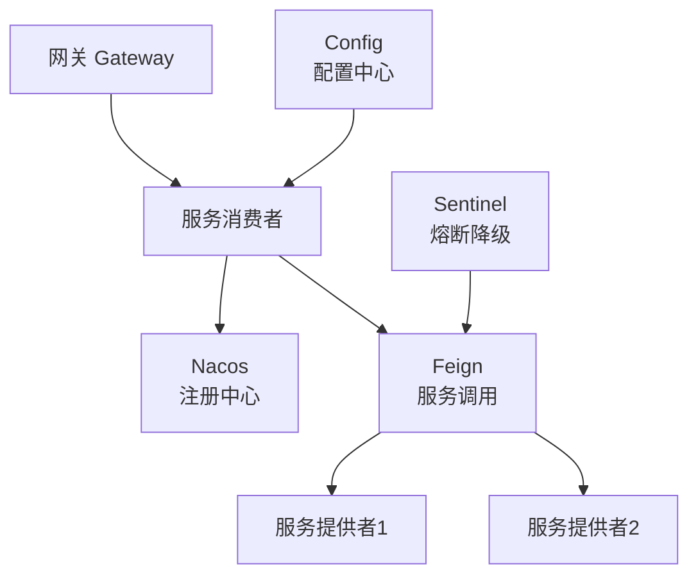
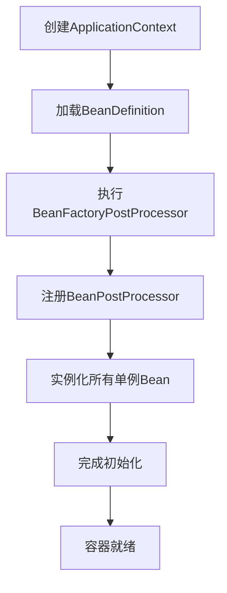

# Spring全家桶核心面试笔记

> 黑马程序员Java面试专题 + 小林coding面试题整理 | 难度星级：★~★★★★★ | 面试频率：高/中/低

---

## 目录

1. [Spring核心IoC](#1-spring核心ioc)
2. [Spring AOP](#2-spring-aop)
3. [Spring事务](#3-spring事务)
4. [Spring循环依赖](#4-spring循环依赖)
5. [SpringMVC](#5-springmvc)
6. [SpringBoot自动装配](#6-springboot自动装配)
7. [SpringCloud核心组件](#7-springcloud核心组件)
8. [SpringBeanFactory与FactoryBean](#8-springbeanfactory与factorybean)
9. [高频面试题补充](#9-高频面试题补充)

---

## 1. Spring核心IoC

### 1.1 IoC控制反转 ★★★★☆



**IoC好处**：
- 降低对象耦合
- 便于单元测试
- 提高可维护性

### 1.2 BeanFactory vs ApplicationContext ★★★☆☆

| 对比项 | BeanFactory | ApplicationContext |
|--------|-------------|-------------------|
| 加载时机 | 延迟加载 | 即时加载 |
| 功能 | 基础 | 更丰富 |
| 适用场景 | 移动设备 | 企业应用 |

### 1.3 Bean生命周期 ★★★★★（高频）

```mermaid
flowchart TD
    A[1.实例化\n构造函数] --> B[2.属性填充\n@Autowired注入]
    B --> C{3.初始化阶段}
    C --> C1[BeanNameAware]
    C1 --> C2[BeanFactoryAware]
    C2 --> C3[ApplicationContextAware]
    C3 --> C4[BeanPostProcessor\n前置处理]
    C4 --> C5[@PostConstruct]
    C5 --> C6[InitializingBean\nafterPropertiesSet]
    C6 --> C7[自定义init-method]
    C7 --> C8[BeanPostProcessor\n后置处理]
    C8 --> D[4.使用]
    D --> E[5.销毁]
    E --> E1[@PreDestroy]
    E1 --> E2[DisposableBean\ndestroy]
    E2 --> E3[自定义destroy-method]
```

### 1.4 依赖注入方式 ★★★★☆

| 方式 | 特点 | 推荐度 |
|------|------|--------|
| 构造器注入 | 强制依赖，不可变 | ⭐⭐⭐⭐⭐ |
| Setter注入 | 可选依赖 | ⭐⭐⭐ |
| 字段注入 | 简洁但难测试 | ⭐ |

### 1.5 @Autowired vs @Resource vs @Inject ★★★★☆

| 注解 | 来源 | 匹配方式 |
|------|------|----------|
| @Autowired | Spring | byType → byName |
| @Resource | JSR250 | byName → byType |
| @Inject | JSR330 | byType |

---

## 2. Spring AOP

### 2.1 AOP核心概念 ★★★★☆



**五类通知**：

| 通知类型 | 执行时机 |
|----------|----------|
| @Before | 目标方法前 |
| @AfterReturning | 目标方法返回后 |
| @AfterThrowing | 目标方法异常后 |
| @After | 目标方法后（finally） |
| @Around | 环绕通知 |

### 2.2 通知执行顺序 ★★★★★（高频）

```mermaid
flowchart TD
    A[@Around前置] --> B[@Before]
    B --> C[目标方法执行]
    C --> D{异常?}
    D -->|无| E[@AfterReturning]
    D -->|有| F[@AfterThrowing]
    E --> G[@After]
    F --> G
    G --> H[@Around后置]
```

### 2.3 Spring AOP vs AspectJ

| 对比项 | Spring AOP | AspectJ |
|--------|------------|---------|
| 织入时机 | 运行时 | 编译时/加载时 |
| 代理方式 | 动态代理 | 字节码修改 |
| 功能范围 | 方法级别 | 更广泛 |

### 2.4 JDK动态代理 vs CGLIB代理 ★★★★★（高频）

| 对比项 | JDK动态代理 | CGLIB代理 |
|--------|-------------|-----------|
| 实现方式 | 实现接口 | 继承父类 |
| 原理 | Java反射 | 字节码生成 |
| 性能 | 较慢 | 较快 |
| 适用场景 | 实现了接口的类 | 未实现接口的类 |

**Spring选择规则**：
- 目标类实现了接口：默认使用JDK动态代理
- 目标类未实现接口：使用CGLIB代理
- 可以通过`proxy-target-class="true"`强制使用CGLIB

---

## 3. Spring事务

### 3.1 事务隔离级别 ★★★★★（高频）

| 隔离级别 | 说明 | 脏读 | 不可重复读 | 幻读 |
|----------|------|------|-----------|------|
| DEFAULT | 使用数据库默认 | - | - | - |
| READ_UNCOMMITTED | 未提交读 | 可能 | 可能 | 可能 |
| READ_COMMITTED | 已提交读 | 不可能 | 可能 | 可能 |
| REPEATABLE_READ | 可重复读 | 不可能 | 不可能 | 可能 |
| SERIALIZABLE | 串行化 | 不可能 | 不可能 | 不可能 |

**MySQL默认**：REPEATABLE_READ
**Oracle默认**：READ_COMMITTED

### 3.2 事务传播行为 ★★★★★（高频）

| 传播行为 | 说明 |
|----------|------|
| REQUIRED | 有事务加入，无则创建（默认） |
| REQUIRES_NEW | 每次创建新事务，挂起当前 |
| SUPPORTS | 有事务加入，无则无事务 |
| NOT_SUPPORTED | 无事务执行，挂起当前 |
| MANDATORY | 必须有事务，否则异常 |
| NEVER | 必须无事务，否则异常 |
| NESTED | 嵌套事务，Savepoint |

**NESTED vs REQUIRES_NEW**：
- REQUIRES_NEW：完全独立的事务，内外事务回滚互不影响
- NESTED：嵌套事务，外事务回滚会导致内事务回滚，但内事务回滚不会影响外事务

### 3.3 @Transactional失效场景 ★★★★★（高频）



**详细失效场景**：

1. **非public方法**：`@Transactional`只对public方法生效
2. **自调用**：`this.xxx()`绕过了代理，直接调用同类其他@Transactional方法
3. **异常被吞**：catch块中没有重新抛出异常
4. **异常类型不匹配**：默认只对RuntimeException回滚，需指定rollbackFor
5. **同类内部调用**：同类中一个方法调用另一个@Transactional方法
6. **传播行为不当**：NESTED在某些数据库不支持

**解决自调用问题**：
```java
// 方案1：注入自身
@Autowired
private MyService self;

// 方案2：获取代理对象
((MyService)AopContext.currentProxy()).xxx();
```

---

## 4. Spring循环依赖

### 4.1 什么是循环依赖 ★★★★☆



```java
@Service
public class A {
    @Autowired private B b;
}

@Service
public class B {
    @Autowired private A a;
}
```

**三种循环依赖场景**：
| 场景 | 能否解决 |
|------|----------|
| 构造器注入 | 不能解决 |
| prototype作用域setter注入 | 不能解决 |
| 单例setter注入 | 可以解决（三级缓存） |

### 4.2 三级缓存解决循环依赖 ★★★★★（高频）



**三级缓存详解**：

| 缓存 | 作用 | 存储内容 |
|------|------|----------|
| singletonObjects（一级） | 最终存储完整Bean | 完全初始化好的Bean |
| earlySingletonObjects（二级） | 临时存储早期Bean | 已实例化但未初始化的Bean |
| singletonFactories（三级） | 存储工厂，按需生成 | ObjectFactory工厂对象 |

**解决流程（AB循环依赖）**：

1. 创建A，实例化后暴露ObjectFactory到三级缓存
2. 注入B时发现需要B，开始创建B
3. B实例化后暴露ObjectFactory到三级缓存
4. B注入A时，从三级缓存获取A的ObjectFactory
5. 调用ObjectFactory.getObject()获取A的早期引用
6. 将早期引用存入二级缓存，删除三级缓存中的A
7. B创建完成，存入一级缓存
8. A继续创建，获取到B，完成注入和初始化
9. A存入一级缓存，删除二级缓存中的A

### 4.3 为什么需要三级缓存？ ★★★☆☆

**只用二级缓存不行吗？**

答案是不行。核心原因是为了**正确处理AOP代理**。

**场景分析**：假设A需要被代理（加了@Transactional）

1. 如果只有二级缓存：
   - B创建时从二级缓存获取A的早期引用
   - 这个引用是A的原始对象（非代理）
   - A初始化完成后生成代理对象
   - 结果：B持有的A是原始对象，而容器中的A是代理对象
   - **单例对象不一致！**

2. 三级缓存的作用：
   - ObjectFactory.getObject()会判断是否需要生成代理
   - 如果需要，提前生成代理对象放入二级缓存
   - 这样B获取到的就是代理对象
   - A初始化完成后直接使用代理对象，保证单例一致性

**三级缓存的本质**：延迟代理对象的生成，保证循环依赖时获取到的是最终形态的对象。

### 4.4 循环依赖解决方案深入 ★★★★★（高频）

**构造器循环依赖为什么不能解决？**

构造器注入需要在构造函数中获取依赖对象，而此时对象尚未创建完成，无法暴露早期引用，导致死循环。

**prototype作用域循环依赖为什么不能解决？**

prototypeBean每次获取都会创建新实例，Spring不会缓存这类Bean，因此无法提前暴露引用。

---

## 5. SpringMVC

### 5.1 DispatcherServlet处理流程 ★★★★★（高频）



**九大组件**：

| 组件 | 作用 |
|------|------|
| HandlerMapping | 根据URL找Handler |
| HandlerAdapter | 执行Handler |
| HandlerExceptionResolver | 异常处理 |
| ViewResolver | 解析视图名 |
| RequestToViewNameTranslator | 获取viewName |
| LocaleResolver | 国际化 |
| ThemeResolver | 主题解析 |
| MultipartResolver | 文件上传 |
| FlashMapManager | 重定向数据传递 |

---

## 6. SpringBoot自动装配

### 6.1 @SpringBootApplication注解 ★★★★☆

```java
@SpringBootApplication
├── @Configuration      // 配置类
├── @EnableAutoConfiguration  // 开启自动装配
└── @ComponentScan     // 组件扫描
```

### 6.2 自动装配原理 ★★★★★（高频）

```mermaid
flowchart TD
    A[@SpringBootApplication] --> B[@EnableAutoConfiguration]
    B --> C[SpringFactoriesLoader]
    C --> D[加载META-INF/spring.factories]
    D --> E[读取EnableAutoConfiguration类]
    E --> F[@Conditional条件筛选]
    F --> G[注册@Bean到容器]
```

**自动装配流程详解**：

1. **@EnableAutoConfiguration**触发自动装配
2. **SpringFactoriesLoader**从`META-INF/spring.factories`加载配置
3. 读取所有`EnableAutoConfiguration`对应的类
4. 通过`@Conditional`条件筛选符合条件的配置类
5. 将符合条件的`@Bean`方法注册到容器

**spring.factories示例**：
```properties
# org.springframework.boot.autoconfigure.EnableAutoConfiguration
org.springframework.boot.autoconfigure.AutoConfigureOrder=\
org.springframework.boot.autoconfigure.EnableAutoConfiguration=\
org.springframework.boot.autoconfigure.web.servlet.WebMvcAutoConfiguration
```

### 6.3 @Conditional条件注解 ★★★★☆

| 条件注解 | 作用 |
|----------|------|
| @ConditionalOnClass | 存在指定类时生效 |
| @ConditionalOnMissingClass | 不存在指定类时生效 |
| @ConditionalOnBean | 存在指定Bean时生效 |
| @ConditionalOnMissingBean | 不存在指定Bean时生效 |
| @ConditionalOnProperty | 配置属性满足条件时生效 |
| @ConditionalOnWebApplication | 是Web应用时生效 |

### 6.4 Starter原理 ★★★☆☆



**Starter标准结构**：
```
xxx-spring-boot-starter/
├── pom.xml
└── src/main/resources/
    └── META-INF/
        └── spring/org.springframework.boot.autoconfigure.AutoConfiguration.imports
```

---

## 7. SpringCloud核心组件

### 7.1 微服务架构图 ★★★☆☆



### 7.2 Eureka vs Nacos CAP对比 ★★★★☆

| 对比项 | Eureka | Nacos |
|--------|--------|-------|
| CAP定理 | AP | CP+AP可切换 |
| 一致性 | 最终一致 | 强一致/最终一致 |
| 服务健康检查 | 心跳检测 | TCP/HTTP/MYSQL |
| 雪崩保护 | 有 | 有 |

### 7.3 Feign原理 ★★★☆☆

```mermaid
flowchart LR
    A[启动时] --> B[扫描@FeignClient接口]
    B --> C[创建动态代理对象]
    C --> D[请求时通过代理]
    D --> E[封装HTTP请求]
    E --> F[通过Ribbon负载均衡]
    F --> G[调用目标服务]
```

### 7.4 Sentinel vs Hystrix

| 对比项 | Sentinel | Hystrix |
|--------|----------|---------|
| 隔离策略 | 信号量隔离 | 线程池隔离 |
| 熔断降级 | 基于慢调用/异常比例 | 基于异常比例 |
| 实时指标 | 多维度 | 简单统计 |

---

## 8. SpringBeanFactory与FactoryBean

### 8.1 概念区分 ★★★★★（高频面试题）

| 对比项 | BeanFactory | FactoryBean |
|--------|-------------|-------------|
| 本质 | 容器接口，Spring IOC基础 | Bean实例化的工厂Bean |
| 作用 | 管理Bean生命周期 | 定制Bean创建过程 |
| 获取方式 | getBean() | getBean()获取到的是getObject()返回的对象 |
| 典型使用 | ApplicationContext继承它 | 第三方框架集成 |

### 8.2 BeanFactory接口 ★★★★☆

```java
public interface BeanFactory {
    // 根据名称获取Bean
    Object getBean(String name);

    // 根据名称和类型获取Bean
    <T> T getBean(String name, Class<T> requiredType);

    // 判断是否存在
    boolean containsBean(String name);

    // 获取Bean类型
    Class<?> getType(String name);

    // 判断是否为单例
    boolean isSingleton(String name);
}
```

**常见实现类**：
- `DefaultListableBeanFactory`：最常用的实现
- `XmlBeanFactory`：已废弃，从XML加载
- `ApplicationContext`：BeanFactory的子接口，提供更多企业级功能

### 8.3 FactoryBean接口 ★★★★★（高频面试题）

```java
public interface FactoryBean<T> {
    // 返回创建的对象
    T getObject();

    // 返回创建对象的类型
    Class<?> getObjectType();

    // 是否为单例
    default boolean isSingleton() {
        return true;
    }
}
```

**FactoryBean vs BeanFactory**：

```
BeanFactory IOC容器    →  getBean() 获取的是容器创建的Bean
FactoryBean工厂Bean   →  getBean() 获取的是 getObject() 返回的对象
```

**FactoryBean使用场景**：

1. **第三方框架集成**：MyBatis的`SqlSessionFactoryBean`、Shiro的`RealmFactoryBean`
2. **定制Bean创建逻辑**：创建复杂对象、代理对象
3. **延迟加载**：延缓Bean的创建时机

### 8.4 FactoryBean实现示例 ★★★★☆

```java
// 实现FactoryBean
@Component
public class MyFactoryBean implements FactoryBean<User> {

    @Override
    public User getObject() {
        // 定制创建逻辑
        User user = new User();
        user.setName("factoryCreated");
        return user;
    }

    @Override
    public Class<?> getObjectType() {
        return User.class;
    }

    @Override
    public boolean isSingleton() {
        return true;
    }
}

// 测试
@Autowired
private BeanFactory beanFactory;

// 获取FactoryBean本身（加&前缀）
MyFactoryBean factoryBean = (MyFactoryBean) beanFactory.getBean("&myFactoryBean");

// 获取FactoryBean创建的Bean
User user = (User) beanFactory.getBean("myFactoryBean");
```

### 8.5 Spring内部常用FactoryBean ★★★☆☆

| FactoryBean | 作用 |
|-------------|------|
| SqlSessionFactoryBean | 创建MyBatis的SqlSessionFactory |
| ProxyFactoryBean | 创建AOP代理 |
| WebClient.Builder | 创建响应式WebClient |
| PlatformTransactionManager | 获取事务管理器 |

---

## 9. 高频面试题补充

### 9.1 Spring框架设计模式 ★★★☆☆

| 设计模式 | 应用场景 |
|----------|----------|
| 工厂模式 | BeanFactory创建Bean |
| 单例模式 | Spring Bean默认单例 |
| 代理模式 | Spring AOP |
| 模板方法模式 | JdbcTemplate、HibernateTemplate |
| 适配器模式 | HandlerAdapter |
| 观察者模式 | 事件驱动模型 |
| 装饰器模式 | BufferedReaderDecorator |

### 9.2 Spring是单例还是多例？线程安全问题 ★★★★☆

**默认单例**：Spring容器中的Bean默认是单例的。

**线程安全问题**：
- 单例Bean如果存在可变共享状态（如实例变量），多线程环境下会存在线程安全问题
- 解决方案：
  1. 将Bean设置为prototype（每次创建新实例）
  2. 使用ThreadLocal存储线程本地变量
  3. 保证Bean无状态（不存储可变状态）

### 9.3 Spring启动流程 ★★★☆☆



### 9.4 Spring如何处理依赖冲突 ★★★☆☆

| 冲突类型 | 解决方式 |
|----------|----------|
| @Autowired多个匹配 | byName补充 |
| @Primary指定优先 | @Primary的Bean优先 |
| @Priority指定优先级 | 数值越小越优先 |
| 同名Bean覆盖 | 后注册的覆盖先注册的 |

### 9.5 @ComponentScan扫描规则 ★★★☆☆

```java
@ComponentScan(
    basePackages = {"com.example"},  // 扫描包路径
    includeFilters = {},              // 包含的过滤器
    excludeFilters = {},              // 排除的过滤器
    useDefaultFilters = true          // 是否使用默认过滤器
)
```

**默认扫描**：`@Component`、`@Repository`、`@Service`、`@Controller`、`@Configuration`

---

## 附录：面试高频问题速查

| 优先级 | 问题 | 答案要点 |
|--------|------|----------|
| ★★★★★ | Bean生命周期 | 实例化→属性填充→初始化→销毁 |
| ★★★★★ | 循环依赖解决 | 三级缓存，提前暴露早期引用 |
| ★★★★★ | AOP通知顺序 | Around→Before→目标→Around→After |
| ★★★★★ | @Transactional失效 | 非public/自调用/异常被吞 |
| ★★★★★ | SpringBoot自动装配 | @EnableAutoConfiguration |
| ★★★★★ | BeanFactory vs FactoryBean | 容器接口 vs 工厂Bean |
| ★★★★☆ | IoC/DI | 控制反转/依赖注入 |
| ★★★★☆ | 事务传播行为 | 7种，REQUIRED最常用 |
| ★★★★☆ | 事务隔离级别 | 5种，MySQL默认REPEATABLE_READ |
| ★★★★☆ | 三级缓存详解 | 一级完整Bean/二级早期Bean/三级工厂 |
| ★★★☆☆ | Eureka vs Nacos | CAP定理，支持模式 |

---

## 小林coding面试高频追问

### Q1：Spring为什么用三级缓存而不是二级？

**参考答案**：
核心是为了正确处理AOP代理。如果只用二级缓存，当B依赖A时，B获取到的是A的原始对象。但A在初始化完成后才会生成代理对象，导致B持有的A和容器中的A不一致，违反单例原则。

三级缓存的ObjectFactory会在getObject()时判断是否需要生成代理，如果需要则提前生成代理放入二级缓存，保证循环依赖时获取的是最终形态。

### Q2：@Transactional的rollbackFor为什么不指定Throwable？

**参考答案**：
指定Throwable会导致所有异常都回滚，包括IOException等checked异常。但实际业务中很多checked异常是需要捕获处理的，不应该直接回滚。默认的RuntimeException回滚策略更符合实际业务需求。

### Q3：构造器注入为什么推荐？

**参考答案**：
1. 保证依赖不为null，编译期就能发现问题
2. 依赖不可变（final字段）
3. 测试友好，无需Spring容器也能测试
4. 避免循环依赖问题（构造器循环依赖本身就不能解决）

### Q4：SpringBoot和SpringMVC什么关系？

**参考答案**：
- SpringMVC是Web框架，处理Web请求
- SpringBoot是自动配置工具，简化Spring配置
- SpringBoot自动配置了SpringMVC（WebMvcAutoConfiguration）
- 关系：SpringBoot ⊃ SpringMVC（Boot自动配置了MVC）

---

> **笔记说明**：本笔记根据黑马程序员Spring面试课程和小林coding面试题整理，涵盖Spring全家桶核心面试知识点。使用mermaid图解便于理解，建议面试前快速回顾。
