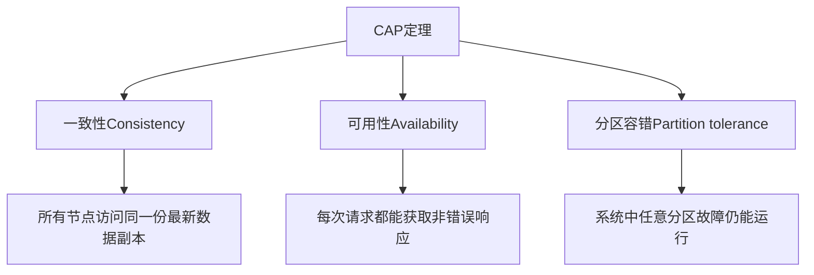
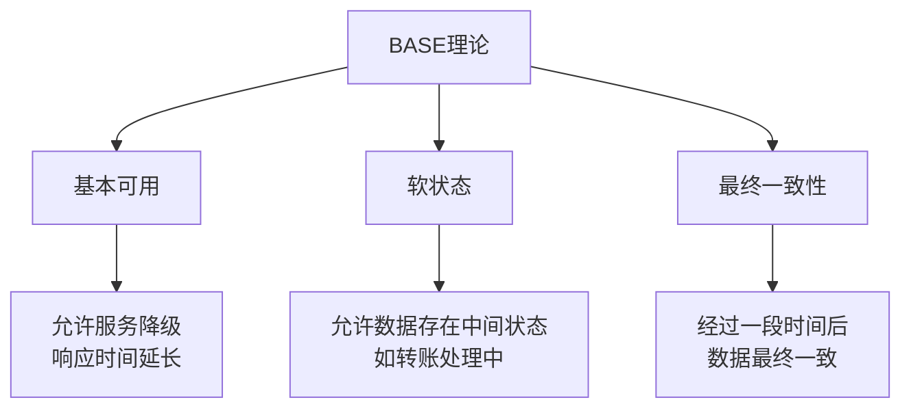
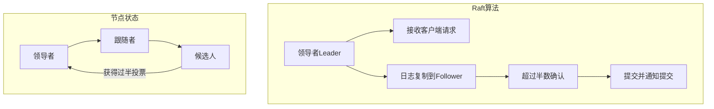
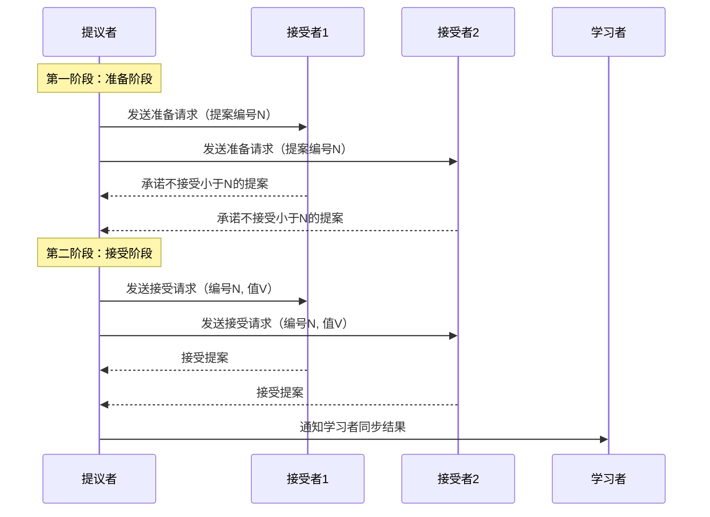
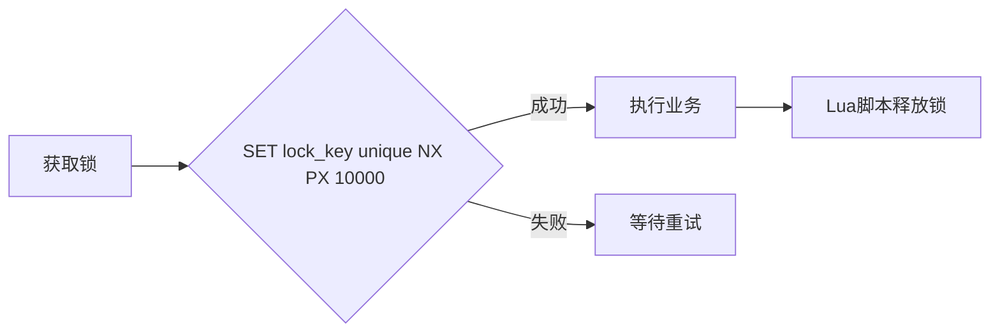
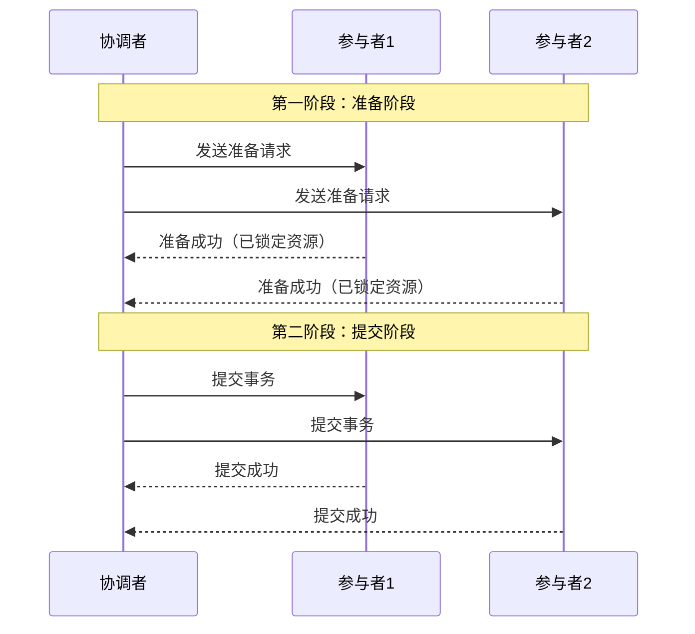
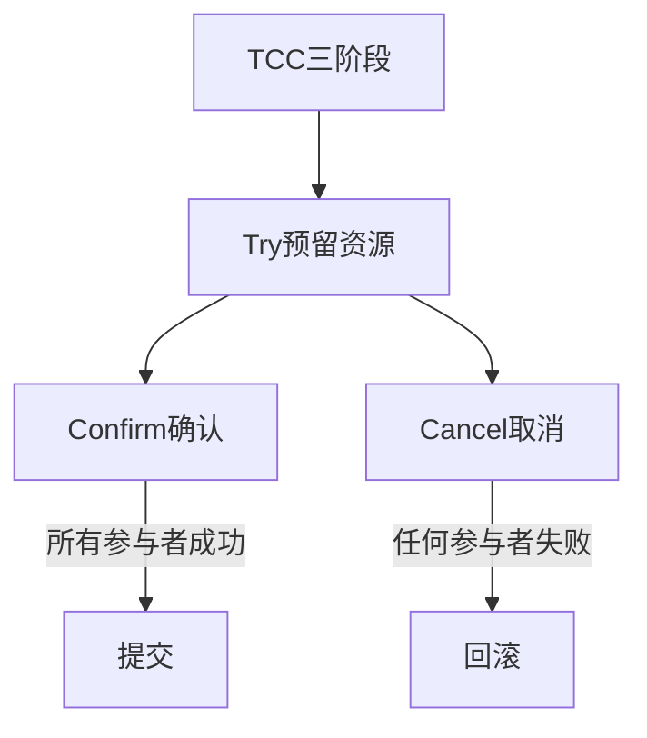
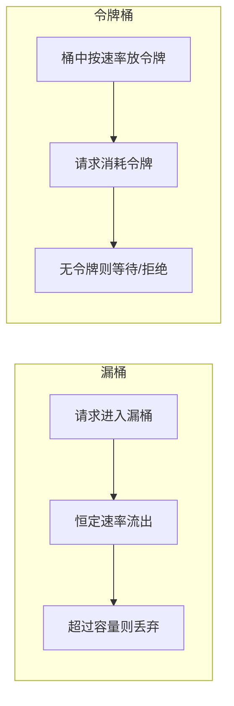
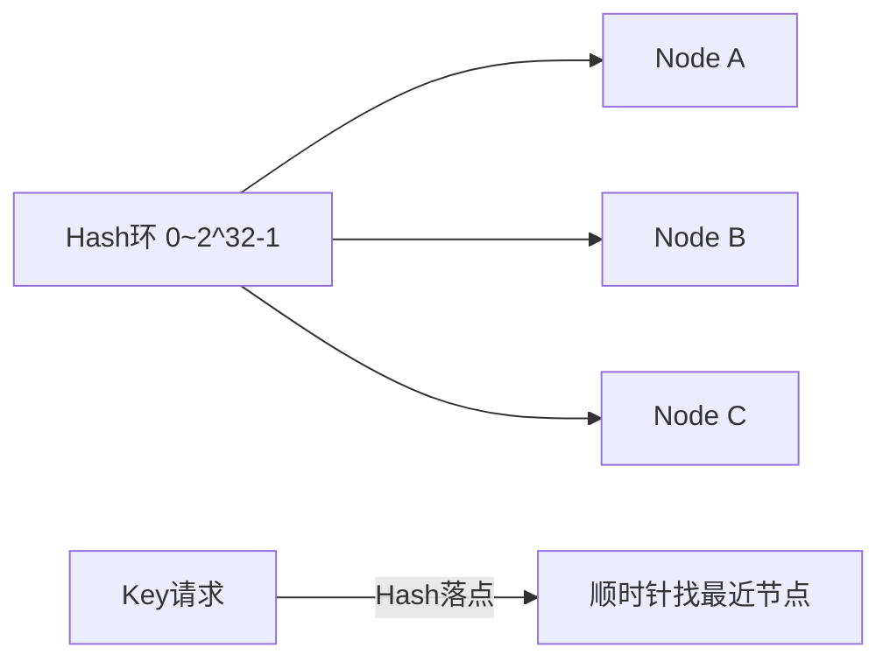

# 分布式核心面试知识点

> 小林coding x 黑马程序员 | 难度星级：★~★★★★★ | 面试频率：高/中/低

---

## 目录

1. [CAP定理](#1-cap定理)
2. [BASE理论](#2-base理论)
3. [一致性协议](#3-一致性协议)
4. [负载均衡策略](#4-负载均衡策略)
5. [分布式锁与分布式ID](#5-分布式锁与分布式id)
6. [分布式事务](#6-分布式事务)
7. [分布式限流算法](#7-分布式限流算法)
8. [高频面试题](#8-高频面试题)

---

## 1. CAP定理 ★★★

### CAP原则



**CAP原则**：在一个分布式系统中，**一致性、可用性、分区容错性**三者不可得兼。

### CAP三选二

| 组合 | 结果 | 适用场景 |
|------|------|----------|
| **CA** | 放弃分区容错 | 单机数据库 |
| **CP** | 放弃可用性 | Zookeeper、HBase |
| **AP** | 放弃一致性 | Eureka、Cassandra |

**为什么必须选P？**
- 网络分区在分布式系统中不可避免
- 分区时必须在C和A之间做出选择

---

## 2. BASE理论 ★★★

### BASE理论核心思想

**核心思想**：既然强一致性太难做到，那就牺牲短暂的一致性，换取系统的高可用和高性能。



### 三个概念

| 概念 | 说明 |
|------|------|
| **Basically Available** | 允许系统在故障时损失部分可用性，如电商大促时关闭退款功能 |
| **Soft State** | 允许数据存在中间状态，如跨行转账时"处理中" |
| **Eventually Consistent** | 经过一段时间后，所有节点数据最终一致 |

### BASE vs CAP

- **CAP**：强一致性，任何时刻都要一致
- **BASE**：允许暂时不一致，最终一致即可
- **实践**：绝大多数互联网架构采用BASE，如消息队列异步处理、缓存等

---

## 3. 一致性协议 ★★★★

### 3.1 Raft算法

**核心思想**：把一致性过程拆成三个部分：**选主、日志复制、安全性保证**



**选主过程：**
1. 跟随者一段时间没收到领导者的心跳，变成候选人
2. 候选人给自己投票，再向其他节点拉票
3. 拿到**超过半数的投票**成为新的领导者

**日志复制：**
1. 客户端请求发给领导者，领导者把操作写成日志
2. 同步给所有跟随者，等**超过半数节点确认**
3. 领导者提交，通知所有跟随者一起提交

**应用场景：** etcd、Kubernetes等

### 3.2 Paxos协议

**核心思想**：解决"**多个节点协同，最终达成同一个决策**"的问题

**三个核心角色：**
- **提议者（Proposer）**：发起提案的节点
- **接受者（Acceptor）**：负责接收提案、投票决定
- **学习者（Learner）**：不参与投票，只同步最终结果

**两阶段提交流程：**



### 3.3 ZAB协议

**核心**：ZooKeeper专门设计的分布式一致性协议

**集群节点角色：**
- **Leader**：接收写请求、发指令
- **Follower**：参与投票和数据同步
- **Observer**：不参与投票，只同步数据

**两种工作模式：**

| 模式 | 说明 |
|------|------|
| **广播模式** | 正常工作，Leader同步提案到Follower，半数确认后提交 |
| **崩溃恢复** | Leader挂了，重新选举新Leader，同步日志 |

### Raft vs Paxos vs ZAB对比

| 对比项 | Raft | Paxos | ZAB |
|--------|------|-------|-----|
| **应用场景** | etcd、K8s | 理论协议 | ZooKeeper |
| **易理解性** | 简单 | 复杂 | 中等 |
| **选主方式** | 候选人获取过半投票 | 多数派acceptor同意 | Leader崩溃后选举 |
| **日志复制** | Leader同步，半数确认 | 类似Raft | 与Raft类似 |

---

## 4. 负载均衡策略 ★★★

### 常见负载均衡算法

| 算法 | 原理 | 优点 | 缺点 |
|------|------|------|------|
| **轮询** | 依次分配给每台服务器 | 简单、公平 | 不考虑服务器性能差异 |
| **加权轮询** | 按权重比例分配 | 支持性能差异 | 需要手动配置权重 |
| **最少连接** | 分配给当前连接数最少的 | 动态平衡 | 需要维护连接数 |
| **IP哈希** | 对客户端IP做哈希取模 | 同一IP访问同一服务器 | 可能导致负载不均 |
| **随机** | 随机选择服务器 | 实现简单 | 无状态关联 |

**实际应用：** Nginx、Dubbo、Spring Cloud Ribbon等

---

## 5. 分布式锁与分布式ID ★★★★★

### 5.1 分布式锁

**Redis实现分布式锁：**



**三个条件：**
1. **加锁原子性**：`SET lock_key unique_value NX PX 10000`
2. **锁过期时间**：避免客户端异常无法释放锁
3. **唯一标识**：值使用UUID，确保只有加锁客户端才能解锁

**Zookeeper实现分布式锁：**
1. 创建持久节点 `/locks`
2. 创建临时有序节点
3. 判断当前节点是否为最小节点：如果是，获取锁；如果不是，监听前一个节点
4. 业务完成后delete当前节点释放锁

**对比：** Zookeeper是强一致性（CP），Redis是最终一致性性能更好

### 5.2 分布式ID

**什么时候需要分布式ID？**

| 场景 | 说明 |
|------|------|
| **数据库分库分表** | 原来单表自增ID失效，不同表ID可能重复 |
| **高并发微服务** | UUID无序，会导致MySQL B+树"页分裂"，写入性能差 |
| **多系统数据合并** | 不同系统各自用自增ID，合并时ID冲突 |

**分布式ID生成方案：**

| 方案 | 优点 | 缺点 | 适用场景 |
|------|------|------|----------|
| **UUID** | 本地生成、全球唯一 | 无序、占用空间大 | 日志追踪等非核心场景 |
| **数据库号段模式** | 稳定、开发成本低 | 依赖数据库 | 普通公司业务 |
| **Redis INCR** | 速度快、纯数字递增 | 依赖Redis集群 | 中等并发场景 |
| **雪花算法** | 本地生成、不依赖外部 | 时钟回拨问题 | 高并发核心系统 |

**雪花算法原理：**
```
64位 = 时间戳(41位) + 机器号(10位) + 序列号(12位)
```
- 开头存时间戳，ID趋势递增
- 中间存机器号，全网不重复
- 末尾存序列号，支持同一毫秒内多ID

---

## 6. 分布式事务 ★★★★★

### 什么情况下需要分布式事务？

- **微服务跨服务协同**：订单服务+库存服务+账户服务，必须同时成功或回滚
- **分库分表**：一个方法内操作多个数据库实例

### 分布式事务解决方案对比

| 方案 | 一致性 | 性能 | 复杂度 | 适用场景 |
|------|--------|------|--------|----------|
| **2PC** | 强一致性 | 低 | 中 | 传统数据库、XA协议 |
| **3PC** | 强一致性 | 中低 | 高 | 需减少阻塞的强一致场景 |
| **TCC** | 最终一致性 | 高 | 高 | 高并发业务（支付、库存） |
| **Saga** | 最终一致性 | 中 | 高 | 长事务、跨服务流程 |
| **消息队列** | 最终一致性 | 高 | 中 | 事件驱动架构 |
| **本地消息表** | 最终一致性 | 中 | 低 | 异步通知（订单-积分） |

### 2PC两阶段提交



**缺点**：单点故障、资源锁导致并发性能低

### TCC模式



**适用场景**：电商订单、库存管理等高并发场景

### 本地消息表 + MQ


---

## 7. 分布式限流算法 ★★★★

### 四种限流算法对比

| 算法 | 原理 | 优点 | 缺点 |
|------|------|------|------|
| **固定窗口** | 固定时间窗口内计数 | 简单 | 有流量突刺问题 |
| **滑动窗口** | 时间轴上滑动计算 | 解决突刺问题 | 实现复杂 |
| **漏桶** | 恒定速率流出 | 平滑流量 | 不能处理突发 |
| **令牌桶** | 桶中按速率放入令牌 | 可处理一定突发 | 推荐使用 |

### 令牌桶 vs 漏桶



**关键区别**：
- 漏桶：匀速处理，不支持突发
- 令牌桶：桶满时允许一定程度的突发流量

---

## 8. 高频面试题 ★★★~★★★★★

### Q1：分布式和微服务有什么区别？

**参考答案**：
- **分布式**：物理部署方式，解决单台机器性能扛不住的问题
- **微服务**：软件架构设计思想，解决系统代码堆积难以维护的问题
- **联系**：微服务架构天然需要分布式方式部署

### Q2：如何解决分布式Session一致性问题？

**参考答案**：
1. **Session复制**：多台服务器间同步Session（浪费内存）
2. **Session集中存储**：存入Redis（推荐，性能高）
3. **Cookie存储**：安全性低、有大小限制
4. **Token机制**：使用JWT等Token代替Session（推荐，无状态）

### Q3：什么是服务雪崩？如何解决？

**参考答案**：

**服务雪崩**：当系统中的一个服务故障，导致调用它的其他服务也相继故障，最终整个系统瘫痪。

**解决方案：**

| 方案 | 原理 |
|------|------|
| **熔断器** | 失败率超过阈值，快速返回错误 |
| **限流** | 控制进入系统的请求速率 |
| **隔离** | 线程池或信号量隔离不同服务调用 |
| **超时控制** | 设置调用超时时间，避免无限等待 |

### Q4：一致性Hash算法了解吗？

**参考答案**：

**解决分布式缓存数据倾斜问题**



**解决数据倾斜**：引入虚拟节点，为每个真实节点分配多个虚拟节点

### Q5：Zookeeper的Watch机制是什么原理？

**参考答案**：
1. 客户端可以在某个Znode上注册一个Watcher
2. 当该Znode的状态发生变化时
3. Zookeeper向客户端发送一条通知
4. **Watch只能被触发一次**，需要重新注册

### Q6：如何实现分布式配置管理？

**参考答案**：
1. **Zookeeper**：存储在Znode中，利用Watch机制通知变更
2. **Apollo**：携程开源，支持配置变更实时推送、历史版本管理
3. **Nacos**：阿里巴巴开源，支持配置管理和服务发现
4. **Spring Cloud Config**：Spring Cloud生态的配置中心

### Q7：Raft和ZAB协议有什么区别？

| 区别 | Raft | ZAB |
|------|------|-----|
| **应用场景** | etcd、Kubernetes | ZooKeeper |
| **选主方式** | 候选人获取超过半数投票 | Leader崩溃后重新选举 |
| **日志复制** | Leader同步日志，半数确认提交 | 与Raft类似 |
| **事务ID** | 无专门的zxid | 有zxid保证提案顺序 |

### Q8：如何保证分布式系统的高可用？

**参考答案**：
1. **冗余备份**：多节点部署，避免单点故障
2. **故障检测与自动切换**：心跳机制，自动切换
3. **限流降级**：流量洪峰时自动降级非核心功能
4. **熔断机制**：快速失败，防止雪崩效应
5. **重试机制**：失败请求自动重试（需保证幂等性）

---

## 附录：分布式核心知识点星级

| 难度 | 知识点 |
|------|--------|
| ★★★ | CAP定理、BASE理论、负载均衡策略 |
| ★★★★ | Raft/Paxos/ZAB协议、分布式限流算法 |
| ★★★★★ | 分布式锁、分布式ID、分布式事务、消息队列一致性 |

---

> **笔记说明**：本笔记结合小林coding和黑马程序员整理，涵盖分布式核心面试知识点。建议面试前快速回顾。
