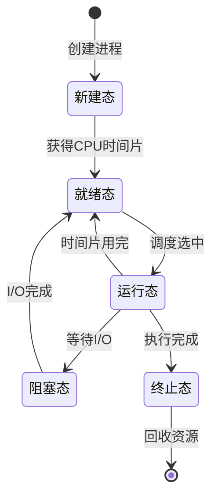
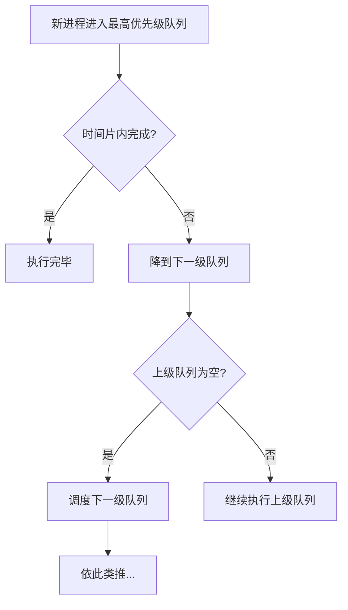
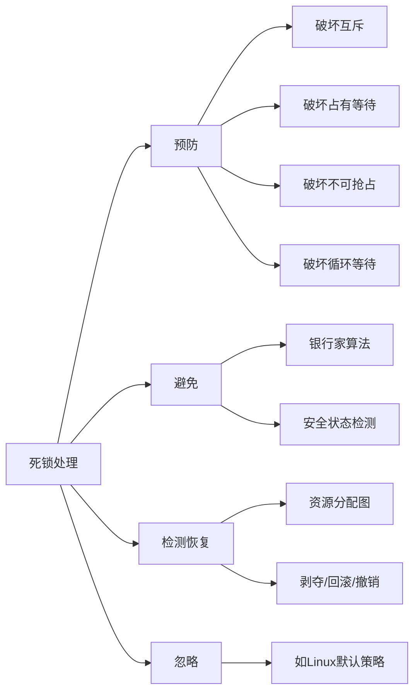
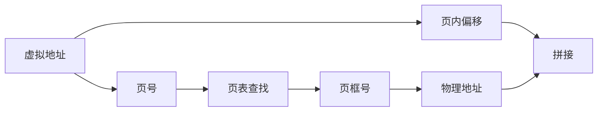
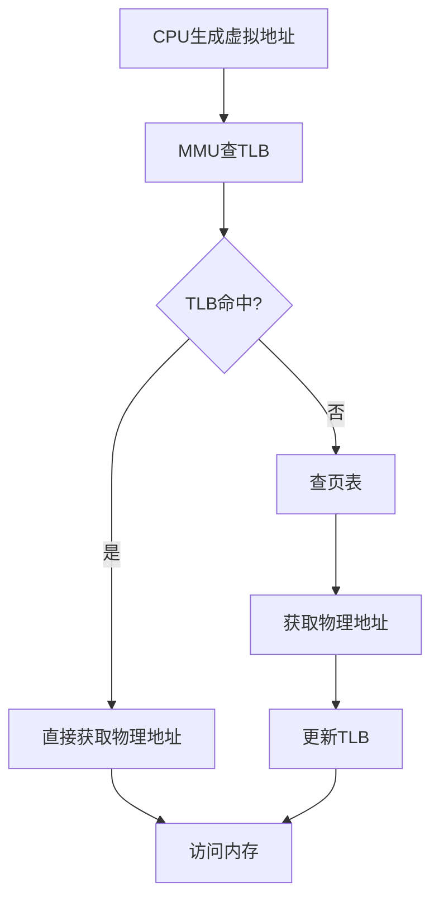
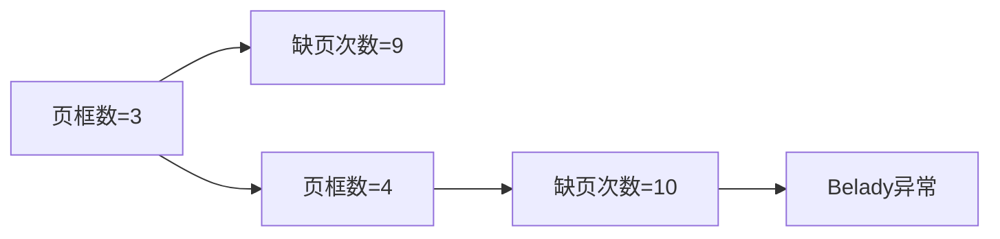

# 操作系统核心面试知识点

> 小林coding x 黑马程序员 | 难度星级：★~★★★★★ | 面试频率：高/中/低

---

## 目录

1. [进程与线程区别](#1-进程与线程区别)
2. [进程状态转换](#2-进程状态转换)
3. [进程调度算法](#3-进程调度算法)
4. [死锁原因与处理](#4-死锁原因与处理)
5. [内存管理](#5-内存管理)
6. [页面置换算法](#6-页面置换算法)
7. [高频面试题](#7-高频面试题)

---

## 1. 进程与线程区别 ★★☆

### 核心对比

| 对比维度 | 进程 | 线程 |
|---------|------|------|
| **定义** | 资源分配的基本单位 | CPU调度的基本单位 |
| **资源拥有** | 拥有独立地址空间 | 共享进程资源 |
| **开销** | 创建/切换开销大 | 创建/切换开销小 |
| **通信** | 需IPC机制 | 直接读写共享内存 |
| **独立性** | 进程间相互隔离 | 线程共享地址空间 |

### 为什么线程切换比进程快？

- 线程共享进程的代码段、数据段、打开的文件等资源
- 线程切换只需切换寄存器和栈，不涉及地址空间切换
- 进程切换需要切换页表、切换内核态堆栈

### 进程间通信方式

| 方式 | 说明 |
|------|------|
| 管道 | 匿名管道/命名管道 |
| 消息队列 | 消息链表，存储在内核中 |
| 共享内存 | 多进程共享同一块物理内存 |
| 信号量 | PV操作，实现进程同步 |
| Socket | 可跨网络通信 |
| 信号 | 通知进程某个事件发生 |

---

## 2. 进程状态转换 ★★★

### 五状态模型



### 状态说明

| 状态 | 说明 |
|------|------|
| **新建态(New)** | 进程被创建，资源未分配 |
| **就绪态(Ready)** | 获得CPU时间片即可运行 |
| **运行态(Running)** | 正在执行 |
| **阻塞态(Blocked)** | 等待I/O或其他资源 |
| **终止态(Exit)** | 执行完毕，等待回收 |

### 就绪态 vs 阻塞态

- **就绪态**：只缺少CPU资源，其他条件已满足
- **阻塞态**：缺少的不止是CPU，可能在等I/O、信号量等

---

## 3. 进程调度算法 ★★★★

### 批处理系统算法

| 算法 | 说明 | 优缺点 |
|------|------|--------|
| **FCFS** | 先来先服务 | 简单，但会导致短作业等待长作业 |
| **SJF** | 最短作业优先 | 最小化平均等待时间，但会饥饿 |
| **SRTF** | 最短剩余时间优先 | SJF的抢占版本 |

### 交互系统算法

| 算法 | 说明 | 优缺点 |
|------|------|--------|
| **RR** | 时间片轮转 | 公平，但上下文切换频繁 |
| **优先级调度** | 按优先级执行 | 可能导致低优先级饥饿 |
| **多级反馈队列** | 多队列+优先级提升 | 综合表现最优，常用 |

### 多级反馈队列调度原理



### 时间片大小选择

- **时间片太大**：响应时间差，退化为FCFS
- **时间片太小**：上下文切换频繁，系统开销大
- **一般选择**：让80%的进程在时间片内完成

---

## 4. 死锁原因与处理 ★★★★★

### 死锁产生的必要条件

| 条件 | 说明 |
|------|------|
| **互斥条件** | 资源一次只能被一个进程使用 |
| **占有并等待** | 进程已持有资源又请求新资源 |
| **不可抢占** | 已分配资源不能被强制释放 |
| **循环等待** | 形成进程-资源的循环链 |

### 死锁处理策略



### 银行家算法

**核心思想**：在资源分配前检查分配后是否仍处于安全状态

**安全状态判断**：存在一个安全序列使得所有进程都能完成

### 死锁与饥饿的区别

| 概念 | 区别 |
|------|------|
| **死锁** | 一组进程相互等待对方持有的资源，形成循环 |
| **饥饿** | 一个或少数进程长时间得不到资源（但无循环等待） |

### 哲学家就餐问题解决方案

1. 最多允许4个哲学家同时拿左筷子
2. 奇数号先拿左再拿右，偶数号先拿右再拿左
3. 检测到邻居在用餐时不拿筷子

---

## 5. 内存管理 ★★★★

### 分页管理

```
逻辑地址 = 页号 + 页内偏移
物理地址 = 页框号 + 页内偏移
```



| 概念 | 说明 |
|------|------|
| **页** | 逻辑地址空间划分 |
| **页框** | 物理内存划分 |
| **页表** | 页号到页框号的映射 |
| **TLB** | 转换检测缓冲区，高速缓存 |

### 分段管理

```
逻辑地址 = 段号 + 段内偏移
```

| 特点 | 说明 |
|------|------|
| **符合用户视角** | 代码段、数据段、堆、栈 |
| **支持保护** | 不同段可设置不同权限 |
| **支持共享** | 段可被多个进程共享 |

### 虚拟内存

**核心思想**：程序不必全部加载到内存，运行时只加载需要的部分

| 功能 | 说明 |
|------|------|
| **请求分页** | 按需调入页面，支持页面置换 |
| **页面失效** | 访问不在内存的页面时触发 |

### TLB作用



**TLB命中率**：可达90%以上，大大减少内存访问时间

---

## 6. 页面置换算法 ★★★★

### 算法分类

| 算法 | 说明 | 特点 |
|------|------|------|
| **OPT** | 最佳置换算法 | 理论最优，无法实现 |
| **FIFO** | 先进先出 | 简单，但Belady异常 |
| **LRU** | 最近最少使用 | 近似OPT，性能好但开销大 |
| **Clock** | 时钟算法 | LRU的近似实现，权衡性能开销 |
| **LFU** | 最不经常使用 | 淘汰访问频率最低的 |

### FIFO Belady异常



**Belady异常**：增加物理页框数反而导致缺页率增加

### Clock算法原理

1. 循环扫描页面
2. 访问位=0时置换
3. 访问位=1时清零并继续
4. 改进版增加修改位考虑

### 页面抖动

- **定义**：进程频繁调入调出页面
- **原因**：进程数过多/物理内存不足
- **解决**：调节进程数或增加内存

---

## 7. 高频面试题 ★★★~★★★★★

### Q1：进程和线程的区别？

**参考答案**：
- 进程是资源分配的基本单位，线程是CPU调度的基本单位
- 进程有独立地址空间，线程共享进程地址空间
- 进程切换开销大（切换页表、内核栈），线程切换开销小
- 线程间通信更高效（共享内存），进程间通信需要IPC

### Q2：什么是死锁？如何避免？

**参考答案**：
死锁是多个进程因循环等待资源而无法继续执行的现象。

**必要条件**：互斥条件、占有并等待、不可抢占、循环等待

**处理方法**：
1. **预防**：破坏其中一个条件（如资源排序）
2. **避免**：银行家算法检查安全状态
3. **检测恢复**：定期检测并剥夺/回滚
4. **忽略**：如Linux默认策略

### Q3：进程调度算法有哪些？哪个最好？

**参考答案**：
- 批处理：FCFS、SJF、SRTF
- 交互系统：RR、优先级、多级反馈队列
- 实时系统：EDF、RMS

**没有"最好"**：不同场景适合不同算法
- RR适合通用系统（公平）
- 多级反馈队列是综合最优（Unix使用）
- 实时系统用EDF/RMS

### Q4：解释一下虚拟内存？

**参考答案**：
- 虚拟内存让程序访问大于物理内存的地址空间
- 通过MMU将虚拟地址映射到物理地址
- 不常用的页面存储在磁盘（swap）
- 访问不在内存的页面时触发缺页中断，从磁盘调入
- 实现了内存扩展和进程地址空间隔离

### Q5：页面置换算法详解

**参考答案**：
- **OPT**：置换最长时间不再访问的页（理论最优）
- **FIFO**：先进先出，简单但可能Belady异常
- **LRU**：置换最近最久未使用的页，性能好但需硬件支持
- **Clock**：二次chance算法，用访问位近似LRU

### Q6：并发和并行的区别

**参考答案**：
- **并发(Concurrency)**：多个任务交替执行，共享CPU时间片
- **并行(Parallelism)**：多个任务同时执行，需要多CPU核心

> 并发是交替执行，并行是同时执行

### Q7：什么是线程安全？如何实现？

**参考答案**：
线程安全指多个线程访问共享资源时不会产生不确定结果。

**实现方法**：
1. **互斥锁**：mutex、semaphore
2. **无锁编程**：原子操作（CAS）
3. **避免共享**：线程本地存储（TLS）
4. **不可变对象**：对象状态不可修改

### Q8：什么是上下文切换？

**参考答案**：
CPU从一个进程/线程切换到另一个时，保存当前进程状态并恢复另一个进程状态的过程。

**保存内容包括**：寄存器值、程序计数器、栈指针、进程控制块(PCB)

### Q9：什么是快表(TLB)？作用是什么？

**参考答案**：
TLB(Translation Lookaside Buffer)是MMU中的硬件缓存。

**作用**：
- 缓存最近使用的页表项
- 避免每次访存都查页表（减少一次内存访问）
- 命中率可达90%以上
- 加速虚拟地址到物理地址的转换

### Q10：系统调用和库函数的区别？

| 对比 | 系统调用 | 库函数 |
|------|---------|--------|
| 运行空间 | 内核态 | 用户态 |
| 开销 | 大（需切换态） | 小 |
| 功能 | 操作系统核心操作 | 封装常用功能 |
| 示例 | open/read/write | fopen/fread/fprintf |

---

## 附录：知识图谱

```
操作系统
├── 进程管理
│   ├── 进程与线程 ★★
│   ├── 进程状态 ★★★
│   ├── 进程调度 ★★★★
│   ├── 同步互斥 ★★★★
│   └── 死锁 ★★★★★
├── 内存管理
│   ├── 内存分配 ★★★
│   ├── 分页管理 ★★★★
│   ├── 分段管理 ★★★
│   ├── 段页式 ★★★★
│   ├── 虚拟内存 ★★★★
│   └── 页面置换 ★★★★
└── 设备管理
    ├── I/O方式 ★★★
    └── 缓冲区 ★★★★
```

---

> **笔记说明**：本笔记结合小林coding和黑马程序员整理，涵盖操作系统核心面试知识点。建议面试前快速回顾。
