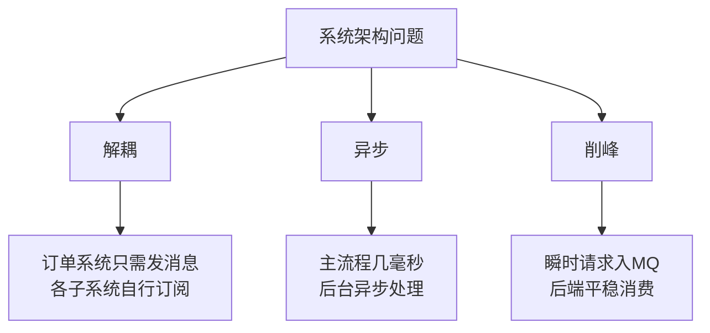
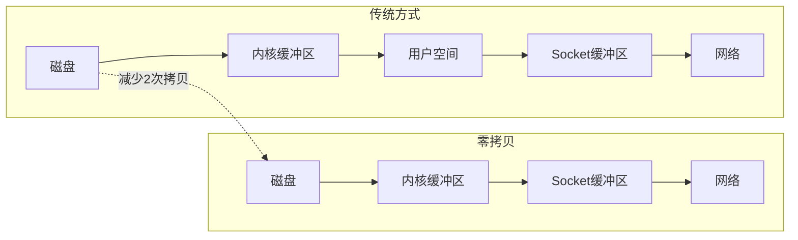
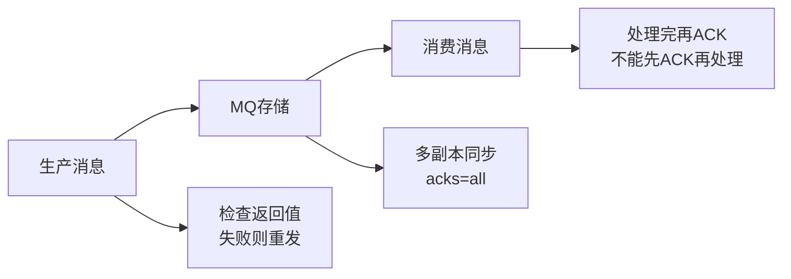
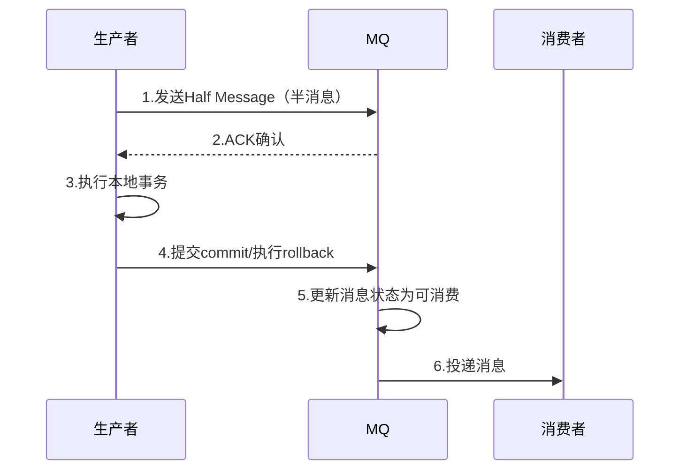

# 消息队列核心面试知识点

> 小林coding x 黑马程序员 | 难度星级：★~★★★★★ | 面试频率：高/中/低

---

## 目录

1. [消息队列应用场景](#1-消息队列应用场景)
2. [Kafka与RabbitMQ对比](#2-kafka与rabbitmq对比)
3. [Kafka高吞吐量原因](#3-kafka高吞吐量原因)
4. [消息丢失、重复消费、顺序性](#4-消息丢失重复消费顺序性)
5. [消费者组与分区](#5-消费者组与分区)
6. [高频面试题](#6-高频面试题)

---

## 1. 消息队列应用场景 ★★★

### 为什么需要消息队列？

消息队列（MQ）核心解决系统架构三大痛点：**解耦、异步、削峰**



| 场景 | 问题 | MQ解决方案 |
|------|------|-----------|
| **解耦** | 订单系统需调用多个子系统，耦合严重 | 订单系统只发消息，各子系统自行订阅 |
| **异步** | 串行调用多个接口，用户等待时间长 | 主流程几毫秒，后台异步处理非核心流程 |
| **削峰** | 秒杀时2万并发直接打爆数据库 | 瞬时请求入MQ，按数据库能力平稳消费 |

### 消息队列的缺点 ★★★

> 没有银弹，引入MQ是典型的Trade-off

1. **可用性降低**：中间件宕机导致整个链路瘫痪，必须搭建高可用集群
2. **开发复杂性上升**：需处理消息重复、消息丢失、分布式事务等问题
3. **数据一致性**：A系统成功、B系统失败的场景需要分布式事务方案

### 四大主流MQ对比选型 ★★★

| 特性 | ActiveMQ | RabbitMQ | RocketMQ | Kafka |
|------|----------|----------|----------|-------|
| 单机吞吐量 | 万级 | 万级 | **10万级** | **10万级** |
| 时效性 | 毫秒级 | 微秒级 | 毫秒级 | 毫秒级 |
| 可用性 | 高（主从） | 高（主从） | 非常高（分布式） | 非常高（分布式） |
| 消息顺序性 | 有序 | 有序 | 有序 | 分区有序 |
| 支持主题数 | 千级 | **百万级** | 千级 | 百级 |
| 消息回溯 | 不支持 | 不支持 | 支持 | 支持 |

**选型建议**：
- 高吞吐场景（日志、大数据）→ **Kafka**
- 电商等复杂业务，需要事务消息、延迟队列 → **RocketMQ**
- 多主题灵活路由 → **RabbitMQ**

---

## 2. Kafka与RabbitMQ对比 ★★★

### 架构模型对比

| 维度 | Kafka | RabbitMQ |
|------|-------|----------|
| **核心架构** | 分区(Partition)为核心，顺序写磁盘 | 交换机(Exchange)+队列模型 |
| **协调机制** | 依赖Zookeeper/KRaft | 依赖轻量级NameServer |
| **适用场景** | 大数据日志处理 | 业务消息可靠传递 |

### 文件存储模型区别（高频考点）★★★★

**Kafka：独立分区文件设计**
- 每个分区独立小本子，顺序写高效
- 问题：Topic过多时，退化为随机写，性能暴跌

**RocketMQ：CommitLog混合存储**（阿里自研解决海量Topic问题）
- 所有消息顺序追加写入统一大文件
- 后台线程整理出ConsumeQueue索引目录
- 保证海量Topic下依然是顺序写

### 消息确认机制对比 ★★★★

**Kafka：偏移量(Offset)提交模式**
```
消费者："我已经看到第100页了"
问题：批量消费时，第99条失败但第100条成功，提交Offset会导致第99条丢失
```

**RocketMQ：单条消息状态确认**
```java
// 必须明确返回状态
CONSUME_SUCCESS  // 消费成功
RECONSUME_LATER   // 稍后重试，自动进入重试队列
```

RocketMQ重试机制：阶梯式延迟（10s→30s→1min），十几次失败后进入死信队列(DLQ)

---

## 3. Kafka高吞吐量原因 ★★★★

### 核心技术点

| 技术 | 原理 | 效果 |
|------|------|------|
| **顺序写入** | 消息顺序追加到磁盘日志文件 | 减少磁盘寻道时间 |
| **批量处理** | 生产者积累到一定量才发送 | 减少网络/磁盘IO次数 |
| **零拷贝** | 数据直接从磁盘到网络套接字 | 避免内核/用户空间多次拷贝 |
| **压缩** | 支持消息压缩传输 | 减少网络传输量 |
| **分区并行** | Topic分多个Partition | 水平扩展消费能力 |

### 零拷贝技术原理



---

## 4. 消息丢失、重复消费、顺序性 ★★★★★

### 4.1 消息丢失问题（必考题）★★★★★

**三环节保证不丢失：**



| 环节 | 保证方式 |
|------|----------|
| **生产阶段** | 检查返回值和异常，失败则重发 |
| **存储阶段** | Kafka多副本同步（acks=all必须等ISR全部写入） |
| **消费阶段** | 必须处理完业务再ACK，不能先ACK再处理 |

**Kafka的acks机制：**
- `acks=0`：发出去不管，数据可能丢失
- `acks=1`：仅Leader写入，不保证从节点同步
- `acks=all/-1`：必须等所有ISR同步完成

### 4.2 重复消费与幂等性（高频追问）★★★★

**产生原因：** 生产者重试、网络抖动导致重复发送

**解决思路：消费者端幂等设计**

| 方案 | 适用场景 |
|------|----------|
| **唯一标识（幂等键）** | 接口调用、消息消费 |
| **数据库事务+乐观锁** | 余额扣减、订单状态变更 |
| **唯一索引约束** | 订单创建等插入场景 |
| **分布式锁** | 秒杀等高并发资源抢夺 |
| **消息ID去重** | 消息队列消费 |

```sql
-- 典型幂等表设计
CREATE TABLE consumed_messages (
    message_id VARCHAR(64) PRIMARY KEY,
    status TINYINT DEFAULT 0,
    created_at TIMESTAMP
);
-- 消费前先查status=0，处理后更新status=1
```

### 4.3 消息顺序性保证 ★★★★

**Kafka天然保证分区内有序，跨分区无序**

**保证顺序的方案：**
1. **生产者端**：相同Key的消息发送到同一分区
2. **消费者端**：单线程消费同一分区

**RocketMQ顺序消息原理：**
- 生产者把有序消息发到同一MessageQueue
- Broker对MessageQueue加锁
- 消费者串行消费

---

## 5. 消费者组与分区 ★★★★

### 核心规则

> **一个分区同一时刻只能被消费者组中的一个消费者消费**

```
Topic: order-topic (4个分区)
Consumer Group: order-group (3个消费者)

消费分配：
- 消费者A → 分区0、分区1
- 消费者B → 分区2
- 消费者C → 分区3（空闲）
```

### 分区数与消费者数关系

| 关系 | 结果 |
|------|------|
| 消费者数 ≤ 分区数 | 每个消费者至少消费一个分区 |
| 消费者数 > 分区数 | 多余消费者空闲，浪费资源 |

**最佳实践：** 消费者数 = 分区数（最大化吞吐）

### 消费者组优点

- **水平扩展**：加机器提升消费能力
- **故障容错**：宕机消费者自动重新分配分区

---

## 6. 高频面试题 ★★★~★★★★★

### Q1：消息队列为什么选择RocketMQ？

**参考答案**：
1. **Java语言开发**：易上手，源码可读性强
2. **社区活跃**：阿里开源，双十一验证，特性丰富
3. **功能强大**：支持事务消息、延迟队列、消息回溯等
4. **高吞吐量**：单机10万级TPS

### Q2：Kafka为什么这么快？

**参考答案**：
1. **顺序写入**：消息追加到磁盘日志，减少寻道时间
2. **批量处理**：积累一定量才发送，减少IO次数
3. **零拷贝**：sendfile技术，内核直接传输
4. **压缩传输**：减少网络数据量
5. **分区并行**：水平扩展

### Q3：如何处理消息积压？

**参考答案**：

**小量积压：** 扩容消费者（前提：分区数足够）

**海量积压（几百万消息几小时）：**
```
1. 停掉故障消费者，修复bug
2. 新建Topic，partition扩大10倍
3. 写临时分发程序，老Topic → 新Topic
4. 征用10倍机器消费新Topic
5. 消费完恢复原架构
```

**业务允许时的急救措施：** 直接重置消费位点到最新，跳过积压消息

### Q4：如何保证消息不重复消费？

**参考答案**：
```java
// 1. 消费前去Redis/数据库查重
String key = "consumed:" + messageId;
if (redis.exists(key)) {
    return; // 已消费，直接返回
}

// 2. 业务处理...

// 3. 消费后写入已消费标记（设置过期时间）
redis.setex(key, 86400, "1");
```

### Q5：RocketMQ事务消息原理？

**参考答案**：



**核心思想：** 最终一致性，不是强一致性。RocketMQ保证的是"本地事务执行成功 → 消息一定能被消费"

### Q6：RabbitMQ核心组件有哪些？

**参考答案**：
- **Producer**：生产者，发送消息到交换机
- **Consumer**：消费者，从队列取消息
- **Queue**：队列，真正存储消息（FIFO）
- **Exchange**：交换机，根据路由规则分发消息
- **RoutingKey + Binding**：交换机与队列的绑定纽带

**四种交换机类型：**

| 类型 | 匹配规则 |
|------|----------|
| Direct | 精确匹配路由键 |
| Fanout | 广播，忽略路由键 |
| Topic | 模糊匹配（*单词，#多个） |
| Headers | 消息头键值对匹配 |

### Q7：让你设计一个消息队列，如何架构？

**参考答案**：

考察点：架构设计能力、高可用、可扩展性、幂等性

```
1. 核心流程：Producer → Broker存储 → Consumer消费 → ACK确认
2. RPC设计：参考Dubbo，服务发现、序列化协议
3. 存储设计：文件系统还是数据库，参考Kafka的分区+索引
4. 消费关系：点对点还是广播，zk维护消费关系
5. 可靠性：消息持久化 + ACK确认 + 重试机制
6. 幂等处理：唯一ID去重
7. 高可用：多副本 → Leader/Follower → 故障自动选举
8. 事务特性：本地消息表 + 定时补偿
9. 可扩展：Broker → Topic → Partition，扩容时迁移Partition
```

### Q8：Kafka和RocketMQ如何选型？

**参考答案**：
- **Kafka**：高吞吐、低延迟，适合大数据日志采集（日志、埋点）
- **RocketMQ**：功能丰富，支持事务消息、延迟队列，Java技术栈首选

**选型决策树：**
```
是否需要事务消息/延迟队列?
├── 否 → Kafka（高性能）
└── 是 → RocketMQ
        └── 是否需要微秒级延迟?
            ├── 是 → RabbitMQ
            └── 否 → RocketMQ
```

### Q9：RabbitMQ死信队列和延迟队列是什么？

**参考答案**：

**延迟队列：** 消息不立即被消费，等指定时间后才投递
- 场景：订单30分钟未支付自动取消
- 实现：x-delayed-message类型交换机

**死信队列：** 无法正常处理的消息的兜底方案
- 三种情况变死信：消费者拒绝且不回队列、消息过期、队列满了
- 死信交换机自动转发到DLQ
- 后续：记录日志、人工处理或重试

### Q10：如何保证Kafka消息不丢失？

**参考答案**：
1. **生产者端**：使用`acks=all`，等待所有ISR副本确认
2. **Broker端**：设置`replication.factor >= 3`，`min.insync.replicas >= 2`
3. **消费者端**：关闭自动提交Offset，改为手动提交，确认处理完成后提交

---

## 附录：面试核心知识点星级

| 难度 | 知识点 |
|------|--------|
| ★★★ | MQ应用场景、MQ选型对比、RabbitMQ组件 |
| ★★★★ | Kafka高吞吐原因、消费者组与分区、消息顺序性、死信队列 |
| ★★★★★ | 消息丢失三环节保证、幂等设计、事务消息原理、消息积压处理、架构设计题 |

---

> **笔记说明**：本笔记结合小林coding和黑马程序员整理，涵盖消息队列核心面试知识点。建议面试前快速回顾。
