# 计算机网络核心面试笔记

> 小林coding x 黑马程序员 | 难度星级：★~★★★★★ | 面试频率：高/中/低

---

## 目录

1. [计算机网络体系结构](#1-计算机网络体系结构)
2. [TCP三次握手与四次挥手](#2-tcp三次握手与四次挥手)
3. [TCP可靠传输机制](#3-tcp可靠传输机制)
4. [TCP流量控制与拥塞控制](#4-tcp流量控制与拥塞控制)
5. [UDP协议](#5-udp协议)
6. [HTTP/HTTPS协议](#6-httphttps协议)
7. [DNS协议](#7-dns协议)
8. [Socket编程](#8-socket编程)

---

## 1. 计算机网络体系结构

### 1.1 五层协议体系 ★★★☆☆

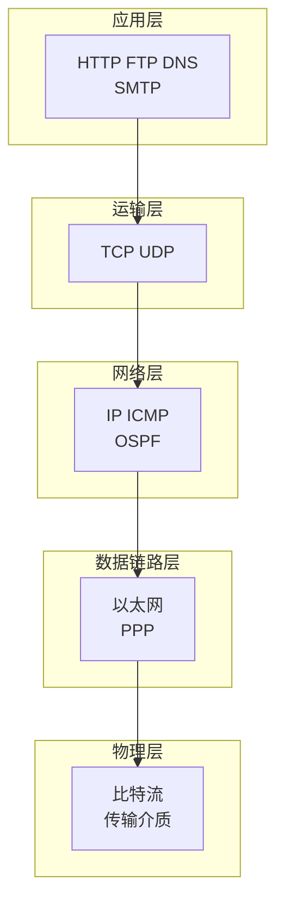

### 1.2 各层数据单位 ★★☆☆☆

| 层 | 数据单元 | 主要协议 |
|----|----------|----------|
| 应用层 | 报文 | HTTP, FTP, DNS |
| 运输层 | 段(segment) | TCP, UDP |
| 网络层 | 包(packet) | IP, ICMP |
| 数据链路层 | 帧(frame) | Ethernet |
| 物理层 | 比特(bit) | - |

---

## 2. TCP三次握手与四次挥手

### 2.1 三次握手 ★★★★★（高频）

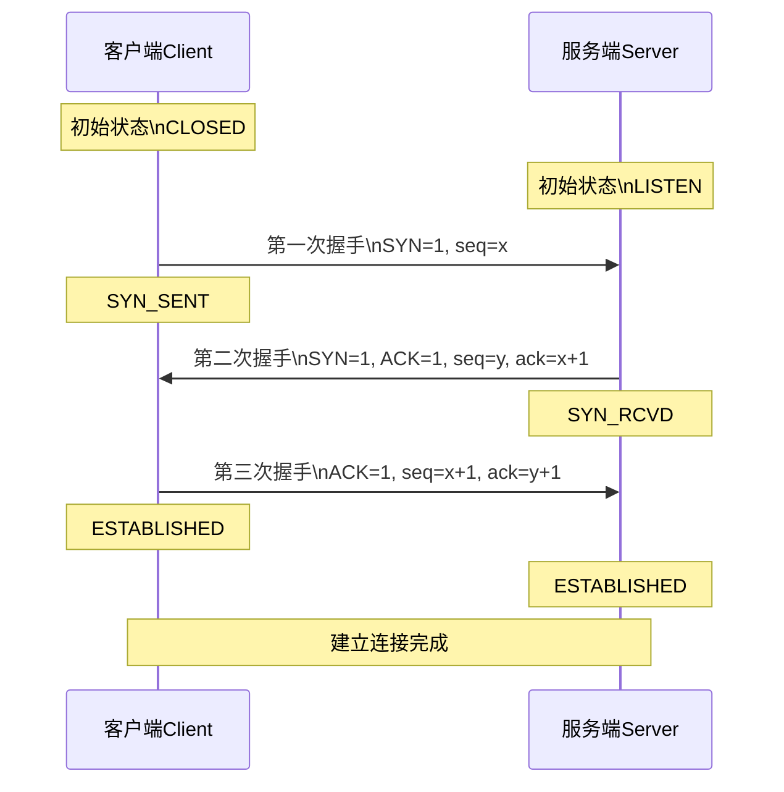

**图解**：

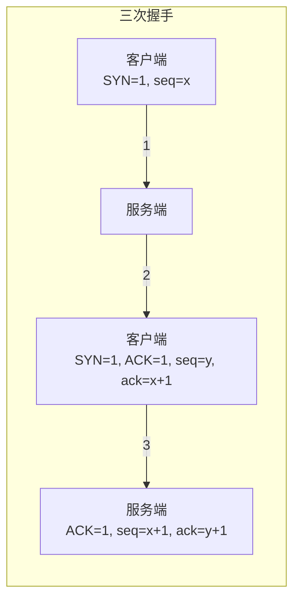

**为什么需要三次？**
- 第一次：服务端确认客户端发送能力
- 第二次：客户端确认服务端发送+接收能力
- 第三次：服务端确认客户端接收能力

### 2.2 四次挥手 ★★★★★（高频）

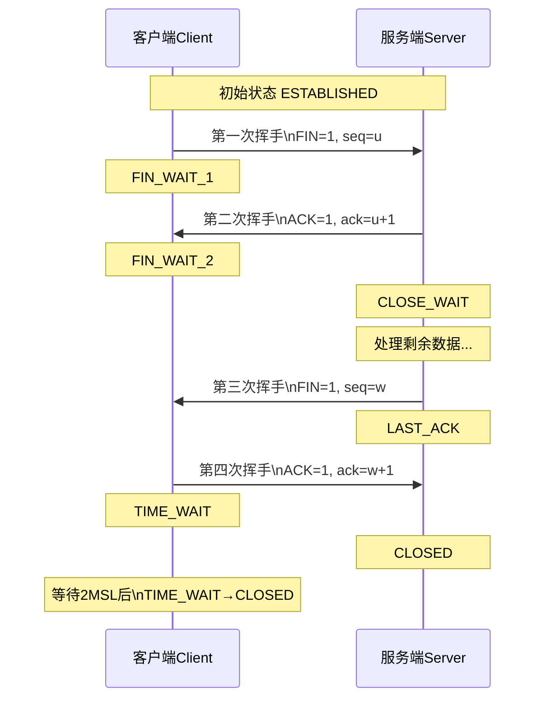

**为什么需要四次？**
- 第一次：客户端请求关闭
- 第二次：服务端确认，但可能还有数据要发送
- 第三次：服务端数据发送完毕，请求关闭
- 第四次：客户端确认，服务端关闭

### 2.3 状态转换 ★★★☆☆

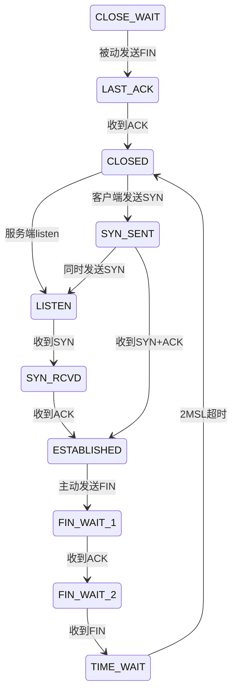

---

## 3. TCP可靠传输机制

### 3.1 可靠传输机制 ★★★★☆

| 机制 | 说明 |
|------|------|
| 校验和 | 检测传输错误 |
| 序列号 | 解决乱序问题 |
| 确认应答(ACK) | 确认收到数据 |
| 超时重传 | 数据丢失重发 |
| 流量控制 | 滑动窗口 |

### 3.2 滑动窗口 ★★★★☆

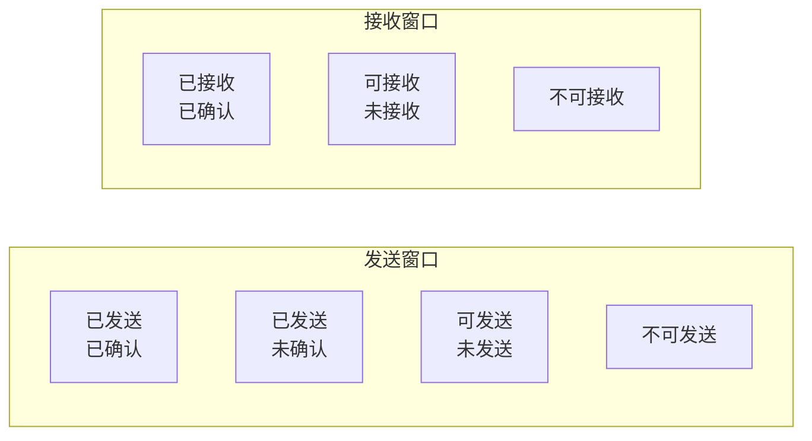

**窗口大小**：由接收方控制，用于流量控制

---

## 4. TCP流量控制与拥塞控制

### 4.1 流量控制 ★★★☆☆

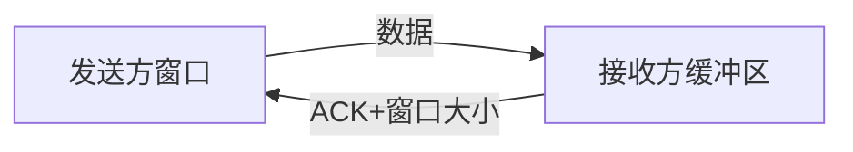

**目的**：防止发送方发送过快，导致接收方缓冲区溢出

### 4.2 拥塞控制 ★★★★☆

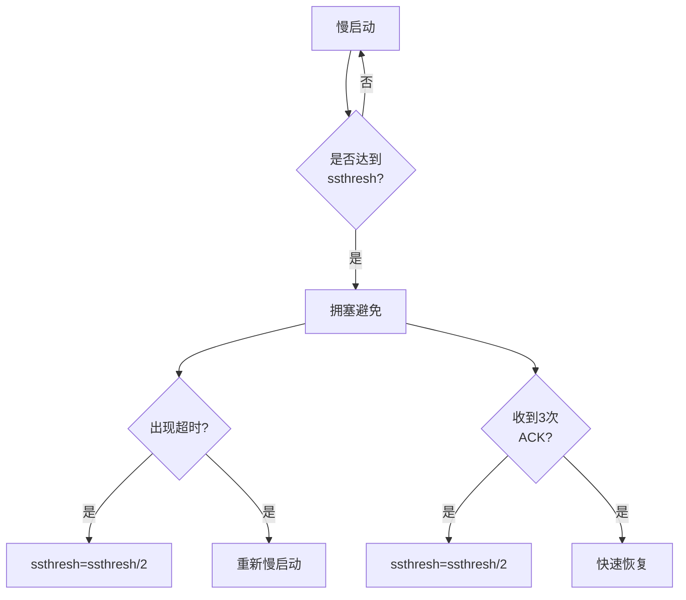

**拥塞控制算法**：
1. **慢启动**：从小到大增加窗口
2. **拥塞避免**：线性增长
3. **快速重传**：收到3次重复ACK
4. **快速恢复**：快速恢复丢失报文段

---

## 5. UDP协议

### 5.1 UDP特点 ★★★☆☆

| 特点 | 说明 |
|------|------|
| 无连接 | 不需要握手挥手 |
| 不可靠 | 不保证交付 |
| 面向报文 | 直接处理应用层报文 |
| 无拥塞控制 | 可能丢包乱序 |

### 5.2 TCP vs UDP ★★★★★（高频）

| 对比项 | TCP | UDP |
|--------|-----|-----|
| 连接性 | 面向连接 | 无连接 |
| 可靠性 | 可靠 | 不可靠 |
| 传输方式 | 字节流 | 数据报文 |
| 拥塞控制 | 有 | 无 |
| 效率 | 较低 | 较高 |
| 应用场景 | 文件传输、邮件 | 视频、语音、DNS |

---

## 6. HTTP/HTTPS协议

### 6.1 HTTP请求方法 ★★★☆☆

| 方法 | 说明 |幂等性 |
|------|------|--------|
| GET | 获取资源 | ✅ |
| POST | 提交数据 | ❌ |
| PUT | 更新资源 | ✅ |
| DELETE | 删除资源 | ✅ |
| HEAD | 获取响应头 | ✅ |

### 6.2 HTTP状态码 ★★★★☆

| 类别 | 含义 | 示例 |
|------|------|------|
| 1xx | 信息 | 100 Continue |
| 2xx | 成功 | 200 OK, 201 Created |
| 3xx | 重定向 | 301 Moved, 304 Not Modified |
| 4xx | 客户端错误 | 400 Bad Request, 404 Not Found |
| 5xx | 服务端错误 | 500 Internal Error, 503 Service Unavailable |

### 6.3 HTTPS原理 ★★★★★（高频）

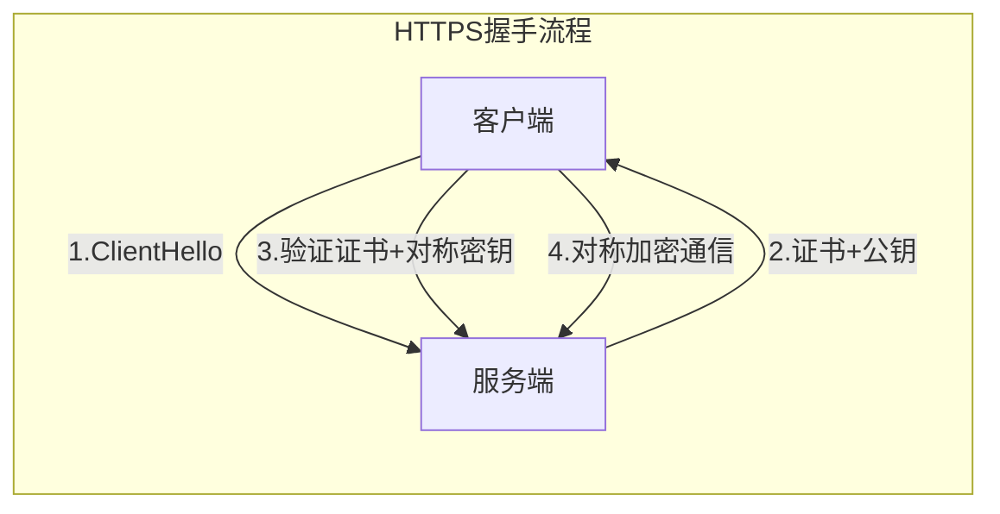

**HTTPS建立连接过程**：
1. ClientHello：客户端支持的TLS版本、加密算法、随机数C
2. ServerHello：服务端证书、公钥、随机数S
3. 客户端验证证书，用公钥加密预备主密钥发送给服务端
4. 双方用三个随机数生成对称密钥
5. 开始对称加密通信

---

## 7. DNS协议

### 7.1 DNS查询过程 ★★★☆☆

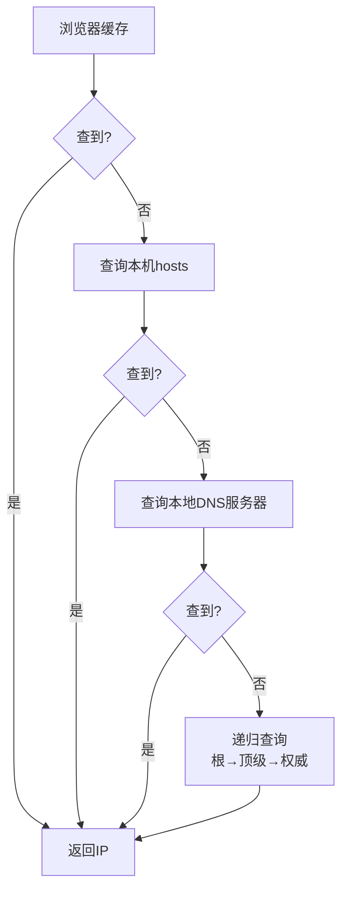

### 7.2 DNS记录类型

| 类型 | 说明 |
|------|------|
| A | IPv4地址 |
| AAAA | IPv6地址 |
| CNAME | 别名 |
| MX | 邮件服务器 |
| NS | 域名服务器 |

---

## 8. Socket编程

### 8.1 TCP socket通信流程 ★★★☆☆

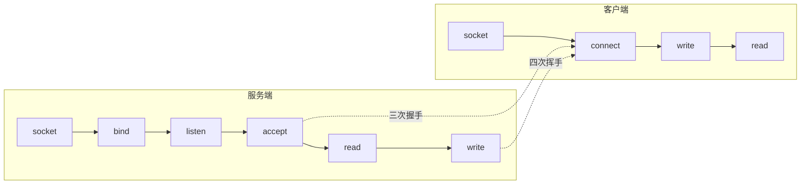

### 8.2 一次HTTP请求的过程 ★★★★★（高频）

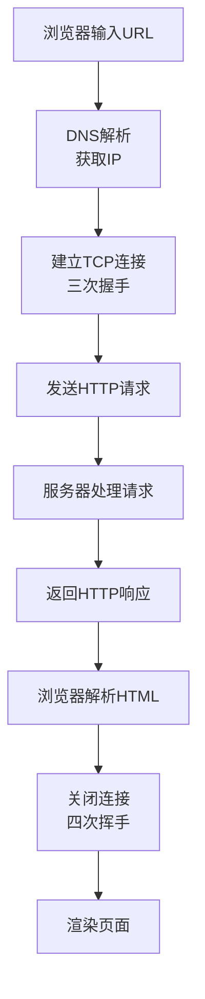

---

## 附录：面试高频问题速查

| 优先级 | 问题 | 答案要点 |
|--------|------|----------|
| ★★★★★ | TCP三次握手 | 为什么需要三次，状态变化 |
| ★★★★★ | TCP四次挥手 | 为什么需要四次，TIME_WAIT |
| ★★★★★ | TCP vs UDP | 连接性、可靠性、效率 |
| ★★★★★ | HTTPS原理 | TLS握手、非对称+对称加密 |
| ★★★★☆ | TCP可靠传输 | 校验和、序列号、ACK、重传 |
| ★★★★☆ | 拥塞控制 | 慢启动、拥塞避免、快速重传 |
| ★★★☆☆ | HTTP状态码 | 2xx/3xx/4xx/5xx含义 |
| ★★★☆☆ | DNS解析过程 | 递归+迭代查询 |

---

> **笔记说明**：本笔记结合小林coding和黑马程序员整理，涵盖计算机网络核心面试知识点。建议面试前快速回顾。
